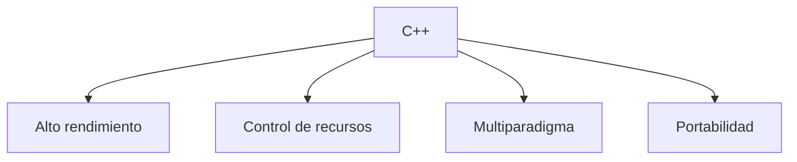

# ¿Qué es C++?

C++ es un lenguaje de programación de propósito general, compilado y de tipado estático, desarrollado por Bjarne Stroustrup a partir del lenguaje C.

Fue diseñado para ofrecer alto rendimiento, control directo sobre los recursos del sistema y soporte para diferentes paradigmas de programación, incluyendo programación procedimental, orientada a objetos, genérica y funcional.

## Objetivos de C++

C++ fue diseñado con varios objetivos fundamentales:

* Mantener la eficiencia y el rendimiento del lenguaje C.
* Permitir la abstracción sin sacrificar rendimiento.
* Proporcionar control directo sobre los recursos del sistema.
* Escalar desde programas pequeños hasta sistemas complejos.
* Ofrecer soporte para múltiples paradigmas de programación.

## Características principales

* Lenguaje compilado.
* Tipado estático.
* Alto rendimiento.
* Multiparadigma.
* Compatible con gran parte del lenguaje C.
* Amplia biblioteca estándar (STL).

## Paradigmas de programación soportados

C++ permite escribir programas utilizando diferentes estilos de programación:

| Paradigma           | Descripción                                      |
| ------------------- | ------------------------------------------------ |
| Procedimental       | Organización mediante funciones y procedimientos |
| Orientado a objetos | Uso de clases y objetos                          |
| Genérico            | Uso de plantillas (*templates*)                  |
| Funcional           | Uso de funciones lambda y algoritmos             |

## ¿Para qué se utiliza?

C++ es utilizado en áreas donde el rendimiento y el control sobre el hardware son importantes:

* Sistemas operativos.
* Motores gráficos.
* Desarrollo de videojuegos.
* Aplicaciones de escritorio.
* Sistemas embebidos.
* Software financiero.
* Computación de alto rendimiento.

| Área                       | Ejemplos                                           |
| -------------------------- | -------------------------------------------------- |
| Sistemas operativos        | Kernels, controladores y utilidades del sistema    |
| Videojuegos                | Motores gráficos y lógica de juego                 |
| Sistemas embebidos         | Microcontroladores, IoT y electrónica              |
| Finanzas                   | Trading de alta frecuencia y análisis de datos     |
| Computación científica     | Simulaciones y cálculo numérico                    |
| Aplicaciones de escritorio | Navegadores, editores y herramientas profesionales |

## Ventajas

* Excelente rendimiento.
* Gran control de memoria y recursos.
* Amplio ecosistema y comunidad.
* Compatible con múltiples plataformas.

## Desventajas

* Curva de aprendizaje elevada.
* Gestión de memoria más compleja que en otros lenguajes modernos.
* Sintaxis extensa en algunos casos.

## Ejemplos de software desarrollado con C++

Algunos proyectos conocidos desarrollados total o parcialmente en C++:

* Google Chrome
* Mozilla Firefox
* Unreal Engine
* Blender
* MySQL
* PostgreSQL

## Nota

Durante muchos años han aparecido nuevos lenguajes de programación, pero C++ continúa evolucionando mediante estándares modernos como C++11, C++14, C++17, C++20 y C++23, incorporando nuevas características y mejoras sin perder compatibilidad con gran parte del código existente.

## Conclusión

C++ es uno de los lenguajes más utilizados para desarrollar software que requiere eficiencia, rendimiento y control sobre los recursos del sistema. A pesar de su complejidad, continúa siendo una herramienta fundamental en la industria del software.

## Resumen

* C++ es un lenguaje compilado, de tipado estático y multiparadigma.
* Fue desarrollado por Bjarne Stroustrup como una extensión del lenguaje C.
* Se utiliza en sistemas donde el rendimiento y el control son importantes.
* Permite programación procedimental, orientada a objetos, genérica y funcional.
* Continúa evolucionando mediante estándares modernos manteniendo compatibilidad con gran parte del código existente.
