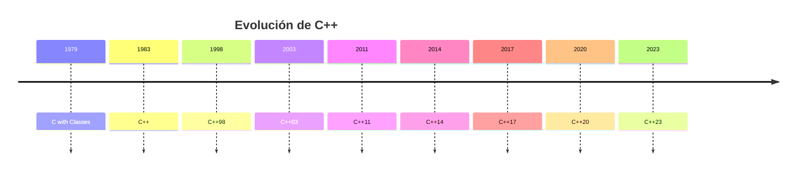

# Historia de C++

## Introducción

C++ fue creado por **Bjarne Stroustrup** en los laboratorios Bell a finales de la década de 1970.

Su objetivo era combinar la eficiencia y el acceso de bajo nivel del lenguaje **C** con mecanismos que facilitaran el desarrollo y mantenimiento de software complejo.

Inicialmente el proyecto recibió el nombre de **"C with Classes"**, ya que incorporaba clases al lenguaje C.

En 1983 pasó a llamarse **C++**, nombre inspirado en el operador de incremento (`++`) de C, que simboliza una evolución respecto a dicho lenguaje.

---

## Origen de C++

A finales de los años setenta, el desarrollo de software comenzaba a enfrentarse a sistemas cada vez más grandes y complejos.

Aunque C era un lenguaje muy eficiente, carecía de herramientas para modelar entidades complejas y organizar grandes bases de código.

Para resolver estos problemas, Stroustrup incorporó características inspiradas en otros lenguajes, especialmente Simula, manteniendo al mismo tiempo el rendimiento y la compatibilidad con C.

Los principales objetivos eran:

* Mantener la eficiencia característica de C.
* Mejorar la organización del código.
* Facilitar la reutilización de componentes.
* Permitir la abstracción sin perder rendimiento.
* Escalar a proyectos de gran tamaño.

---

## Línea temporal

---

## Evolución del lenguaje

| Versión | Año  | Características destacadas                       |
| ------- | ---- | ------------------------------------------------ |
| C++98   | 1998 | Primer estándar oficial, STL                     |
| C++03   | 2003 | Correcciones y mejoras del estándar              |
| C++11   | 2011 | `auto`, `nullptr`, lambdas, move semantics       |
| C++14   | 2014 | Mejoras y refinamientos de C++11                 |
| C++17   | 2017 | `filesystem`, `optional`, structured bindings    |
| C++20   | 2020 | concepts, ranges, coroutines, modules            |
| C++23   | 2023 | Mejoras y ampliaciones de la biblioteca estándar |

---

## ¿Por qué nació C++?

A medida que los programas crecían en tamaño y complejidad, el lenguaje C comenzaba a mostrar limitaciones para organizar grandes proyectos.

C++ introdujo mecanismos que permitían:

* Organizar mejor el código.
* Reutilizar componentes mediante clases.
* Modelar entidades del mundo real.
* Reducir la complejidad de grandes sistemas.
* Mantener el rendimiento característico de C.

---

## De C a C++

La evolución de C a C++ incorporó nuevas capacidades sin abandonar gran parte de la compatibilidad existente.

| C                            | C++                               |
| ---------------------------- | --------------------------------- |
| Procedimental                | Multiparadigma                    |
| Funciones y estructuras      | Funciones, clases y objetos       |
| Sin herencia                 | Herencia                          |
| Sin polimorfismo             | Polimorfismo                      |
| Biblioteca estándar limitada | STL y biblioteca estándar moderna |
| Menor nivel de abstracción   | Mayor capacidad de abstracción    |

---

## Influencia en la industria

Desde su creación, C++ ha sido utilizado para desarrollar algunos de los sistemas más importantes de la industria del software.

Su combinación de rendimiento, flexibilidad y control sobre los recursos lo convirtió en una de las herramientas principales para el desarrollo de:

* Sistemas operativos.
* Motores gráficos.
* Navegadores web.
* Bases de datos.
* Aplicaciones científicas.
* Sistemas embebidos.
* Videojuegos.

---

## Importancia de C++ en la actualidad

Más de cuatro décadas después de su creación, C++ continúa evolucionando mediante nuevos estándares.

Actualmente sigue siendo una de las principales opciones para proyectos donde son importantes:

* El rendimiento.
* El uso eficiente de memoria.
* La baja latencia.
* El acceso directo al hardware.
* La compatibilidad con sistemas existentes.

Su capacidad para combinar programación de alto nivel con control de bajo nivel explica su permanencia en sectores críticos de la industria.

---

## Relación con los estándares modernos

La evolución de C++ puede dividirse en tres grandes etapas:

| Etapa                      | Estándares          |
| -------------------------- | ------------------- |
| Primeros estándares        | C++98, C++03        |
| Modernización del lenguaje | C++11, C++14, C++17 |
| C++ moderno                | C++20, C++23        |

Esta evolución ha permitido que el lenguaje incorpore nuevas herramientas sin perder compatibilidad con una enorme cantidad de software existente.

---

## Resumen

* C++ fue creado por Bjarne Stroustrup en los laboratorios Bell.
* Nació como una extensión de C llamada **C with Classes**.
* El nombre C++ apareció oficialmente en 1983.
* Su objetivo fue combinar eficiencia, control y abstracción.
* El primer estándar oficial fue C++98.
* C++11 y C++20 representan dos de las evoluciones más importantes del lenguaje.
* Actualmente continúa evolucionando mediante nuevos estándares.
* Sigue siendo uno de los lenguajes más utilizados para software de alto rendimiento.
