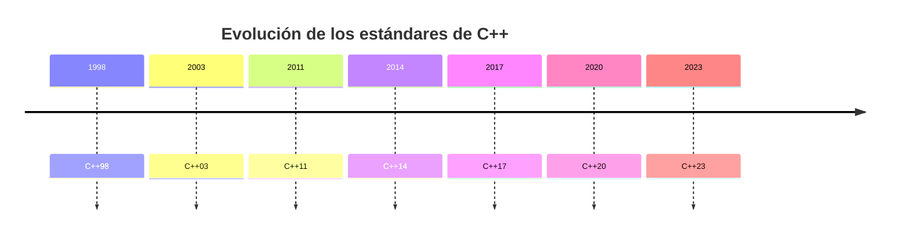

# Versiones de C++

## Introducción

Desde su estandarización en 1998, C++ ha evolucionado constantemente mediante nuevas versiones del estándar.

Cada versión incorpora características que mejoran la seguridad, productividad, expresividad y rendimiento del lenguaje, manteniendo al mismo tiempo la compatibilidad con gran parte del código existente.

Comprender la evolución de los estándares ayuda a entender por qué existen determinadas características y cómo el lenguaje ha ido adaptándose a las necesidades modernas del desarrollo de software.

---

## Línea temporal



---

## Evolución de los estándares

| Estándar | Año  | Características principales                   |
| -------- | ---- | --------------------------------------------- |
| C++98    | 1998 | Primer estándar oficial, STL                  |
| C++03    | 2003 | Correcciones y mejoras                        |
| C++11    | 2011 | `auto`, `nullptr`, lambdas, move semantics    |
| C++14    | 2014 | Refinamiento de C++11                         |
| C++17    | 2017 | `filesystem`, `optional`, structured bindings |
| C++20    | 2020 | concepts, ranges, coroutines, modules         |
| C++23    | 2023 | Nuevas utilidades y mejoras de biblioteca     |

---

## C++98

Fue el primer estándar oficial del lenguaje y estableció las bases del C++ moderno.

Principales aportes:

* Biblioteca estándar (STL).
* Namespaces.
* Excepciones.
* Plantillas (*templates*).
* Sobrecarga de operadores.

Gracias a este estándar, los desarrolladores comenzaron a disponer de una especificación común y portable entre compiladores.

---

## C++03

Fue una actualización menor enfocada principalmente en:

* Corrección de errores.
* Clarificación de especificaciones.
* Mejoras de estabilidad.
* Compatibilidad entre compiladores.

No introdujo nuevas características importantes para los desarrolladores.

---

## C++11

Es considerado uno de los cambios más importantes en la historia del lenguaje.

Introdujo numerosas características que modernizaron C++ y simplificaron la escritura de código.

Principales novedades:

* `auto`
* `nullptr`
* Expresiones lambda
* Smart pointers
* Move semantics
* Concurrencia mediante `std::thread`
* Inicialización uniforme
* Enumeraciones fuertemente tipadas (`enum class`)

Ejemplo:

```cpp
auto numero {42};
```

---

## C++14

Puede considerarse una evolución natural de C++11.

Sus principales aportes fueron:

* Lambdas más flexibles.
* Mejor inferencia de tipos.
* Mejoras para `constexpr`.
* Mejoras en la biblioteca estándar.

Su objetivo principal fue simplificar y refinar características introducidas en C++11.

---

## C++17

Introdujo herramientas que actualmente forman parte del desarrollo cotidiano en C++.

Principales novedades:

* `std::filesystem`
* `std::optional`
* `std::variant`
* Structured bindings
* `if constexpr`

Ejemplo:

```cpp
auto [x, y] {punto};
```

---

## C++20

Representa otro gran salto evolutivo del lenguaje.

Muchas características introducidas en esta versión buscan simplificar la escritura de código genérico y mejorar la expresividad.

Principales novedades:

* Concepts
* Ranges
* Coroutines
* Modules
* Three-way comparison (`<=>`)

Ejemplo:

```cpp
template<typename T>
concept Numero = std::integral<T>;
```

---

## C++23

Continúa la modernización iniciada por C++20.

Incluye:

* Mejoras en ranges.
* Mejoras en la biblioteca estándar.
* Nuevas utilidades para programación moderna.
* Simplificaciones sintácticas.
* Mejor soporte para programación genérica.

Aunque no introduce cambios tan revolucionarios como C++11 o C++20, continúa mejorando la productividad y consistencia del lenguaje.

---

## Evolución del lenguaje

La historia moderna de C++ suele dividirse en tres grandes etapas:

| Etapa         | Estándares          |
| ------------- | ------------------- |
| C++ clásico   | C++98, C++03        |
| Modernización | C++11, C++14, C++17 |
| C++ moderno   | C++20, C++23        |

---

## ¿Qué estándar debería aprender?

Actualmente los estándares más utilizados son:

| Estándar | Recomendación              |
| -------- | -------------------------- |
| C++11    | Conocerlo                  |
| C++17    | Dominarlo                  |
| C++20    | Aprenderlo progresivamente |
| C++23    | Explorar sus novedades     |

Para proyectos personales modernos se recomienda utilizar al menos C++20.

Ejemplos:

```bash
g++ main.cpp -std=c++20
```

```bash
g++ main.cpp -std=c++23
```

---

## Compatibilidad entre estándares

Una de las características más importantes de C++ es su fuerte compromiso con la compatibilidad hacia atrás.

En la mayoría de los casos, un programa escrito para un estándar anterior puede compilarse en estándares posteriores con pocos o ningún cambio.

```text
C++98
   ↓
C++03
   ↓
C++11
   ↓
C++14
   ↓
C++17
   ↓
C++20
   ↓
C++23
```

Esta compatibilidad ha permitido que enormes bases de código sigan funcionando y evolucionando durante décadas.

---

## Importancia de C++11 y C++20

Dentro de la evolución del lenguaje, dos estándares destacan especialmente:

| Estándar | Importancia                                                           |
| -------- | --------------------------------------------------------------------- |
| C++11    | Modernizó completamente el lenguaje                                   |
| C++20    | Introdujo herramientas avanzadas para programación genérica y modular |

Muchos desarrolladores consideran estos dos estándares como los hitos más importantes en la historia moderna de C++.

---

## Resumen

* C++ evoluciona mediante estándares oficiales.
* C++98 fue el primer estándar oficial.
* C++03 fue una actualización enfocada en correcciones.
* C++11 modernizó profundamente el lenguaje.
* C++17 introdujo características ampliamente utilizadas en la actualidad.
* C++20 incorporó concepts, ranges, coroutines y modules.
* C++23 continúa mejorando la biblioteca estándar y las herramientas modernas.
* Comprender los estándares ayuda a entender la evolución y filosofía de C++.
