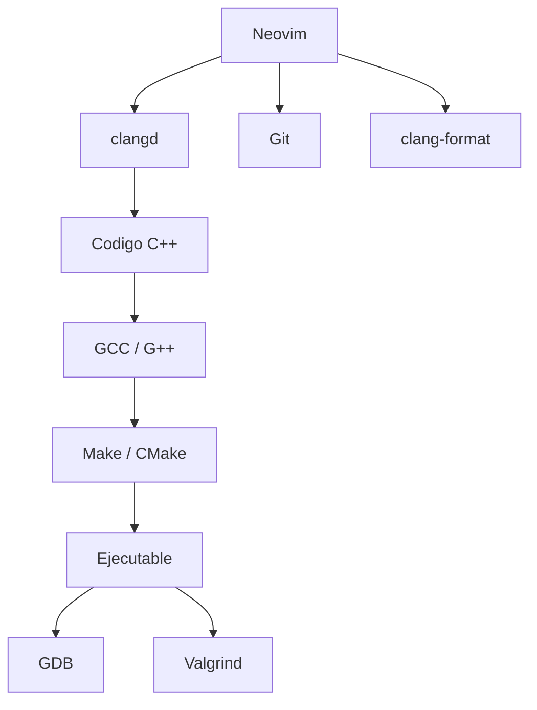
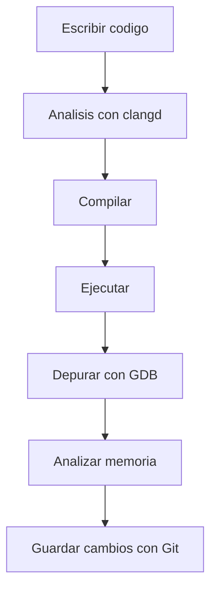

# Entorno de Desarrollo

## Introducción

Para desarrollar aplicaciones en C++ no basta con conocer el lenguaje. También es necesario utilizar un conjunto de herramientas que permitan escribir código, compilar programas, construir proyectos, depurar errores y mantener el software de forma eficiente.

Durante este proceso de aprendizaje se utilizará un entorno basado en Linux, GCC y Neovim, acompañado de herramientas ampliamente utilizadas en el desarrollo profesional de software.

---

## ¿Qué es un entorno de desarrollo?

Un entorno de desarrollo es el conjunto de programas y herramientas que utiliza un desarrollador para crear software.

En C++, normalmente incluye:

* Un editor o IDE.
* Un compilador.
* Herramientas de construcción.
* Herramientas de depuración.
* Sistemas de control de versiones.
* Herramientas de análisis y calidad de código.


---

## Herramientas del entorno

| Herramienta      | Función principal                                       | Uso habitual                           |
| ---------------- | ------------------------------------------------------- | -------------------------------------- |
| **GCC / G++**    | Compilar código fuente                                  | Cada compilación                       |
| **Make**         | Automatizar tareas de construcción                      | Proyectos medianos y grandes           |
| **CMake**        | Configurar proyectos y generar sistemas de construcción | Proyectos modernos                     |
| **GDB**          | Depurar programas                                       | Búsqueda de errores                    |
| **Valgrind**     | Analizar memoria                                        | Detección de fugas y accesos inválidos |
| **Git**          | Control de versiones                                    | Gestión del código fuente              |
| **Neovim**       | Editor de código                                        | Desarrollo diario                      |
| **clangd**       | Autocompletado y análisis semántico                     | Mientras se escribe código             |
| **clang-format** | Formateo automático                                     | Mantener consistencia                  |
| **clang-tidy**   | Análisis estático                                       | Detectar errores y malas prácticas     |

---

## Arquitectura del entorno



---

## Instalación

### Arch Linux

```bash
sudo pacman -S \
gcc \
make \
cmake \
gdb \
valgrind \
git \
neovim \
clang \
clang-tools-extra
```

---

## Verificación de la instalación

Después de instalar las herramientas es recomendable comprobar que todas están disponibles:

```bash
g++ --version
make --version
cmake --version
gdb --version
valgrind --version
git --version
nvim --version
clangd --version
clang-format --version
clang-tidy --version
```

---

## ¿Qué instala cada paquete?

| Paquete           | Componentes principales     |
| ----------------- | --------------------------- |
| gcc               | gcc, g++                    |
| make              | make                        |
| cmake             | cmake                       |
| gdb               | gdb                         |
| valgrind          | valgrind                    |
| git               | git                         |
| neovim            | nvim                        |
| clang             | clang, clangd, clang-format |
| clang-tools-extra | clang-tidy                  |

---

## Flujo de trabajo habitual

Un ciclo de desarrollo típico suele seguir estos pasos:



---

## Primer ejemplo

Archivo:

```cpp
#include <iostream>

int main()
{
    std::cout << "Hola Mundo\n";

    return 0;
}
```

Compilación:

```bash
g++ main.cpp -o app
```

Ejecución:

```bash
./app
```

Salida:

```text
Hola Mundo
```

---

## Relación entre las herramientas

Cada herramienta cumple una función específica dentro del proceso de desarrollo:

| Etapa                | Herramienta       |
| -------------------- | ----------------- |
| Edición              | Neovim            |
| Asistencia de código | clangd            |
| Compilación          | G++               |
| Construcción         | Make / CMake      |
| Ejecución            | Sistema operativo |
| Depuración           | GDB               |
| Análisis de memoria  | Valgrind          |
| Control de versiones | Git               |

---

## ¿Por qué aprender estas herramientas?

Aprender únicamente la sintaxis de C++ no es suficiente para desarrollar software profesional.

Estas herramientas permiten:

* Automatizar tareas repetitivas.
* Detectar errores más rápidamente.
* Mantener proyectos grandes.
* Trabajar en equipo.
* Mejorar la calidad del código.
* Facilitar el mantenimiento a largo plazo.

---

## Objetivo de este entorno

Este conjunto de herramientas proporciona todo lo necesario para:

* Escribir código.
* Compilar programas.
* Gestionar proyectos.
* Depurar errores.
* Analizar memoria.
* Mantener historial de cambios.
* Aplicar buenas prácticas de desarrollo.

Con estas herramientas es posible desarrollar desde pequeños ejercicios hasta proyectos profesionales de gran tamaño.

---

## Resumen

* Un entorno de desarrollo está formado por varias herramientas complementarias.
* GCC es el compilador principal utilizado durante el curso.
* Make y CMake ayudan a gestionar la construcción de proyectos.
* GDB permite depurar programas paso a paso.
* Valgrind ayuda a detectar problemas relacionados con la memoria.
* Git controla el historial y evolución del proyecto.
* Neovim es el editor principal utilizado en el curso.
* clangd proporciona inteligencia y análisis de código.
* clang-format mantiene un estilo consistente.
* clang-tidy ayuda a mejorar la calidad del software.

Este será el entorno utilizado durante todo el proceso de aprendizaje de C++.
