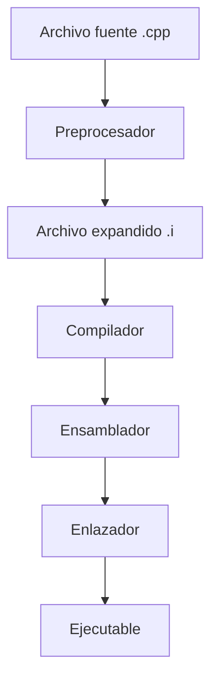
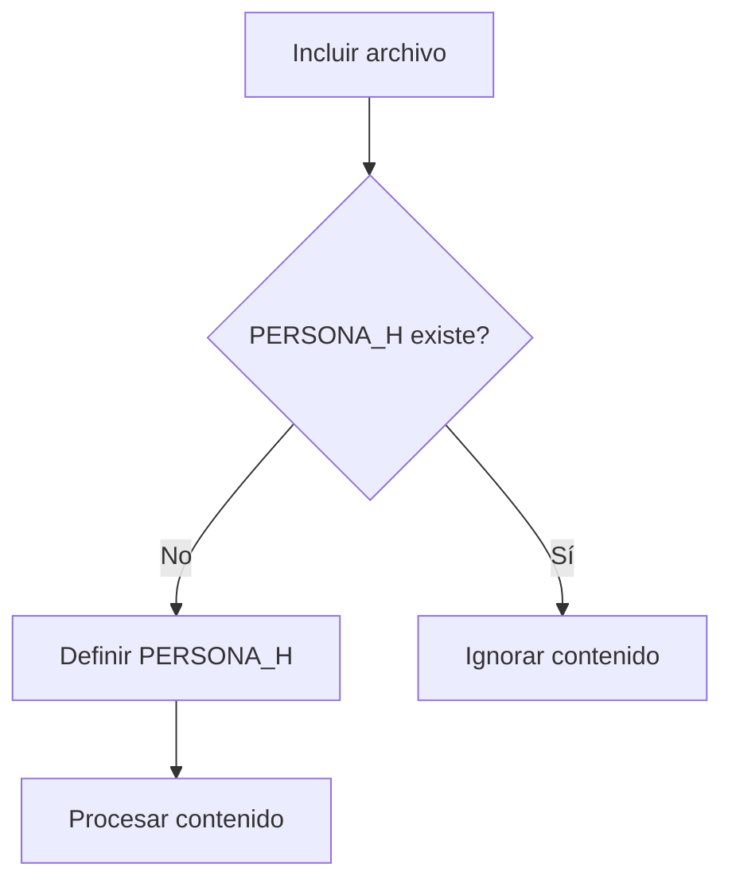

# Preprocesado

## Introducción

Antes de que el compilador traduzca un programa C++ a código máquina, existe una etapa previa llamada **preprocesado**.

Durante esta fase, el preprocesador procesa todas las directivas que comienzan con el símbolo `#` y realiza transformaciones sobre el código fuente.

El resultado es un nuevo archivo expandido que posteriormente será enviado al compilador.

---

## Flujo de construcción



---

## ¿Qué es el preprocesador?

El preprocesador es una herramienta que actúa antes de la compilación.

Su trabajo consiste en procesar instrucciones especiales llamadas **directivas de preprocesador**.

Estas directivas permiten:

* Incluir archivos.
* Definir macros.
* Realizar compilación condicional.
* Evitar inclusiones múltiples de cabeceras.

El preprocesador trabaja únicamente con texto y no entiende la sintaxis ni los tipos de C++.

---

## Directivas del preprocesador

Las directivas más utilizadas son:

| Directiva  | Función                              |
| ---------- | ------------------------------------ |
| `#include` | Inserta el contenido de otro archivo |
| `#define`  | Define una macro                     |
| `#undef`   | Elimina una macro                    |
| `#ifdef`   | Comprueba si una macro existe        |
| `#ifndef`  | Comprueba si una macro no existe     |
| `#if`      | Evaluación condicional               |
| `#elif`    | Condición adicional                  |
| `#else`    | Alternativa                          |
| `#endif`   | Fin del bloque condicional           |

---

## Ejemplo: `#include`

Archivo:

```cpp
#include <iostream>

int main()
{
    std::cout << "Hola Mundo\n";
}
```

Durante el preprocesado:

```cpp
#include <iostream>
```

es sustituido por el contenido completo del archivo de cabecera correspondiente.

Conceptualmente:

```text
#include <iostream>
        │
        ▼
Contenido completo de iostream
```

El archivo resultante puede contener miles de líneas adicionales.

---

## Inclusión de cabeceras

Existen dos formas habituales de incluir archivos:

### Biblioteca estándar

```cpp
#include <iostream>
```

Los símbolos `< >` indican que el archivo debe buscarse en las rutas estándar del compilador.

### Cabeceras del proyecto

```cpp
#include "persona.h"
```

Las comillas `" "` indican que el compilador debe buscar primero en el directorio actual del proyecto.

---

## Ejemplo: `#define`

Las macros permiten realizar sustituciones de texto.

```cpp
#define PI 3.14159

double area = PI * radio * radio;
```

Después del preprocesado:

```cpp
double area = 3.14159 * radio * radio;
```

El reemplazo ocurre antes de la compilación.

---

## Problemas de las macros

Las macros son simples sustituciones de texto y no respetan reglas de tipos.

Ejemplo:

```cpp
#define CUADRADO(x) x * x

int resultado = CUADRADO(3 + 1);
```

Después del preprocesado:

```cpp
int resultado = 3 + 1 * 3 + 1;
```

Resultado:

```cpp
4 + 1
```

No:

```cpp
16
```

Por este motivo, en C++ moderno suele preferirse:

```cpp
constexpr
```

o

```cpp
inline
```

en lugar de macros cuando sea posible.

---

## Compilación condicional

Permite incluir o excluir partes del código dependiendo de ciertas condiciones.

```cpp
#define DEBUG

#ifdef DEBUG
std::cout << "Modo depuración\n";
#endif
```

Si la macro existe:

```cpp
std::cout << "Modo depuración\n";
```

permanece en el código.

Si no existe:

```cpp
#ifdef DEBUG
std::cout << "Modo depuración\n";
#endif
```

es eliminado completamente durante el preprocesado.

---

## Include Guards

Los *Include Guards* evitan que una cabecera sea procesada varias veces dentro de la misma unidad de traducción.

```cpp
#ifndef PERSONA_H
#define PERSONA_H

class Persona
{
};

#endif
```

Funcionamiento:



---

## `#pragma once`

Muchos compiladores modernos ofrecen una alternativa más sencilla:

```cpp
#pragma once

class Persona
{
};
```

Su objetivo es el mismo que los *Include Guards*: evitar inclusiones múltiples.

Aunque está ampliamente soportado, no forma parte del estándar original del preprocesador.

---

## Ver el resultado del preprocesado

GCC permite detener el proceso de construcción después del preprocesado.

Mostrar el resultado en pantalla:

```bash
g++ -E main.cpp
```

Guardar el resultado en un archivo:

```bash
g++ -E main.cpp -o main.i
```

Resultado:

```text
main.cpp
   │
   ▼
main.i
```

La extensión `.i` suele utilizarse para archivos ya preprocesados.

---

## Ejemplo práctico

Archivo original:

```cpp
#include <iostream>

#define MENSAJE "Hola Mundo"

int main()
{
    std::cout << MENSAJE << '\n';
}
```

Después del preprocesado:

```cpp
// contenido expandido de iostream

int main()
{
    std::cout << "Hola Mundo" << '\n';
}
```

Obsérvese que la macro ha sido sustituida por su valor literal.

---

## ¿Qué NO hace el preprocesador?

El preprocesador NO:

* Comprueba errores de sintaxis.
* Verifica tipos.
* Genera código máquina.
* Optimiza código.
* Comprueba reglas del lenguaje.

Estas tareas pertenecen a etapas posteriores del proceso de compilación.

---

## Buenas prácticas

* Utilizar `#include` únicamente cuando sea necesario.
* Preferir `constexpr` frente a macros para constantes.
* Utilizar nombres descriptivos para macros.
* Emplear *Include Guards* o `#pragma once` en cabeceras.
* Mantener las condiciones de compilación simples y fáciles de entender.

---

## Resumen

* El preprocesado es la primera etapa de construcción de un programa C++.
* El preprocesador trabaja antes de la compilación.
* Procesa directivas que comienzan con `#`.
* `#include` inserta el contenido de otros archivos.
* `#define` realiza sustituciones de texto mediante macros.
* La compilación condicional permite incluir o excluir código.
* Los *Include Guards* y `#pragma once` evitan inclusiones múltiples.
* GCC permite visualizar el resultado usando `g++ -E`.
* El resultado suele almacenarse en un archivo con extensión `.i`.
