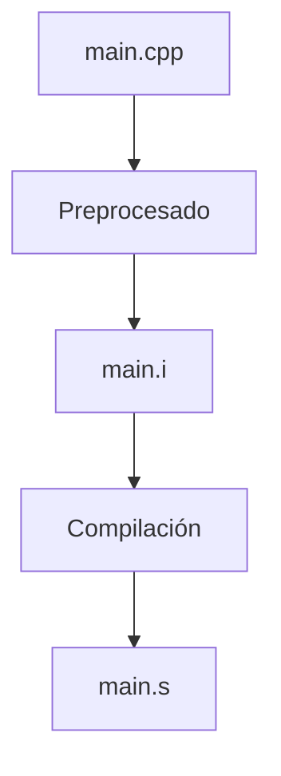
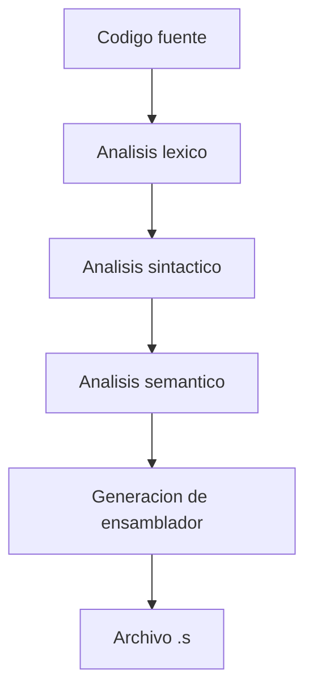

# Compilación

## Introducción

La compilación es la segunda etapa del proceso de construcción de un programa en C++.

Después del preprocesado, el compilador recibe el archivo fuente expandido y verifica que el código cumpla las reglas del lenguaje. Si no encuentra errores, genera código ensamblador que será utilizado en la siguiente fase del proceso.

Esta es una de las etapas más importantes, ya que es donde el compilador analiza y comprende el programa.

---

## Flujo de construcción



---

## ¿Qué hace el compilador?

Durante esta etapa el compilador:

* Analiza los elementos del lenguaje.
* Comprueba la sintaxis.
* Verifica los tipos de datos.
* Detecta errores semánticos.
* Aplica optimizaciones si se solicitan.
* Genera código ensamblador.

---

## Proceso interno de compilación

La compilación no es una única operación. Internamente se divide en varias fases.



---

## Ejemplo

Código fuente:

```cpp
#include <iostream>

int main()
{
    int numero {10};

    std::cout << numero << '\n';

    return 0;
}
```

---

## Análisis léxico

El compilador divide el código en pequeñas unidades llamadas **tokens**.

Por ejemplo:

```cpp
int numero = 10;
```

Se transforma conceptualmente en:

```text
int
numero
=
10
;
```

Cada token representa un elemento reconocido por el lenguaje.

Algunos ejemplos de tokens son:

| Tipo          | Ejemplo               |
| ------------- | --------------------- |
| Palabra clave | `int`, `return`, `if` |
| Identificador | `numero`, `edad`      |
| Operador      | `+`, `-`, `=`         |
| Literal       | `10`, `"Hola"`        |
| Separador     | `;`, `{`, `}`         |

---

## Análisis sintáctico

Una vez identificados los tokens, el compilador verifica que estén organizados según las reglas gramaticales del lenguaje.

Ejemplo válido:

```cpp
int numero = 10;
```

Ejemplo inválido:

```cpp
int = numero 10;
```

Resultado:

```text
Error de sintaxis
```

---

## Análisis semántico

Después de comprobar la sintaxis, el compilador verifica que las instrucciones tengan sentido.

Ejemplo:

```cpp
int edad = "veinte";
```

Resultado:

```text
Error de tipos
```

La sintaxis es correcta, pero el valor asignado no coincide con el tipo declarado.

Otros errores semánticos comunes son:

* Uso de variables no declaradas.
* Llamadas incorrectas a funciones.
* Conversión inválida entre tipos.
* Acceso a miembros inexistentes.

---

## Generación de ensamblador

Si todas las verificaciones son correctas, el compilador genera código ensamblador.

Detener el proceso después de esta etapa:

```bash
g++ -S main.cpp
```

Resultado:

```text
main.s
```

---

## Archivo ensamblador

Ejemplo simplificado:

```asm
main:
    mov eax, 0
    ret
```

El contenido real suele ser mucho más extenso y depende de:

* La arquitectura del procesador.
* El sistema operativo.
* El compilador utilizado.
* El nivel de optimización.

---

## Errores detectados durante la compilación

### Error de sintaxis

Código:

```cpp
int main(
{
}
```

Salida aproximada:

```text
error: expected ')' before '{'
```

---

### Error de tipos

Código:

```cpp
int numero = "hola";
```

Salida aproximada:

```text
error: invalid conversion
```

---

### Variable no declarada

Código:

```cpp
int main()
{
    numero = 5;
}
```

Salida aproximada:

```text
error: 'numero' was not declared in this scope
```

---

### Llamada incorrecta a función

Código:

```cpp
int sumar(int a, int b)
{
    return a + b;
}

int main()
{
    sumar(10);
}
```

Salida aproximada:

```text
error: too few arguments
```

---

## Optimización

El compilador puede transformar el programa para generar código más eficiente.

Sin optimización:

```bash
g++ main.cpp
```

Con optimización:

```bash
g++ -O2 main.cpp
```

Niveles más comunes:

| Opción   | Descripción                                |
| -------- | ------------------------------------------ |
| `-O0`    | Sin optimización                           |
| `-O1`    | Optimización básica                        |
| `-O2`    | Optimización recomendada                   |
| `-O3`    | Optimización agresiva                      |
| `-Ofast` | Máximo rendimiento con menos restricciones |

---

## Advertencias

Además de errores, el compilador puede emitir advertencias (*warnings*).

Una advertencia no impide generar el ejecutable, pero suele indicar posibles problemas.

Ejemplo:

```cpp
int numero;
```

El compilador puede advertir que la variable nunca se utiliza.

Compilación recomendada:

```bash
g++ -Wall -Wextra main.cpp
```

Opciones frecuentes:

| Opción      | Función                                     |
| ----------- | ------------------------------------------- |
| `-Wall`     | Activa advertencias comunes                 |
| `-Wextra`   | Activa advertencias adicionales             |
| `-Werror`   | Convierte advertencias en errores           |
| `-pedantic` | Verifica cumplimiento estricto del estándar |

---

## Compilación recomendada

Durante el aprendizaje es recomendable utilizar:

```bash
g++ -std=c++20 -Wall -Wextra -Werror -pedantic main.cpp -o app
```

| Opción       | Significado                                 |
| ------------ | ------------------------------------------- |
| `-std=c++20` | Utiliza el estándar C++20                   |
| `-Wall`      | Activa advertencias comunes                 |
| `-Wextra`    | Activa advertencias adicionales             |
| `-Werror`    | Convierte advertencias en errores           |
| `-pedantic`  | Verifica cumplimiento estricto del estándar |
| `-o app`     | Nombre del ejecutable generado              |

---

## ¿Qué NO hace el compilador?

Durante esta etapa el compilador NO:

* Ejecuta el programa.
* Genera el ejecutable final.
* Une múltiples archivos objeto.
* Carga bibliotecas dinámicas.

Estas tareas pertenecen a etapas posteriores del proceso de construcción.

---

## Buenas prácticas

* Compilar siempre con advertencias activadas.
* Corregir todas las advertencias antes de continuar.
* Utilizar un estándar moderno como C++20 o superior.
* Activar optimizaciones únicamente cuando sea necesario.
* Leer cuidadosamente los mensajes de error del compilador.

---

## Resumen

* La compilación es la segunda etapa del proceso de construcción.
* Recibe el archivo preprocesado generado anteriormente.
* Realiza análisis léxico, sintáctico y semántico.
* Detecta errores antes de generar código ejecutable.
* Produce un archivo ensamblador con extensión `.s`.
* Puede aplicar optimizaciones para mejorar el rendimiento.
* Es recomendable compilar con advertencias activadas.
* El resultado de esta etapa será utilizado por el ensamblador en la siguiente fase.
