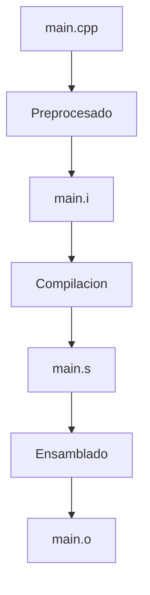
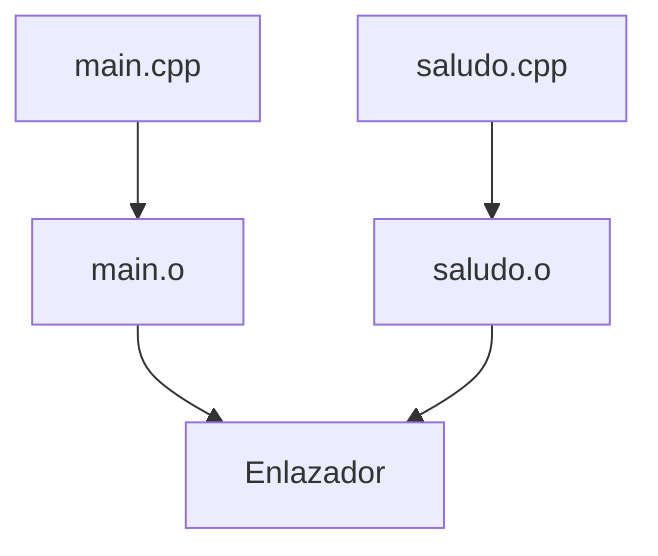

# Ensamblado

## Introducción

Después de la compilación, el archivo ensamblador generado (`.s`) es procesado por el ensamblador.

Su función es traducir las instrucciones escritas en lenguaje ensamblador a código máquina, produciendo un archivo objeto (`.o`).

Este archivo todavía no es ejecutable, ya que debe pasar por una etapa adicional llamada **enlazado**.

---

## Flujo de construcción



---

## ¿Qué es el lenguaje ensamblador?

El lenguaje ensamblador (*assembly language*) es una representación textual de las instrucciones que entiende una arquitectura de procesador específica.

Ejemplo:

```asm
mov eax, 5
add eax, 3
ret
```

Cada instrucción tiene una correspondencia directa con instrucciones reales del procesador.

A diferencia de C++, el lenguaje ensamblador depende de la arquitectura utilizada (x86-64, ARM, RISC-V, entre otras).

---

## ¿Qué hace el ensamblador?

Durante esta etapa:

* Traduce instrucciones ensambladoras a código máquina.
* Genera archivos objeto.
* Organiza símbolos.
* Registra referencias externas.
* Prepara información para el enlazador.

El resultado es un archivo binario que contiene información parcialmente construida del programa.

---

## Del ensamblador al código máquina

Conceptualmente, el ensamblador transforma:

```asm
mov eax, 5
add eax, 3
ret
```

en una secuencia de bytes que puede ejecutar directamente el procesador.

```text
Lenguaje ensamblador
         │
         ▼
   Codigo maquina
         │
         ▼
     Archivo .o
```

---

## Generar únicamente el archivo objeto

Podemos detener el proceso después del ensamblado usando:

```bash
g++ -c main.cpp
```

Resultado:

```text
main.o
```

La opción `-c` indica que debe compilarse y ensamblarse el código, pero sin realizar el enlazado.

---

## Archivo objeto

Un archivo objeto contiene información necesaria para construir el ejecutable final.

Incluye:

* Código máquina.
* Tabla de símbolos.
* Referencias externas.
* Información de reubicación.
* Metadatos adicionales.

Representación simplificada:

```text
main.o
│
├── Codigo maquina
├── Simbolos
├── Referencias externas
└── Informacion de reubicacion
```

---

## Símbolos

Un símbolo representa una entidad conocida por el compilador o el enlazador.

Ejemplos:

* Funciones.
* Variables globales.
* Constantes globales.

Código:

```cpp
void saludar()
{
}
```

Genera un símbolo asociado a la función:

```text
saludar
```

El enlazador utilizará posteriormente esta información para conectar distintas partes del programa.

---

## Ejemplo práctico

Archivo:

```cpp
#include <iostream>

int main()
{
    std::cout << "Hola Mundo\n";

    return 0;
}
```

Generar archivo objeto:

```bash
g++ -c main.cpp
```

Resultado:

```text
main.o
```

---

## Ver el contenido del archivo objeto

Aunque un archivo objeto es binario, podemos inspeccionar parte de su información.

Mostrar símbolos:

```bash
nm main.o
```

Ejemplo simplificado:

```text
0000000000000000 T main
                 U std::cout
```

Interpretación:

| Símbolo | Significado                     |
| ------- | ------------------------------- |
| `T`     | Símbolo definido en el archivo  |
| `U`     | Símbolo externo aún no resuelto |

En este ejemplo:

* `main` está definido dentro de `main.o`.
* `std::cout` aún debe resolverse durante el enlazado.

---

## ¿Por qué aún no es ejecutable?

Supongamos el siguiente programa:

```cpp
#include <iostream>

int main()
{
    std::cout << "Hola Mundo\n";
}
```

El archivo objeto contiene una referencia a:

```cpp
std::cout
```

Sin embargo, la implementación real de `std::cout` se encuentra dentro de la biblioteca estándar de C++.

Durante el ensamblado únicamente se registra la referencia.

Resolver dicha referencia es responsabilidad del enlazador.

---

## Compilación de múltiples archivos

Archivo:

```cpp
// main.cpp

void saludar();

int main()
{
    saludar();
}
```

Archivo:

```cpp
// saludo.cpp

#include <iostream>

void saludar()
{
    std::cout << "Hola\n";
}
```

Generar objetos:

```bash
g++ -c main.cpp
g++ -c saludo.cpp
```

Resultado:

```text
main.o
saludo.o
```

Cada archivo fuente genera su propio archivo objeto.

---

## Relación entre archivos



Los archivos objeto serán combinados posteriormente durante el enlazado.

---

## Información de reubicación

Cuando el ensamblador genera un archivo objeto, muchas direcciones de memoria aún son desconocidas.

Por ello almacena información de reubicación que permitirá al enlazador:

* Ajustar direcciones.
* Resolver símbolos externos.
* Construir el ejecutable final.

```text
Archivo objeto
      │
      ▼
Direcciones temporales
      │
      ▼
Enlazador
      │
      ▼
Direcciones definitivas
```

---

## Ventajas de los archivos objeto

Los archivos objeto permiten:

* Compilar proyectos grandes por partes.
* Recompilar únicamente los archivos modificados.
* Reducir los tiempos de construcción.
* Facilitar el trabajo en equipo.
* Organizar mejor el código fuente.

Esta es una de las razones por las que herramientas como Make y CMake son tan importantes.

---

## ¿Qué NO hace el ensamblador?

El ensamblador NO:

* Resuelve símbolos externos.
* Combina múltiples archivos objeto.
* Genera el ejecutable final.
* Carga bibliotecas dinámicas.
* Ejecuta el programa.

Estas tareas pertenecen a la etapa de enlazado.

---

## Buenas prácticas

* Compilar proyectos grandes en múltiples archivos.
* Evitar recompilar todo el proyecto innecesariamente.
* Utilizar herramientas como Make o CMake para automatizar la construcción.
* Comprender la diferencia entre archivo fuente y archivo objeto.
* Familiarizarse con herramientas como `nm` para inspeccionar símbolos.

---

## Resumen

* El ensamblador transforma código ensamblador en código máquina.
* El resultado es un archivo objeto con extensión `.o`.
* Un archivo objeto no es un ejecutable.
* Contiene código máquina, símbolos y referencias externas.
* Cada archivo fuente suele generar su propio archivo objeto.
* Los símbolos externos se resolverán durante el enlazado.
* La información de reubicación permite construir el ejecutable final.
* Los archivos objeto facilitan la compilación modular de proyectos grandes.
