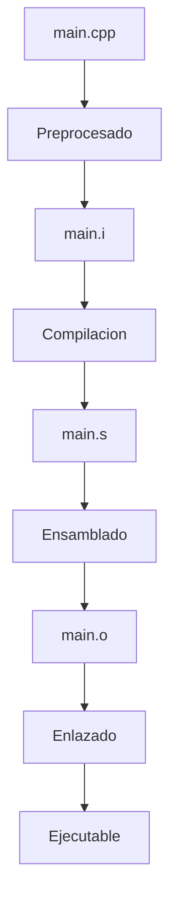
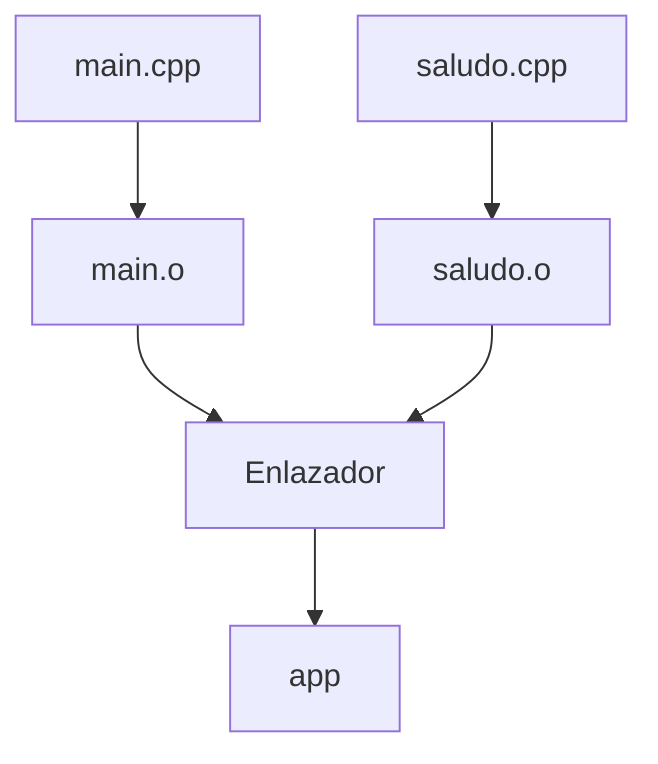
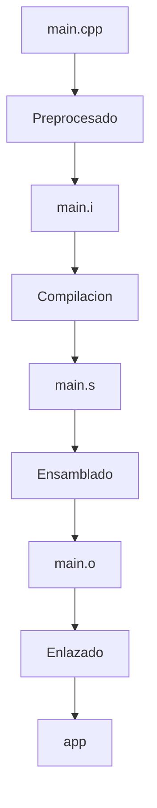

# Enlazado

## Introducción

El enlazado (*linking*) es la etapa final del proceso de construcción de un programa en C++.

Su objetivo es combinar los archivos objeto generados durante el ensamblado y resolver todas las referencias externas para producir un ejecutable.

En otras palabras, el enlazador toma todas las piezas del programa y las une en un único archivo ejecutable listo para ser ejecutado por el sistema operativo.

---

## Flujo de construcción



---

## ¿Qué hace el enlazador?

Durante esta etapa el enlazador:

* Combina múltiples archivos objeto.
* Resuelve referencias externas.
* Incorpora bibliotecas necesarias.
* Organiza las direcciones de memoria.
* Genera el ejecutable final.

Sin esta etapa, los archivos objeto permanecerían como piezas independientes incapaces de ejecutarse por sí solas.

---

## Ejemplo básico

Supongamos los siguientes archivos.

### main.cpp

```cpp id="2k0bfb"
void saludar();

int main()
{
    saludar();
}
```

### saludo.cpp

```cpp id="g8ihzf"
#include <iostream>

void saludar()
{
    std::cout << "Hola\n";
}
```

---

## Compilación de cada archivo

```bash id="oxzje7"
g++ -c main.cpp
g++ -c saludo.cpp
```

Resultado:

```text id="ewj2a2"
main.o
saludo.o
```

Todavía no existe un ejecutable.

---

## Enlazado

```bash id="tkxrmf"
g++ main.o saludo.o -o app
```

Resultado:

```text id="l0y18e"
app
```

Ahora sí se genera el programa ejecutable.

---

## Representación visual



---

## Resolución de símbolos

Cuando el compilador encuentra:

```cpp id="xayfmr"
saludar();
```

sabe que la función existe porque fue declarada.

Sin embargo, todavía no conoce dónde está implementada.

Más adelante, el enlazador encuentra:

```cpp id="y1hddn"
void saludar()
{
    std::cout << "Hola\n";
}
```

y conecta ambas partes.

```text id="7lf4yf"
Declaracion
      │
      ▼
  saludar()
      │
      ▼
 Implementacion
```

Este proceso se conoce como **resolución de símbolos**.

---

## Símbolos definidos y símbolos externos

Un archivo objeto puede contener dos tipos principales de símbolos.

### Símbolos definidos

Aquellos cuya implementación existe dentro del archivo.

```cpp id="c5efg7"
void saludar()
{
}
```

---

### Símbolos externos

Aquellos que están declarados o utilizados, pero cuya implementación se encuentra en otro lugar.

```cpp id="p8vr3d"
void saludar();

int main()
{
    saludar();
}
```

Durante el enlazado, los símbolos externos deben resolverse correctamente.

---

## Error de símbolo no definido

Si olvidamos enlazar un archivo:

```bash id="zk9rvr"
g++ main.o -o app
```

podemos obtener un error similar a:

```text id="qopdfz"
undefined reference to 'saludar()'
```

Esto significa que el enlazador encontró una declaración, pero no pudo encontrar la implementación correspondiente.

---

## Bibliotecas

Además de unir archivos objeto, el enlazador también incorpora bibliotecas.

Ejemplo:

```cpp id="r7lv8m"
#include <iostream>
```

Cuando utilizamos:

```cpp id="x2x1ly"
std::cout
```

la implementación real no está en nuestro programa.

Se encuentra dentro de la biblioteca estándar de C++.

Durante el enlazado, esa implementación se conecta con nuestro código.

---

## Bibliotecas estáticas

Una biblioteca estática se incorpora dentro del ejecutable final.

```text id="aefh8h"
Ejecutable
│
├── Codigo propio
└── Biblioteca estatica
```

Ventajas:

* El ejecutable es independiente.
* No requiere archivos adicionales.

Desventajas:

* Mayor tamaño del ejecutable.
* Posible duplicación de código entre programas.

Extensiones habituales:

| Sistema | Extensión |
| ------- | --------- |
| Linux   | `.a`      |
| Windows | `.lib`    |

---

## Bibliotecas dinámicas

Una biblioteca dinámica se carga durante la ejecución.

```text id="1i0s09"
Programa
     │
     ▼
Biblioteca compartida
```

Ventajas:

* Ejecutables más pequeños.
* Compartición de código entre programas.
* Actualización centralizada de bibliotecas.

Desventajas:

* Dependencia de archivos externos.
* Posibles problemas de compatibilidad.

Extensiones habituales:

| Sistema | Extensión |
| ------- | --------- |
| Linux   | `.so`     |
| Windows | `.dll`    |
| macOS   | `.dylib`  |

---

## Reubicación de direcciones

Durante el ensamblado muchas direcciones de memoria aún son desconocidas.

El enlazador utiliza la información de reubicación para asignar direcciones definitivas.

```text id="53ib1o"
Archivo objeto
      │
      ▼
Direcciones temporales
      │
      ▼
Enlazador
      │
      ▼
Direcciones definitivas
```

Este proceso permite que diferentes módulos del programa funcionen correctamente juntos.

---

## Flujo completo de construcción



---

## Comando habitual

Cuando ejecutamos:

```bash id="xaw14u"
g++ main.cpp -o app
```

GCC realiza automáticamente:

```text id="qvhf5i"
1. Preprocesado
2. Compilacion
3. Ensamblado
4. Enlazado
```

Todo ocurre mediante una única orden.

---

## ¿Qué NO hace el enlazador?

El enlazador NO:

* Analiza sintaxis.
* Verifica tipos.
* Optimiza el código fuente.
* Genera código ensamblador.
* Ejecuta el programa.

Estas tareas pertenecen a etapas anteriores o posteriores del proceso de construcción.

---

## Buenas prácticas

* Dividir proyectos grandes en múltiples archivos fuente.
* Utilizar cabeceras para compartir declaraciones.
* Resolver todas las advertencias y errores de enlazado.
* Comprender la diferencia entre declaración e implementación.
* Familiarizarse con el concepto de símbolos y bibliotecas.

---

## Resumen

* El enlazado es la última etapa del proceso de construcción.
* Combina archivos objeto y bibliotecas.
* Resuelve referencias externas entre módulos.
* Genera el ejecutable final.
* Los errores de tipo `undefined reference` suelen ocurrir durante esta fase.
* Puede trabajar con bibliotecas estáticas y dinámicas.
* GCC realiza el enlazado automáticamente cuando no se utiliza la opción `-c`.
* Sin enlazado no es posible obtener un programa ejecutable.
