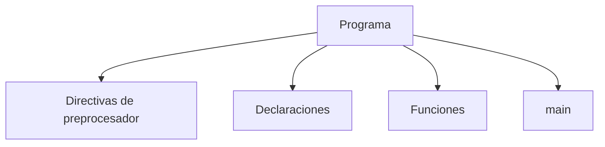
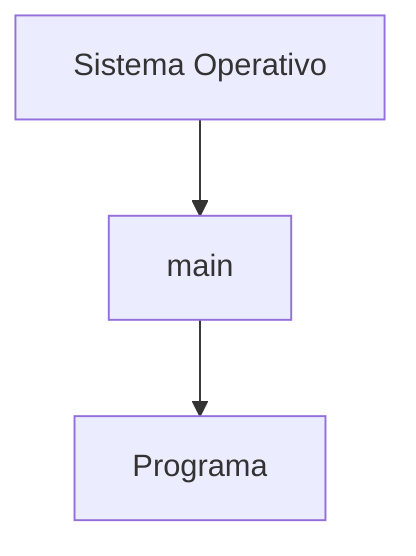
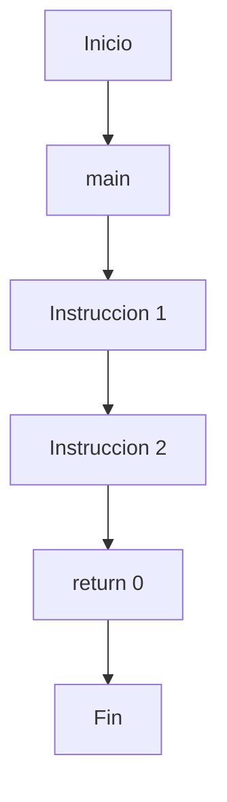

# Estructura de un Programa en C++

## Introducción

Todo programa en C++ sigue una estructura básica que permite al compilador comprender dónde comienza la ejecución y qué elementos forman parte del programa.

Aunque los proyectos reales pueden contener cientos o miles de archivos, todos se construyen a partir de los mismos componentes fundamentales.

Comprender esta estructura es esencial antes de estudiar variables, funciones, control de flujo y otros conceptos del lenguaje.

---

## Programa mínimo

```cpp
int main()
{
}
```

Este es el programa más simple válido en C++.

En C++ moderno, llegar al final de `main()` equivale implícitamente a:

```cpp
return 0;
```

Por claridad pedagógica, durante este curso se utilizará normalmente:

```cpp
int main()
{
    return 0;
}
```

---

## Estructura general

```cpp
#include <iostream>

int main()
{
    std::cout << "Hola Mundo\n";

    return 0;
}
```

Este programa contiene la mayoría de los elementos fundamentales que aparecen en aplicaciones reales.

---

## Componentes principales



---

## Vista general

```cpp
#include <iostream>   // Directiva de preprocesador

int main()            // Funcion principal
{
    std::cout << "Hola Mundo\n";

    return 0;
}
```

---

## Directivas de preprocesador

Las directivas comienzan con el símbolo `#`.

Ejemplo:

```cpp
#include <iostream>
```

Su función es proporcionar instrucciones al preprocesador antes de que el código sea compilado.

En este caso:

```cpp
#include <iostream>
```

permite utilizar herramientas de entrada y salida como:

```cpp
std::cout
```

---

## Función principal

Todo programa en C++ comienza su ejecución en la función:

```cpp
int main()
{
}
```

Cuando se ejecuta un programa, el sistema operativo transfiere el control a esta función.



Sin `main()`, un programa ejecutable de C++ no puede iniciarse.

---

## Firma de `main`

La forma más común es:

```cpp
int main()
{
    return 0;
}
```

Sin embargo, también existen otras variantes válidas:

```cpp
int main(int argc, char* argv[])
{
    return 0;
}
```

Estas permiten recibir argumentos desde la línea de comandos.

Más adelante se estudiarán en detalle.

---

## Tipo de retorno

La palabra:

```cpp
int
```

indica que la función devolverá un valor entero.

```cpp
int main()
{
    return 0;
}
```

Ese valor es recibido por el sistema operativo cuando finaliza el programa.

---

## Valor de retorno

La instrucción:

```cpp
return 0;
```

indica que el programa terminó correctamente.

Por convención:

| Valor           | Significado                  |
| --------------- | ---------------------------- |
| `0`             | Ejecución exitosa            |
| Distinto de `0` | Error o finalización anómala |

Ejemplo:

```cpp
return 1;
```

---

## Bloques de código

Las llaves delimitan bloques.

```cpp
{
    // instrucciones
}
```

Ejemplo:

```cpp
int main()
{
    return 0;
}
```

Todo lo que pertenece a `main()` debe estar contenido dentro de sus llaves.

Los bloques también se utilizan en:

* Funciones.
* Condicionales.
* Bucles.
* Clases.
* Namespaces.

---

## Instrucciones

Una instrucción representa una acción que el programa debe realizar.

Ejemplo:

```cpp
int edad = 20;
```

En C++, la mayoría de las instrucciones terminan con:

```cpp
;
```

Ejemplos:

```cpp
int edad = 20;
```

```cpp
return 0;
```

```cpp
std::cout << "Hola\n";
```

---

## Comentarios

Los comentarios permiten documentar el código y son ignorados por el compilador.

Comentario de una línea:

```cpp
// Esto es un comentario
```

Comentario de múltiples líneas:

```cpp
/*
   Comentario
   de varias lineas
*/
```

Más adelante se estudiarán con mayor detalle.

---

## Programa comentado

```cpp
#include <iostream>     // Biblioteca estándar

int main()              // Punto de entrada
{
    std::cout << "Hola Mundo\n";

    return 0;           // Finalización correcta
}
```

---

## Flujo de ejecución

La ejecución ocurre de forma secuencial.



Más adelante veremos estructuras que permiten modificar este flujo, como:

* `if`
* `switch`
* `while`
* `for`

---

## Error común: olvidar el punto y coma

Código:

```cpp
int edad = 20
```

Resultado aproximado:

```text
error: expected ';'
```

---

## Error común: olvidar una llave

Código:

```cpp
int main()
{
    return 0;
```

Resultado aproximado:

```text
error: expected '}'
```

---

## Error común: olvidar `main`

Código:

```cpp
void saludar()
{
}
```

Resultado aproximado durante el enlazado:

```text
undefined reference to 'main'
```

El programa contiene funciones, pero no posee un punto de entrada.

---

## Estructura típica de un programa

```cpp
#include <iostream>

int main()
{
    std::cout << "Hola Mundo\n";

    return 0;
}
```

Elementos principales:

| Elemento   | Función                 |
| ---------- | ----------------------- |
| `#include` | Incluir bibliotecas     |
| `main()`   | Punto de entrada        |
| `{}`       | Delimitar bloques       |
| `;`        | Finalizar instrucciones |
| `return`   | Devolver un valor       |

---

## Buenas prácticas

* Mantener una única función `main()` por programa ejecutable.
* Utilizar nombres descriptivos para variables y funciones.
* Indentar correctamente el código.
* Mantener los bloques claramente delimitados.
* Añadir comentarios únicamente cuando aporten información útil.

---

## Resumen

* Todo programa ejecutable de C++ necesita una función `main()`.
* La ejecución comienza en `main()`.
* Las directivas de preprocesador suelen aparecer al inicio del archivo.
* Las llaves delimitan bloques de código.
* La mayoría de las instrucciones terminan con punto y coma.
* `return 0;` indica finalización exitosa.
* Los comentarios permiten documentar el código.
* Esta estructura constituye la base de cualquier aplicación escrita en C++.
