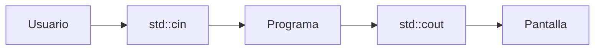
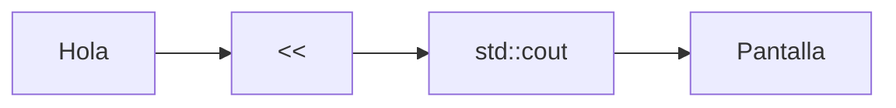
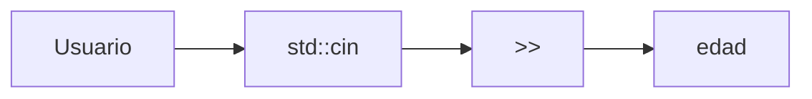
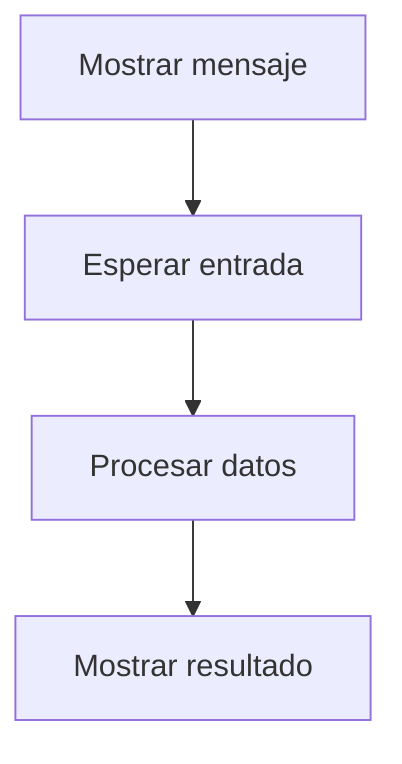

# Entrada y Salida

## Introducción

La entrada y salida (*Input/Output* o *I/O*) permite que un programa interactúe con el exterior.

En C++, esta funcionalidad se proporciona principalmente a través de la biblioteca estándar `<iostream>`, que ofrece mecanismos para:

* Mostrar información en pantalla.
* Leer datos introducidos por el usuario.
* Informar errores.
* Registrar información de ejecución.

Este capítulo presenta los conceptos fundamentales. Más adelante se estudiarán en detalle `std::cout`, `std::cin`, formatos de salida, buffers y otros aspectos relacionados.

---

## La biblioteca `<iostream>`

Para utilizar las operaciones básicas de entrada y salida es necesario incluir:

```cpp
#include <iostream>
```

Esta cabecera proporciona varios flujos (*streams*) de datos utilizados para comunicarse con el exterior.

---

## ¿Qué es un Stream?

Un *stream* es un flujo de datos que permite transferir información entre un programa y un dispositivo.

Conceptualmente puede verse como un canal por el que circulan datos.



---

## Principales Streams

| Stream      | Propósito               |
| ----------- | ----------------------- |
| `std::cin`  | Entrada estándar        |
| `std::cout` | Salida estándar         |
| `std::cerr` | Salida de errores       |
| `std::clog` | Registro de información |

---

## Salida con `std::cout`

`std::cout` permite mostrar información por pantalla.

Ejemplo:

```cpp
#include <iostream>

int main()
{
    std::cout << "Hola Mundo";

    return 0;
}
```

Salida:

```text
Hola Mundo
```

---

## Operador de inserción

Para enviar datos a un flujo se utiliza el operador:

```cpp
<<
```

Ejemplo:

```cpp
std::cout << "Hola";
```

Representación conceptual:



---

## Mostrar múltiples valores

```cpp
#include <iostream>

int main()
{
    std::cout << "Edad: " << 25;

    return 0;
}
```

Salida:

```text
Edad: 25
```

El operador `<<` puede encadenarse para enviar varios valores consecutivamente.

---

## Salto de línea

### Utilizando `\n`

```cpp
std::cout << "Primera línea\n";
std::cout << "Segunda línea\n";
```

Salida:

```text
Primera línea
Segunda línea
```

---

### Utilizando `std::endl`

```cpp
std::cout << "Primera línea" << std::endl;
```

`std::endl` realiza dos acciones:

1. Inserta un salto de línea.
2. Fuerza el vaciado (*flush*) del búfer de salida.

Por motivos de rendimiento suele preferirse:

```cpp
'\n'
```

cuando no es necesario forzar el vaciado del búfer.

---

## Entrada con `std::cin`

`std::cin` permite leer datos introducidos por el usuario.

Ejemplo:

```cpp
#include <iostream>

int main()
{
    int edad {};

    std::cin >> edad;

    std::cout << edad;

    return 0;
}
```

Entrada:

```text
25
```

Salida:

```text
25
```

---

## Operador de extracción

Para obtener datos desde un flujo se utiliza:

```cpp
>>
```

Ejemplo:

```cpp
std::cin >> edad;
```

Representación conceptual:



---

## Lectura de múltiples valores

```cpp
#include <iostream>

int main()
{
    int edad {};
    double altura {};

    std::cin >> edad >> altura;

    return 0;
}
```

Entrada:

```text
25 1.78
```

Cada valor se almacena en la variable correspondiente.

---

## Ejemplo completo

```cpp
#include <iostream>
#include <string>

int main()
{
    std::string nombre {};
    int edad {};

    std::cout << "Nombre: ";
    std::cin >> nombre;

    std::cout << "Edad: ";
    std::cin >> edad;

    std::cout << "Hola " << nombre << ", tienes " << edad << " años.\n";

    return 0;
}
```

---

## Salida de errores

`std::cerr` se utiliza para mostrar mensajes de error.

```cpp
#include <iostream>

int main()
{
    std::cerr << "Error: archivo no encontrado\n";

    return 0;
}
```

Salida:

```text
Error: archivo no encontrado
```

Normalmente se utiliza para errores y diagnósticos.

---

## Registro de información

`std::clog` permite registrar mensajes informativos.

```cpp
#include <iostream>

int main()
{
    std::clog << "Aplicación iniciada\n";

    return 0;
}
```

Se utiliza frecuentemente para registros (*logs*) y mensajes de seguimiento.

---

## Diferencias entre Streams

| Stream      | Uso                    |
| ----------- | ---------------------- |
| `std::cin`  | Entrada de datos       |
| `std::cout` | Salida normal          |
| `std::cerr` | Errores                |
| `std::clog` | Registro e información |

---

## Flujo básico de interacción

La mayoría de los programas interactivos siguen este patrón:



---

## Error común: tipo incorrecto

Código:

```cpp
int edad {};

std::cin >> edad;
```

Entrada:

```text
veinte
```

Resultado:

```text
La lectura falla y el flujo entra en estado de error.
```

El valor introducido no puede convertirse a un entero.

---

## Error común: olvidar incluir `<iostream>`

Código:

```cpp
int main()
{
    std::cout << "Hola";
}
```

Resultado aproximado:

```text
error: 'cout' is not a member of 'std'
```

La cabecera necesaria no ha sido incluida.

---

## Buenas prácticas

* Incluir `<iostream>` únicamente cuando sea necesario.
* Utilizar `'\n'` para saltos de línea habituales.
* Reservar `std::endl` para situaciones donde se requiera *flush*.
* Utilizar `std::cerr` para errores.
* Utilizar `std::clog` para mensajes informativos.
* Comprobar siempre que la entrada del usuario sea válida.

---

## Resumen

* La biblioteca `<iostream>` proporciona mecanismos de entrada y salida.
* Un *stream* es un flujo de datos entre un programa y el exterior.
* `std::cout` permite mostrar información por pantalla.
* `std::cin` permite leer datos del usuario.
* `std::cerr` se utiliza para mensajes de error.
* `std::clog` se utiliza para mensajes informativos.
* Los operadores `<<` y `>>` permiten enviar y extraer datos de los flujos.
* Los streams constituyen la base de la interacción entre un programa y el exterior.
* Los detalles avanzados de `std::cout`, `std::cin` y el manejo de buffers se estudiarán en capítulos posteriores.
