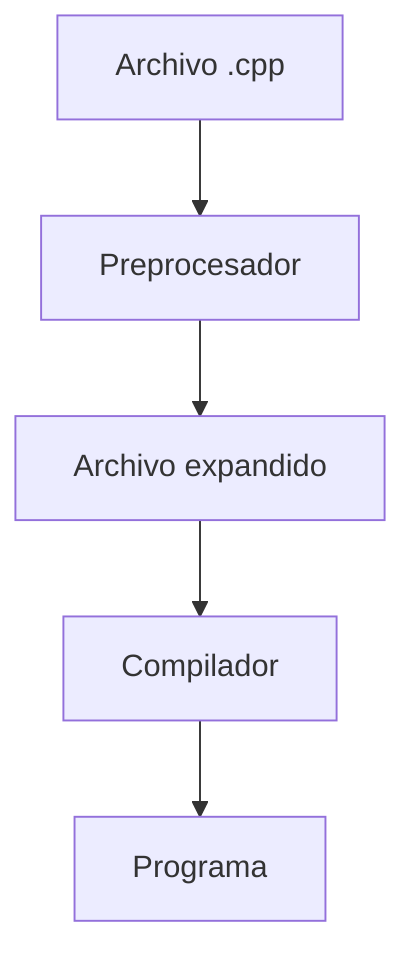
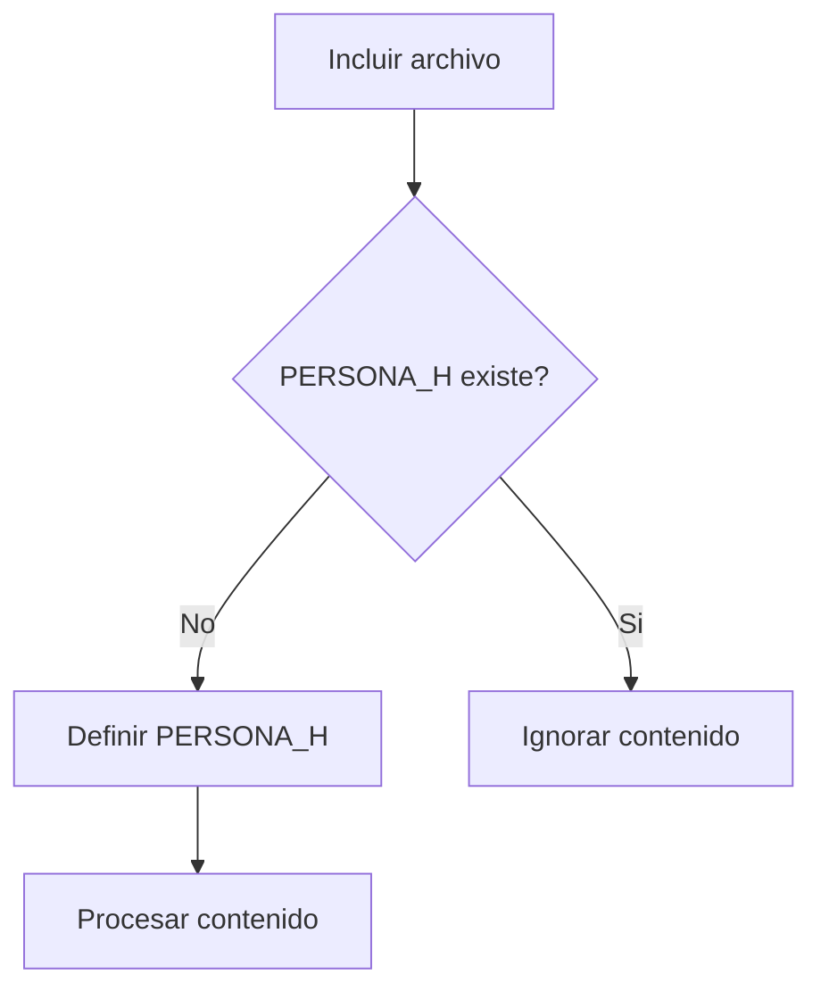

# Directivas del Preprocesador

## Introducción

Antes de que el compilador analice un programa C++, el código pasa por una etapa denominada **preprocesado**.

Durante esta fase se procesan las directivas que comienzan con el símbolo `#`.

Estas directivas permiten:

* Incluir archivos.
* Definir macros.
* Controlar qué partes del código serán compiladas.
* Configurar el comportamiento del programa antes de la compilación.

El preprocesador trabaja únicamente con texto y actúa antes de que el compilador comprenda el lenguaje C++.

---

## Relación con el proceso de compilación



Las directivas son procesadas completamente antes de que el compilador analice el código.

---

## ¿Qué es una directiva?

Una directiva es una instrucción especial destinada al preprocesador.

Sintaxis general:

```cpp
#directiva
```

Ejemplos:

```cpp
#include <iostream>
#define PI 3.141592
```

Todas las directivas comienzan con el carácter:

```cpp
#
```

---

## Principales directivas

| Directiva  | Descripción                                 |
| ---------- | ------------------------------------------- |
| `#include` | Incluye el contenido de otro archivo        |
| `#define`  | Define una macro                            |
| `#undef`   | Elimina una macro                           |
| `#if`      | Compilación condicional                     |
| `#ifdef`   | Comprueba si una macro existe               |
| `#ifndef`  | Comprueba si una macro no existe            |
| `#else`    | Rama alternativa                            |
| `#elif`    | Condición adicional                         |
| `#endif`   | Fin de una condición                        |
| `#pragma`  | Instrucciones especiales para el compilador |

---

## `#include`

Permite incluir el contenido de otro archivo.

Ejemplo:

```cpp
#include <iostream>
```

Conceptualmente:

```text
main.cpp
    │
    ▼
#include <iostream>
    │
    ▼
Contenido de iostream
```

El preprocesador sustituye la directiva por el contenido real del archivo incluido.

---

## Inclusión mediante ángulos

Se utiliza normalmente para bibliotecas estándar o bibliotecas instaladas en el sistema.

```cpp
#include <iostream>
#include <vector>
#include <string>
```

El compilador busca estos archivos en rutas predefinidas.

---

## Inclusión mediante comillas

Se utiliza habitualmente para archivos propios del proyecto.

```cpp
#include "persona.h"
```

El compilador busca primero en el directorio actual.

---

## ¿Qué ocurre realmente con `#include`?

Supongamos:

```cpp
#include "persona.h"
```

El preprocesador sustituye la línea por el contenido completo del archivo.

```text
#include "persona.h"
          │
          ▼
Contenido de persona.h
```

Por este motivo los archivos grandes pueden expandirse a miles de líneas durante el preprocesado.

---

## `#define`

Permite definir macros.

Ejemplo:

```cpp
#define PI 3.141592
```

Uso:

```cpp
double area {PI * radio * radio};
```

Después del preprocesado:

```cpp
double area {3.141592 * radio * radio};
```

---

## Macros con parámetros

También es posible definir macros que reciban argumentos.

```cpp
#define CUADRADO(x) ((x) * (x))
```

Uso:

```cpp
int resultado {CUADRADO(5)};
```

Expansión:

```cpp
int resultado {((5) * (5))};
```

---

## Problemas de las macros

Las macros realizan sustituciones de texto y no respetan reglas de tipos.

Ejemplo:

```cpp
#define SUMA(a, b) a + b
```

Uso:

```cpp
SUMA(2, 3) * 2
```

Expansión:

```cpp
2 + 3 * 2
```

Resultado:

```text
8
```

Resultado esperado:

```text
10
```

Esto ocurre debido a la precedencia de operadores.

---

## Otro problema clásico

```cpp
#define CUADRADO(x) x * x
```

Uso:

```cpp
CUADRADO(1 + 2)
```

Expansión:

```cpp
1 + 2 * 1 + 2
```

Resultado:

```text
5
```

Resultado esperado:

```text
9
```

---

## Alternativas modernas a las macros

En C++ moderno suele preferirse:

### Constantes

```cpp
constexpr double PI {3.141592};
```

### Funciones

```cpp
constexpr int cuadrado(int numero)
{
    return numero * numero;
}
```

### Templates

```cpp
template<typename T>
constexpr T cuadrado(T numero)
{
    return numero * numero;
}
```

Estas alternativas son más seguras y respetan el sistema de tipos.

---

## `#undef`

Permite eliminar una macro.

```cpp
#define PI 3.141592

#undef PI
```

Después de `#undef`, la macro deja de existir.

---

## Compilación condicional

Permite incluir o excluir partes del código dependiendo de ciertas condiciones.

```cpp
#define DEBUG

#ifdef DEBUG
std::cout << "Modo depuración\n";
#endif
```

Si la macro existe:

```text
Modo depuración
```

Si no existe:

```text
El código es eliminado durante el preprocesado.
```

---

## `#ifdef`

Comprueba si una macro está definida.

```cpp
#ifdef DEBUG
std::cout << "Debug\n";
#endif
```

Equivale conceptualmente a:

```text
¿Existe DEBUG?
```

---

## `#ifndef`

Comprueba si una macro NO está definida.

```cpp
#ifndef DEBUG
std::cout << "Modo producción\n";
#endif
```

---

## `#if`

Permite evaluar expresiones enteras.

```cpp
#define VERSION 2

#if VERSION >= 2
std::cout << "Versión moderna\n";
#endif
```

---

## `#else`

Permite definir una alternativa.

```cpp
#ifdef DEBUG
std::cout << "Debug\n";
#else
std::cout << "Producción\n";
#endif
```

---

## `#elif`

Permite evaluar condiciones adicionales.

```cpp
#define VERSION 2

#if VERSION == 1
std::cout << "Versión 1\n";
#elif VERSION == 2
std::cout << "Versión 2\n";
#else
std::cout << "Otra versión\n";
#endif
```

---

## Include Guards

Uno de los usos más importantes de las directivas.

Archivo:

```cpp
#ifndef PERSONA_H
#define PERSONA_H

class Persona
{
};

#endif
```

Funcionamiento:



---

## Problema que resuelven los Include Guards

Sin protección:

```text
main.cpp
│
├── persona.h
└── empleado.h
      │
      └── persona.h
```

El compilador puede intentar procesar la misma definición varias veces.

Resultado:

```text
redefinition of class Persona
```

---

## `#pragma once`

Alternativa moderna a los include guards.

```cpp
#pragma once

class Persona
{
};
```

Ventajas:

* Más simple.
* Más legible.
* Menos propenso a errores tipográficos.

Actualmente es compatible con prácticamente todos los compiladores modernos.

---

## Comparación

| Include Guards          | `#pragma once`        |
| ----------------------- | --------------------- |
| Estándar tradicional    | Solución moderna      |
| Más código              | Más simple            |
| Requiere nombres únicos | No requiere nombres   |
| Totalmente portable     | Amplio soporte actual |

---

## Ver el resultado del preprocesado

Mostrar resultado:

```bash
g++ -E main.cpp
```

Guardar resultado:

```bash
g++ -E main.cpp -o main.i
```

Resultado:

```text
main.i
```

La extensión `.i` suele utilizarse para archivos ya preprocesados.

---

## Buenas prácticas

### Utilizar constantes en lugar de macros

Preferir:

```cpp
constexpr double PI {3.141592};
```

En lugar de:

```cpp
#define PI 3.141592
```

---

### Utilizar funciones en lugar de macros complejas

Preferir:

```cpp
constexpr int cuadrado(int numero)
{
    return numero * numero;
}
```

En lugar de:

```cpp
#define CUADRADO(x) ((x) * (x))
```

---

### Proteger todas las cabeceras

Utilizar:

```cpp
#pragma once
```

o include guards en todos los archivos de cabecera.

---

### Utilizar macros únicamente cuando sea necesario

Las macros siguen siendo útiles para:

* Compilación condicional.
* Configuración de compilación.
* Compatibilidad multiplataforma.
* Include guards.

---

## ¿Qué NO hace el preprocesador?

El preprocesador NO:

* Comprueba sintaxis.
* Verifica tipos.
* Genera código máquina.
* Optimiza código.

Únicamente transforma texto antes de la compilación.

---

## Resumen

* Las directivas del preprocesador comienzan con `#`.
* Se ejecutan antes de la compilación.
* `#include` permite incluir archivos.
* `#define` crea macros mediante sustitución textual.
* `#undef` elimina macros existentes.
* `#ifdef`, `#ifndef` y `#if` permiten compilación condicional.
* Los include guards evitan inclusiones múltiples.
* `#pragma once` es una alternativa moderna a los include guards.
* Las macros pueden generar errores difíciles de detectar.
* En C++ moderno suele preferirse `constexpr`, funciones y templates frente a macros complejas.
