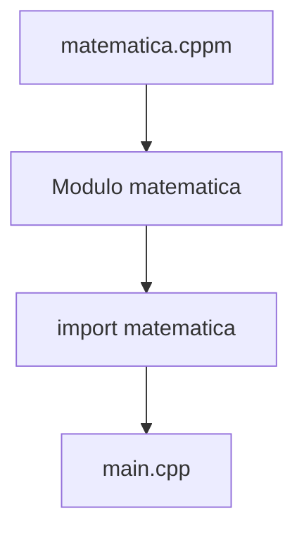

# Módulos

## Introducción

Durante muchos años, C++ ha utilizado el sistema basado en archivos de cabecera (`.h`) y directivas `#include` para compartir código entre diferentes archivos.

Aunque este sistema ha funcionado durante décadas, presenta varios inconvenientes:

* Compilaciones lentas.
* Dependencias complejas.
* Inclusiones redundantes.
* Problemas de encapsulación.
* Errores relacionados con cabeceras.

Para solucionar estas limitaciones, C++20 introdujo los **módulos**.

Los módulos proporcionan una forma moderna de organizar y compartir código, reduciendo dependencias y mejorando los tiempos de compilación.

---

## El problema del sistema tradicional

Supongamos el siguiente programa:

```cpp
#include <iostream>
#include <vector>
#include <string>

int main()
{
    return 0;
}
```

Durante el preprocesado:

```text
main.cpp
    │
    ▼
#include <iostream>
#include <vector>
#include <string>
    │
    ▼
Miles de lineas de codigo
```

Cada vez que un archivo es compilado, todas las cabeceras incluidas vuelven a procesarse.

En proyectos grandes esto puede aumentar significativamente los tiempos de compilación.

---

## Problemas del modelo basado en cabeceras

### Inclusiones repetidas

Un mismo archivo puede ser procesado cientos o miles de veces.

```text
Archivo A
    │
    ├── vector
    ├── string
    └── iostream

Archivo B
    │
    ├── vector
    ├── string
    └── iostream
```

El compilador vuelve a procesar las mismas cabeceras una y otra vez.

---

### Dependencias ocultas

Las cabeceras pueden incluir otras cabeceras.

```text
main.cpp
    │
    ▼
persona.h
    │
    ▼
direccion.h
    │
    ▼
pais.h
```

Esto dificulta comprender las dependencias reales de un proyecto.

---

### Include Guards

Para evitar redefiniciones es necesario utilizar mecanismos como:

```cpp
#ifndef PERSONA_H
#define PERSONA_H

// ...

#endif
```

o

```cpp
#pragma once
```

Los módulos eliminan gran parte de esta complejidad.

---

## ¿Qué es un módulo?

Un módulo es una unidad de código compilable que puede ser reutilizada por otros archivos sin necesidad de utilizar `#include`.

Representación conceptual:

```text
Modulo
│
├── Funciones
├── Clases
├── Estructuras
├── Variables
└── Templates
```

Un módulo se compila una vez y luego puede reutilizarse desde múltiples archivos.

---

## Conceptos principales

Los módulos introducen tres palabras clave fundamentales:

| Palabra clave | Función                  |
| ------------- | ------------------------ |
| `module`      | Define un módulo         |
| `export`      | Hace visible un elemento |
| `import`      | Utiliza un módulo        |

---

## Importar un módulo

En lugar de:

```cpp
#include <iostream>
```

puede utilizarse:

```cpp
import std;
```

o dependiendo del compilador:

```cpp
import <iostream>;
```

---

## Declaración de un módulo

Archivo:

```cpp
export module matematica;
```

La palabra clave:

```cpp
export
```

indica que el módulo puede ser utilizado desde otros archivos.

---

## Exportar funciones

```cpp
export module matematica;

export int sumar(int a, int b)
{
    return a + b;
}
```

La función queda disponible para cualquier archivo que importe el módulo.

---

## Utilizar un módulo

```cpp
import matematica;

int main()
{
    int resultado {sumar(2, 3)};

    return 0;
}
```

---

## Relación entre módulos



---

## Comparación con cabeceras

### Sistema tradicional

```text
main.cpp
    │
    ▼
#include "matematica.h"
    │
    ▼
Procesar cabecera
```

---

### Sistema de módulos

```text
main.cpp
    │
    ▼
import matematica;
    │
    ▼
Utilizar modulo ya compilado
```

---

## Ejemplo tradicional

### matematica.h

```cpp
#pragma once

int sumar(int a, int b);
```

### matematica.cpp

```cpp
int sumar(int a, int b)
{
    return a + b;
}
```

### main.cpp

```cpp
#include "matematica.h"

int main()
{
    sumar(2, 3);

    return 0;
}
```

---

## Ejemplo con módulos

### matematica.cppm

```cpp
export module matematica;

export int sumar(int a, int b)
{
    return a + b;
}
```

### main.cpp

```cpp
import matematica;

int main()
{
    sumar(2, 3);

    return 0;
}
```

---

## Visibilidad y encapsulación

Los módulos permiten decidir qué elementos serán públicos y cuáles permanecerán ocultos.

```cpp
export module matematica;

int multiplicar(int a, int b)
{
    return a * b;
}

export int sumar(int a, int b)
{
    return a + b;
}
```

Resultado:

```text
sumar()        -> Visible
multiplicar()  -> Interna al modulo
```

Solo los elementos marcados con `export` son accesibles desde el exterior.

---

## Importar módulos estándar

Con soporte moderno pueden utilizarse módulos de la biblioteca estándar.

Ejemplo:

```cpp
import std;

int main()
{
    std::cout << "Hola Mundo\n";

    return 0;
}
```

Esto evita incluir numerosas cabeceras individuales.

---

## Beneficios de los módulos

| Beneficio              | Descripción                                 |
| ---------------------- | ------------------------------------------- |
| Compilación más rápida | Los módulos se compilan una sola vez        |
| Menos dependencias     | Relaciones más claras entre componentes     |
| Mejor encapsulación    | Control preciso de la interfaz pública      |
| Menos errores          | Se reducen problemas asociados a `#include` |
| Mejor escalabilidad    | Adecuados para proyectos grandes            |

---

## Limitaciones actuales

Aunque los módulos forman parte del estándar desde C++20, todavía existen algunas limitaciones:

* Su adopción es progresiva.
* El soporte depende del compilador.
* Muchas bibliotecas siguen utilizando cabeceras tradicionales.
* Gran parte del código existente está basado en `#include`.

Por ello es normal encontrar ambos sistemas coexistiendo.

---

## ¿Debo aprender módulos?

Sí, pero en el momento adecuado.

Orden recomendado:

```text
1. Archivos fuente (.cpp)
2. Archivos de cabecera (.h)
3. Include Guards
4. Compilacion y enlazado
5. Modulos
```

Comprender primero el modelo tradicional facilita enormemente entender qué problemas intentan resolver los módulos.

---

## ¿Cuándo utilizar módulos?

Actualmente suelen ser más comunes en:

* Proyectos nuevos.
* Aplicaciones modernas basadas en C++20 o superior.
* Bibliotecas diseñadas específicamente para módulos.
* Código que busca reducir tiempos de compilación.

---

## Buenas prácticas

* Comprender primero el modelo clásico basado en cabeceras.
* Utilizar nombres descriptivos para los módulos.
* Exportar únicamente la interfaz pública necesaria.
* Mantener ocultos los detalles internos de implementación.
* Verificar el soporte del compilador antes de adoptarlos.

---

## Resumen

* Los módulos fueron introducidos en C++20.
* Buscan reemplazar parcialmente el sistema basado en `#include`.
* Utilizan las palabras clave `module`, `export` e `import`.
* Se compilan una sola vez y luego pueden reutilizarse.
* Mejoran los tiempos de compilación.
* Facilitan la organización y encapsulación del código.
* Permiten controlar qué elementos son públicos y cuáles son internos.
* La adopción todavía es gradual dentro del ecosistema C++.
* Es importante comprender primero el modelo tradicional basado en cabeceras antes de trabajar con módulos.
