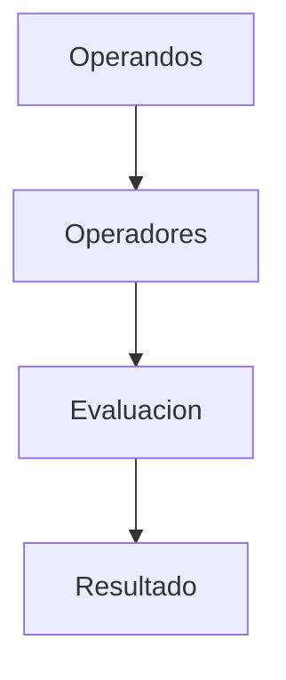

# Expresiones

## Introducción

Una expresión es una combinación de valores, variables, operadores y llamadas a funciones que produce un resultado.

Las expresiones constituyen uno de los elementos fundamentales de cualquier programa, ya que permiten realizar cálculos, comparaciones, transformaciones de datos y tomar decisiones.

Prácticamente todo el código que escribimos en C++ contiene expresiones.

---

## ¿Qué es una expresión?

Ejemplo:

```cpp
5 + 3
```

La expresión produce:

```text
8
```

Otro ejemplo:

```cpp
10 * 2
```

Resultado:

```text
20
```

Una expresión siempre genera un valor.

---

## Componentes de una expresión

Una expresión puede estar formada por:

* Literales.
* Variables.
* Operadores.
* Llamadas a funciones.
* Otras expresiones.

Ejemplo:

```cpp
edad + 5
```

Elementos:

```text
edad    -> Variable
+       -> Operador
5       -> Literal
```

---

## Literales

Los literales son valores escritos directamente en el código.

Ejemplos:

```cpp
10
3.14
'A'
true
"Hola"
```

Clasificación:

| Literal  | Tipo                 |
| -------- | -------------------- |
| `10`     | `int`                |
| `3.14`   | `double`             |
| `'A'`    | `char`               |
| `true`   | `bool`               |
| `"Hola"` | Cadena de caracteres |

---

## Expresiones con variables

```cpp
int edad {20};

edad + 5
```

Resultado:

```text
25
```

La variable aporta su valor actual a la expresión.

---

## Expresiones con funciones

```cpp
int sumar(int a, int b)
{
    return a + b;
}

sumar(2, 3)
```

Resultado:

```text
5
```

Las llamadas a funciones también son expresiones porque producen un valor.

---

## Expresiones simples

Contienen una única operación.

Ejemplos:

```cpp
5 + 3
```

```cpp
10 - 4
```

```cpp
8 * 2
```

```cpp
numero > 10
```

---

## Expresiones compuestas

Contienen múltiples operaciones.

Ejemplo:

```cpp
(5 + 3) * 2
```

Proceso:

```text
5 + 3 = 8
8 * 2 = 16
```

Resultado:

```text
16
```

---

## Expresiones anidadas

Una expresión puede contener otras expresiones.

```cpp
(10 + 5) * (20 - 3)
```

Representación:

```text
       *
      / \
    (+) (-)
```

Las expresiones complejas suelen construirse combinando expresiones más simples.

---

## Evaluación de expresiones

El compilador evalúa las expresiones siguiendo reglas de precedencia y asociatividad.

Ejemplo:

```cpp
5 + 3 * 2
```

No se calcula de izquierda a derecha.

Proceso:

```text
3 * 2 = 6
5 + 6 = 11
```

Resultado:

```text
11
```

---

## Uso de paréntesis

Los paréntesis permiten modificar el orden normal de evaluación.

Ejemplo:

```cpp
(5 + 3) * 2
```

Proceso:

```text
5 + 3 = 8
8 * 2 = 16
```

Resultado:

```text
16
```

---

## Toda expresión tiene un tipo

Además de producir un valor, toda expresión posee un tipo.

Ejemplo:

```cpp
5 + 3
```

Resultado:

```text
8
```

Tipo:

```text
int
```

---

```cpp
5.0 + 3.2
```

Tipo:

```text
double
```

---

```cpp
5 > 3
```

Tipo:

```text
bool
```

---

## Categorías comunes de expresiones

### Expresiones aritméticas

Producen resultados numéricos.

```cpp
10 + 5
```

Resultado:

```text
15
```

---

### Expresiones relacionales

Comparan valores.

```cpp
10 > 5
```

Resultado:

```text
true
```

---

### Expresiones lógicas

Operan sobre valores booleanos.

```cpp
true && false
```

Resultado:

```text
false
```

---

### Expresiones combinadas

Combinan varios tipos de operadores.

```cpp
(10 > 5) && (8 < 20)
```

Resultado:

```text
true
```

---

## Expresiones válidas

```cpp
5 + 3
```

```cpp
edad * 2
```

```cpp
numero > 10
```

```cpp
true && false
```

```cpp
sumar(2, 3)
```

Todas producen un valor.

---

## Expresiones inválidas

Falta un operando:

```cpp
5 +
```

---

Falta un operando izquierdo:

```cpp
* 10
```

---

Paréntesis sin cerrar:

```cpp
(5 + 3
```

---

Estas expresiones no pueden ser interpretadas correctamente por el compilador.

---

## Expresiones y sentencias

Es importante distinguir ambos conceptos.

### Expresión

Produce un valor.

```cpp
5 + 3
```

---

### Sentencia

Realiza una acción.

```cpp
int resultado {5 + 3};
```

Representación:

```text
5 + 3                  -> Expresion
int resultado {5 + 3}; -> Sentencia
```

Una sentencia puede contener una o varias expresiones.

---

## Expresiones con efectos secundarios

Algunas expresiones no solo producen un valor, sino que también modifican el estado del programa.

Ejemplo:

```cpp
contador++;
```

Esta expresión:

```text
Produce un valor
+
Modifica contador
```

Más adelante se estudiarán en detalle los operadores de incremento y decremento.

---

## Flujo de evaluación



Ejemplo:

```text id="jlwm9h"
5 + 3
 │   │
 └─┬─┘
   ▼
 Operador +
   │
   ▼
   8
```

---

## Importancia de las expresiones

Las expresiones aparecen prácticamente en todo el lenguaje:

```cpp
int edad {20};
```

```cpp
if (edad >= 18)
{
}
```

```cpp
resultado = a + b;
```

```cpp
while (contador < 10)
{
}
```

Comprender las expresiones es fundamental para entender el resto de C++.

---

## Buenas prácticas

* Utilizar paréntesis cuando mejoren la claridad.
* Evitar expresiones excesivamente complejas.
* Dividir cálculos grandes en varias expresiones simples.
* Aprovechar nombres descriptivos para mejorar la legibilidad.
* No depender únicamente de la precedencia de operadores cuando pueda generar confusión.

---

## Resumen

* Una expresión es cualquier construcción que produce un valor.
* Puede estar formada por literales, variables, operadores y funciones.
* Toda expresión tiene un valor y un tipo.
* Las expresiones pueden ser simples, compuestas o anidadas.
* El compilador las evalúa siguiendo reglas de precedencia y asociatividad.
* Los paréntesis permiten controlar el orden de evaluación.
* Algunas expresiones producen efectos secundarios además de un valor.
* Una expresión produce un valor; una sentencia realiza una acción.
* Las expresiones constituyen la base de la mayoría de las operaciones realizadas en C++.
