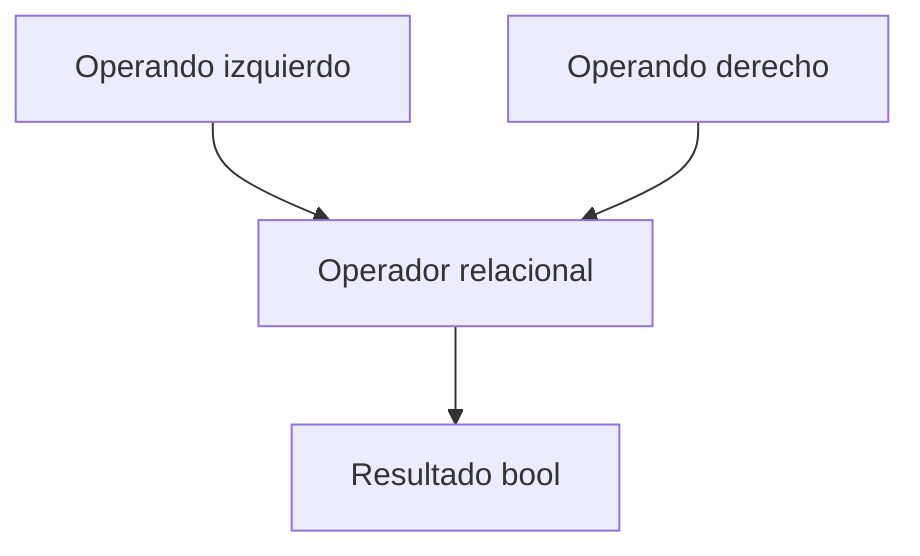

# Operadores Relacionales

## Introducción

Los operadores relacionales permiten comparar valores.

El resultado de una comparación siempre es un valor booleano:

```cpp
true
```

o

```cpp
false
```

Estos operadores son fundamentales para construir condiciones, controlar el flujo de ejecución y tomar decisiones dentro de un programa.

---

## Operadores disponibles

| Operador | Descripción       |
| -------- | ----------------- |
| `==`     | Igual que         |
| `!=`     | Distinto de       |
| `<`      | Menor que         |
| `>`      | Mayor que         |
| `<=`     | Menor o igual que |
| `>=`     | Mayor o igual que |

---

## Operador de igualdad (`==`)

Comprueba si dos valores son iguales.

Ejemplo:

```cpp
5 == 5
```

Resultado:

```text
true
```

---

```cpp
5 == 3
```

Resultado:

```text
false
```

---

## Operador de desigualdad (`!=`)

Comprueba si dos valores son diferentes.

Ejemplo:

```cpp
5 != 3
```

Resultado:

```text
true
```

---

```cpp
5 != 5
```

Resultado:

```text
false
```

---

## Operador menor que (`<`)

Comprueba si el operando izquierdo es menor que el derecho.

Ejemplo:

```cpp
3 < 5
```

Resultado:

```text
true
```

---

```cpp
10 < 5
```

Resultado:

```text
false
```

---

## Operador mayor que (`>`)

Comprueba si el operando izquierdo es mayor que el derecho.

Ejemplo:

```cpp
10 > 5
```

Resultado:

```text
true
```

---

```cpp
2 > 8
```

Resultado:

```text
false
```

---

## Operador menor o igual que (`<=`)

Comprueba si el operando izquierdo es menor o igual que el derecho.

Ejemplo:

```cpp
5 <= 5
```

Resultado:

```text
true
```

---

```cpp
4 <= 2
```

Resultado:

```text
false
```

---

## Operador mayor o igual que (`>=`)

Comprueba si el operando izquierdo es mayor o igual que el derecho.

Ejemplo:

```cpp
10 >= 5
```

Resultado:

```text
true
```

---

```cpp
2 >= 8
```

Resultado:

```text
false
```

---

## Comparación entre variables

```cpp
int edad {20};

edad >= 18
```

Resultado:

```text
true
```

---

## Comparación entre expresiones

Las expresiones también pueden compararse.

```cpp
(5 + 3) == 8
```

Resultado:

```text
true
```

---

```cpp
(10 * 2) > 15
```

Resultado:

```text
true
```

---

## Tipo de resultado

Todos los operadores relacionales producen un valor de tipo:

```cpp
bool
```

Ejemplo:

```cpp
bool resultado {10 > 5};
```

Contenido:

```cpp
true
```

---

## Uso en condiciones

Los operadores relacionales son la base de las estructuras de control.

Ejemplo:

```cpp
if (edad >= 18)
{
    std::cout << "Mayor de edad\n";
}
```

---

## Comparación de caracteres

También pueden compararse caracteres.

```cpp
'A' == 'A'
```

Resultado:

```text
true
```

---

```cpp
'A' < 'B'
```

Resultado:

```text
true
```

La comparación se realiza utilizando los valores numéricos asociados a cada carácter.

```text
'A' = 65
'B' = 66
```

---

## Mostrar valores booleanos

Por defecto, los valores booleanos se muestran como números.

```cpp
std::cout << (10 > 5) << '\n';
```

Salida:

```text
1
```

Donde:

```text
1 → true
0 → false
```

Para mostrar texto puede utilizarse:

```cpp
std::cout << std::boolalpha;
```

Ejemplo:

```cpp
std::cout << std::boolalpha;
std::cout << (10 > 5) << '\n';
```

Salida:

```text
true
```

---

## Error común: usar `=` en lugar de `==`

Incorrecto:

```cpp
if (edad = 18)
{
}
```

Aquí no se realiza una comparación.

Se está realizando una asignación.

Correcto:

```cpp
if (edad == 18)
{
}
```

---

## Comparaciones encadenadas

Incorrecto:

```cpp
10 < x < 20
```

Aunque parece correcto matemáticamente, en C++ no funciona como se espera.

Forma correcta:

```cpp
x > 10 && x < 20
```

---

## Ejemplo completo

```cpp
#include <iostream>

int main()
{
    int edad {20};

    std::cout << std::boolalpha;

    std::cout << (edad >= 18) << '\n';
    std::cout << (edad == 20) << '\n';
    std::cout << (edad != 30) << '\n';

    return 0;
}
```

Salida:

```text
true
true
true
```

---

## Flujo de evaluación



---

## Precedencia

Los operadores aritméticos tienen mayor prioridad que los operadores relacionales.

Ejemplo:

```cpp
5 + 3 > 6
```

Se evalúa como:

```cpp
(5 + 3) > 6
```

Proceso:

```text
5 + 3 = 8
8 > 6 = true
```

Resultado:

```text
true
```

---

## Tabla resumen

| Expresión | Resultado |
| --------- | --------- |
| `5 == 5`  | `true`    |
| `5 != 5`  | `false`   |
| `3 < 7`   | `true`    |
| `10 > 20` | `false`   |
| `5 <= 5`  | `true`    |
| `8 >= 10` | `false`   |

---

## Resumen

* Los operadores relacionales permiten comparar valores.
* El resultado de una comparación es siempre un valor booleano (`bool`).
* Existen seis operadores relacionales principales.
* Son fundamentales para construir condiciones y controlar el flujo de ejecución.
* Debe distinguirse claramente entre `=` (asignación) y `==` (comparación).
* Las comparaciones pueden realizarse sobre números, caracteres y expresiones.
* `std::boolalpha` permite mostrar `true` y `false` en lugar de `1` y `0`.
* Los operadores aritméticos tienen mayor prioridad que los operadores relacionales.
* El tipo resultante de una comparación es siempre `bool`.
