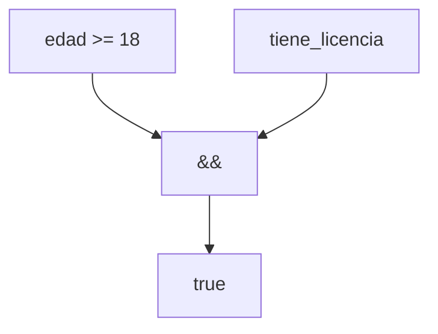

# Operadores Lógicos

## Introducción

Los operadores lógicos permiten combinar, invertir o evaluar expresiones booleanas.

Su resultado siempre es un valor de tipo:

```cpp
bool
```

Estos operadores son fundamentales para construir condiciones complejas y controlar el flujo de ejecución de un programa.

---

## Operadores disponibles

| Operador | Nombre | Descripción |
|----------|---------|-------------|
| `&&` | AND lógico | Verdadero si ambas expresiones son verdaderas |
| `\|\|` | OR lógico | Verdadero si al menos una expresión es verdadera |
| `!` | NOT lógico | Invierte el valor lógico |

---

## Operador AND (`&&`)

Devuelve `true` únicamente cuando ambas expresiones son verdaderas.

Sintaxis:

```cpp
expresion_1 && expresion_2
```

Ejemplo:

```cpp
true && true
```

Resultado:

```text
true
```

---

```cpp
true && false
```

Resultado:

```text
false
```

### Tabla de verdad

| A | B | A `&&` B |
|---|---|---|
| false | false | false |
| false | true | false |
| true | false | false |
| true | true | true |

### Ejemplo práctico

```cpp
int edad {20};
bool tiene_licencia {true};

edad >= 18 && tiene_licencia
```

Resultado:

```text
true
```

---

## Operador OR (`||`)

Devuelve `true` cuando al menos una expresión es verdadera.

Sintaxis:

```cpp
expresion_1 || expresion_2
```

Ejemplo:

```cpp
true || false
```

Resultado:

```text
true
```

---

```cpp
false || false
```

Resultado:

```text
false
```

### Tabla de verdad

| A | B | A `\|\|` B |
|---|---|---|
| false | false | false |
| false | true | true |
| true | false | true |
| true | true | true |

### Ejemplo práctico

```cpp
bool es_administrador {false};
bool es_moderador {true};

es_administrador || es_moderador
```

Resultado:

```text
true
```

---

## Operador NOT (`!`)

Invierte el valor lógico de una expresión.

Sintaxis:

```cpp
!expresion
```

Ejemplo:

```cpp
!true
```

Resultado:

```text
false
```

---

```cpp
!false
```

Resultado:

```text
true
```

### Tabla de verdad

| A | `!`A |
|---|---|
| false | true |
| true | false |

### Ejemplo práctico

```cpp
bool activo {false};

!activo
```

Resultado:

```text
true
```

---

## Negación de expresiones

El operador `!` también puede aplicarse a expresiones completas.

Ejemplo:

```cpp
!(10 > 5)
```

Proceso:

```text
10 > 5
   │
   ▼
 true
   │
   ▼
   !
   │
   ▼
false
```

Resultado:

```text
false
```

---

## Combinación de operadores

Los operadores lógicos suelen utilizarse junto con operadores relacionales.

Ejemplo:

```cpp
int edad {25};

edad >= 18 && edad <= 65
```

Resultado:

```text
true
```

---

Otro ejemplo:

```cpp
int nota {8};

nota >= 9 || nota == 8
```

Resultado:

```text
true
```

---

## Expresiones complejas

```cpp
int edad {20};
bool tiene_licencia {true};

(edad >= 18) && tiene_licencia
```

Proceso:

```text
edad >= 18
     │
     ▼
   true

tiene_licencia
     │
     ▼
   true

true && true
     │
     ▼
   true
```

---

## Prioridad de evaluación

Los operadores lógicos tienen diferentes niveles de precedencia.

| Prioridad | Operador |
|-----------|-----------|
| Alta | `!` |
| Media | `&&` |
| Baja | `\|\|` |

Ejemplo:

```cpp
true || false && false
```

Se evalúa como:

```cpp
true || (false && false)
```

Resultado:

```text
true
```

---

## Uso de paréntesis

Es recomendable utilizar paréntesis para mejorar la claridad.

Preferible:

```cpp
(edad >= 18) && (edad <= 65)
```

En lugar de:

```cpp
edad >= 18 && edad <= 65
```

Aunque ambas expresiones son equivalentes.

---

## Cortocircuito

Los operadores lógicos utilizan evaluación de cortocircuito.

### AND (`&&`)

Si la primera expresión es falsa:

```cpp
false && expresion
```

La segunda expresión no se evalúa.

### OR (`||`)

Si la primera expresión es verdadera:

```cpp
true || expresion
```

La segunda expresión no se evalúa.

### Ejemplo práctico

```cpp
int divisor {0};

divisor != 0 && (100 / divisor > 10)
```

Proceso:

```text
divisor != 0
      │
      ▼
    false

La segunda expresión no se evalúa.
```

Gracias al cortocircuito se evita una división por cero.

---

## Mostrar valores booleanos

Por defecto, los valores booleanos se muestran como números.

```cpp
std::cout << true << '\n';
```

Salida:

```text
1
```

---

```cpp
std::cout << false << '\n';
```

Salida:

```text
0
```

---

Para mostrar texto puede utilizarse:

```cpp
std::cout << std::boolalpha;
```

Ejemplo:

```cpp
std::cout << std::boolalpha;
std::cout << true << '\n';
```

Salida:

```text
true
```

---

## Error común

Confundir AND con OR.

```cpp
edad >= 18 && edad <= 65
```

Significa:

```text
La edad debe cumplir ambas condiciones.
```

---

```cpp
edad >= 18 || edad <= 65
```

Significa:

```text
La edad puede cumplir cualquiera de las condiciones.
```

El resultado será muy diferente.

---

## Ejemplo completo

```cpp
#include <iostream>

int main()
{
    int edad {25};
    bool tiene_licencia {true};

    bool puede_conducir {(edad >= 18) && tiene_licencia};

    std::cout << std::boolalpha;
    std::cout << puede_conducir << '\n';

    return 0;
}
```

Salida:

```text
true
```

---

## Flujo de evaluación



---

## Tabla resumen

| Expresión | Resultado |
|-----------|-----------|
| `true && true` | `true` |
| `true && false` | `false` |
| `false \|\| true` | `true` |
| `false \|\| false` | `false` |
| `!true` | `false` |
| `!false` | `true` |

---

## Resumen

* Los operadores lógicos trabajan con valores booleanos.
* `&&` requiere que ambas expresiones sean verdaderas.
* `||` requiere que al menos una expresión sea verdadera.
* `!` invierte el valor lógico de una expresión.
* Los operadores lógicos suelen combinarse con operadores relacionales.
* Existe una jerarquía de precedencia entre `!`, `&&` y `||`.
* La evaluación de cortocircuito mejora el rendimiento y ayuda a evitar errores.
* `std::boolalpha` permite mostrar `true` y `false` en lugar de `1` y `0`.
* El uso de paréntesis mejora la legibilidad de expresiones complejas.
* Son la base para construir condiciones en estructuras de control como `if`, `while` y `for`.
