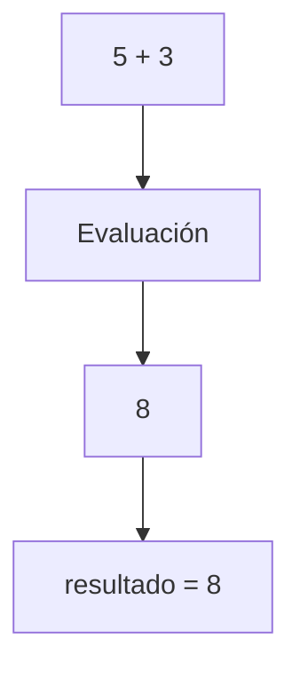

# Operadores de Asignación

## Introducción

Los operadores de asignación permiten almacenar o modificar valores en variables.

Son algunos de los operadores más utilizados en C++, ya que permiten cambiar el estado de un programa durante su ejecución.

El operador de asignación más básico es:

```cpp
=
```

Además, C++ proporciona operadores de asignación compuesta que combinan una operación aritmética con una asignación.

---

## Operador de asignación (`=`)

Permite asignar un valor a una variable.

Sintaxis:

```cpp
variable = valor;
```

Ejemplo:

```cpp
int edad {};

edad = 25;
```

Resultado:

```text
edad = 25
```

---

## Inicialización vs Asignación

Es importante diferenciar ambos conceptos.

### Inicialización

La variable recibe un valor en el momento de su creación.

```cpp
int edad {25};
```

---

### Asignación

La variable ya existe y recibe un nuevo valor.

```cpp
int edad {};

edad = 25;
```

---

## Asignación entre variables

```cpp
int a {10};
int b {20};

a = b;
```

Resultado:

```text
a = 20
b = 20
```

Se copia el valor almacenado en la variable, no la variable en sí.

---

## Asignación de expresiones

El lado derecho puede contener cualquier expresión válida.

```cpp
int resultado {};

resultado = 5 + 3;
```

Resultado:

```text
resultado = 8
```

---

```cpp
int numero {10};

numero = numero * 2;
```

Resultado:

```text
numero = 20
```

---

## Flujo de una asignación



---

## Operadores de asignación compuesta

Permiten combinar una operación aritmética y una asignación en una sola instrucción.

| Operador | Equivalente |
|----------|-------------|
| `a += b` | `a = a + b` |
| `a -= b` | `a = a - b` |
| `a *= b` | `a = a * b` |
| `a /= b` | `a = a / b` |
| `a %= b` | `a = a % b` |

---

## Suma y asignación (`+=`)

Ejemplo:

```cpp
int puntos {10};

puntos += 5;
```

Equivale a:

```cpp
puntos = puntos + 5;
```

Resultado:

```text
15
```

---

## Resta y asignación (`-=`)

Ejemplo:

```cpp
int vidas {5};

vidas -= 1;
```

Equivale a:

```cpp
vidas = vidas - 1;
```

Resultado:

```text
4
```

---

## Multiplicación y asignación (`*=`)

Ejemplo:

```cpp
int numero {4};

numero *= 3;
```

Equivale a:

```cpp
numero = numero * 3;
```

Resultado:

```text
12
```

---

## División y asignación (`/=`)

Ejemplo:

```cpp
int numero {20};

numero /= 4;
```

Equivale a:

```cpp
numero = numero / 4;
```

Resultado:

```text
5
```

---

## Módulo y asignación (`%=`)

Ejemplo:

```cpp
int numero {10};

numero %= 3;
```

Equivale a:

```cpp
numero = numero % 3;
```

Resultado:

```text
1
```

---

## Restricción de `%`

Los operadores `%` y `%=` solo pueden utilizarse con tipos enteros.

Correcto:

```cpp
int numero {10};

numero %= 3;
```

---

Incorrecto:

```cpp
double numero {10.5};

numero %= 3;
```

Resultado:

```text
Error de compilación
```

---

## Comparación visual

```cpp
a += b;
```

Equivale a:

```cpp
a = a + b;
```

---

```cpp
a -= b;
```

Equivale a:

```cpp
a = a - b;
```

---

```cpp
a *= b;
```

Equivale a:

```cpp
a = a * b;
```

---

```cpp
a /= b;
```

Equivale a:

```cpp
a = a / b;
```

---

```cpp
a %= b;
```

Equivale a:

```cpp
a = a % b;
```

---

## Asignación encadenada

Es posible asignar el mismo valor a varias variables.

```cpp
int a {};
int b {};
int c {};

a = b = c = 10;
```

Resultado:

```text
a = 10
b = 10
c = 10
```

---

## Asociatividad

Los operadores de asignación se evalúan de derecha a izquierda.

```cpp
a = b = c = 10;
```

Proceso:

```text
c = 10
   │
   ▼
b = 10
   │
   ▼
a = 10
```

---

## Error común: confundir `=` con `==`

Incorrecto:

```cpp
if (edad = 18)
{
}
```

Aquí se realiza una asignación.

---

Correcto:

```cpp
if (edad == 18)
{
}
```

Aquí se realiza una comparación.

---

## Ejemplo completo

```cpp
#include <iostream>

int main()
{
    int saldo {100};

    saldo += 50;
    saldo -= 20;
    saldo *= 2;
    saldo /= 5;

    std::cout << "Saldo final: " << saldo << '\n';

    return 0;
}
```

Proceso:

```text
100 + 50 = 150
150 - 20 = 130
130 * 2 = 260
260 / 5 = 52
```

Salida:

```text
Saldo final: 52
```

---

## Buenas prácticas

Preferir:

```cpp
contador += 1;
```

sobre:

```cpp
contador = contador + 1;
```

porque:

* Es más legible.
* Es más compacto.
* Expresa claramente la intención.

---

## Resumen

* El operador `=` asigna valores a variables.
* La asignación copia el resultado de la expresión del lado derecho al lado izquierdo.
* Existen operadores de asignación compuesta como `+=`, `-=`, `*=`, `/=` y `%=`.
* Estos operadores simplifican operaciones frecuentes.
* Los operadores de asignación se evalúan de derecha a izquierda.
* `%` y `%=` solo funcionan con tipos enteros.
* Debe diferenciarse claramente entre `=` (asignación) y `==` (comparación).
* Los operadores de asignación permiten modificar el estado de las variables durante la ejecución del programa.
