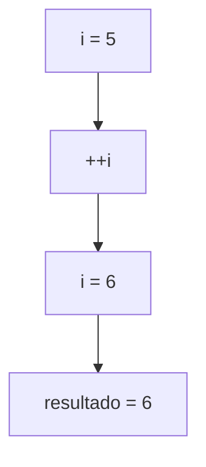
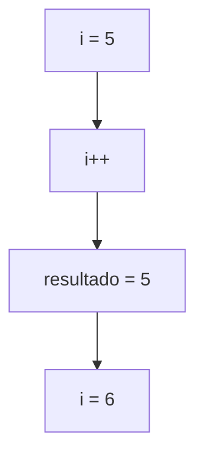

# Operadores de Incremento y Decremento

## Introducción

Los operadores de incremento y decremento permiten aumentar o disminuir el valor de una variable en una unidad.

Son ampliamente utilizados en:

* Bucles.
* Contadores.
* Iteradores.
* Algoritmos numéricos.

C++ proporciona dos operadores:

| Operador | Descripción |
|-----------|-------------|
| `++` | Incrementa en 1 |
| `--` | Decrementa en 1 |

---

## Operador de Incremento (`++`)

Incrementa el valor de una variable en una unidad.

Ejemplo:

```cpp
int numero {5};

++numero;
```

Resultado:

```text
numero = 6
```

Equivale a:

```cpp
numero = numero + 1;
```

o

```cpp
numero += 1;
```

---

## Operador de Decremento (`--`)

Disminuye el valor de una variable en una unidad.

Ejemplo:

```cpp
int numero {5};

--numero;
```

Resultado:

```text
numero = 4
```

Equivale a:

```cpp
numero = numero - 1;
```

o

```cpp
numero -= 1;
```

---

## Uso básico

En su forma más simple, ambos operadores modifican directamente la variable.

```cpp
int contador {10};

++contador;
```

Resultado:

```text
contador = 11
```

---

```cpp
int contador {10};

--contador;
```

Resultado:

```text
contador = 9
```

---

## Formas de uso

Existen dos variantes para cada operador:

### Prefijo

```cpp
++i
--i
```

### Sufijo

```cpp
i++
i--
```

Cuando se utilizan como expresiones, ambas formas producen resultados diferentes.

---

## Preincremento

Sintaxis:

```cpp
++i
```

Primero incrementa la variable y después devuelve el nuevo valor.

Ejemplo:

```cpp
int i {5};

int resultado {++i};
```

Estado final:

```text
i = 6
resultado = 6
```

---

### Flujo de ejecución



---

## Postincremento

Sintaxis:

```cpp
i++
```

Primero devuelve el valor actual y después incrementa la variable.

Ejemplo:

```cpp
int i {5};

int resultado {i++};
```

Estado final:

```text
i = 6
resultado = 5
```

---

### Flujo de ejecución



---

## Predecremento

Sintaxis:

```cpp
--i
```

Primero disminuye el valor y después devuelve el nuevo valor.

Ejemplo:

```cpp
int i {5};

int resultado {--i};
```

Estado final:

```text
i = 4
resultado = 4
```

---

## Postdecremento

Sintaxis:

```cpp
i--
```

Primero devuelve el valor actual y después disminuye la variable.

Ejemplo:

```cpp
int i {5};

int resultado {i--};
```

Estado final:

```text
i = 4
resultado = 5
```

---

## Comparación rápida

### Preincremento

```cpp
int i {5};

int x {++i};
```

Resultado:

```text
i = 6
x = 6
```

---

### Postincremento

```cpp
int i {5};

int x {i++};
```

Resultado:

```text
i = 6
x = 5
```

---

## Resumen visual

| Operación | Valor devuelto | Valor final de la variable |
|------------|------------|------------|
| `++i` | Nuevo valor | Incrementado |
| `i++` | Valor anterior | Incrementado |
| `--i` | Nuevo valor | Decrementado |
| `i--` | Valor anterior | Decrementado |

---

## Uso en expresiones

```cpp
int edad {17};

bool es_mayor {++edad >= 18};
```

Resultado:

```text
edad = 18
es_mayor = true
```

---

```cpp
int contador {5};

int valor {contador++};
```

Resultado:

```text
contador = 6
valor = 5
```

---

## Uso en bucles

Uno de los usos más comunes.

```cpp
for (int i {0}; i < 5; ++i)
{
    std::cout << i << '\n';
}
```

Salida:

```text
0
1
2
3
4
```

---

## ¿Por qué suele preferirse `++i`?

En tipos simples como:

```cpp
int
double
char
```

la diferencia suele ser insignificante.

Sin embargo, en iteradores y tipos definidos por el usuario, el postincremento puede requerir la creación de una copia temporal.

Por este motivo es habitual encontrar:

```cpp
++it
```

en código moderno.

---

## Buenas prácticas

### Utilizar incremento cuando la intención sea sumar una unidad

Preferir:

```cpp
++contador;
```

o

```cpp
contador++;
```

en lugar de:

```cpp
contador += 1;
```

cuando el objetivo sea aumentar exactamente una unidad.

---

### Elegir la forma adecuada

Si no necesitas el valor anterior, suele preferirse:

```cpp
++i
```

porque expresa mejor la intención y puede ser más eficiente en algunos tipos.

---

### Evitar expresiones complejas

Preferir:

```cpp
++contador;

int resultado {contador};
```

en lugar de combinar múltiples modificaciones dentro de una misma expresión.

---

## Ejemplo completo

```cpp
#include <iostream>

int main()
{
    int contador {5};

    std::cout << "Valor inicial: " << contador << '\n';
    std::cout << "Postincremento: " << contador++ << '\n';
    std::cout << "Valor actual: " << contador << '\n';
    std::cout << "Preincremento: " << ++contador << '\n';

    return 0;
}
```

Salida:

```text
Valor inicial: 5
Postincremento: 5
Valor actual: 6
Preincremento: 7
```

---

## Resumen

* `++` incrementa una variable en una unidad.
* `--` decrementa una variable en una unidad.
* El preincremento (`++i`) modifica primero y devuelve después.
* El postincremento (`i++`) devuelve primero y modifica después.
* El predecremento (`--i`) modifica primero y devuelve después.
* El postdecremento (`i--`) devuelve primero y modifica después.
* Son operadores ampliamente utilizados en contadores, iteradores y bucles.
* Cuando no se necesita el valor anterior suele preferirse el preincremento (`++i`).
* Comprender la diferencia entre prefijo y sufijo es importante para evitar errores en expresiones.
```**``**
