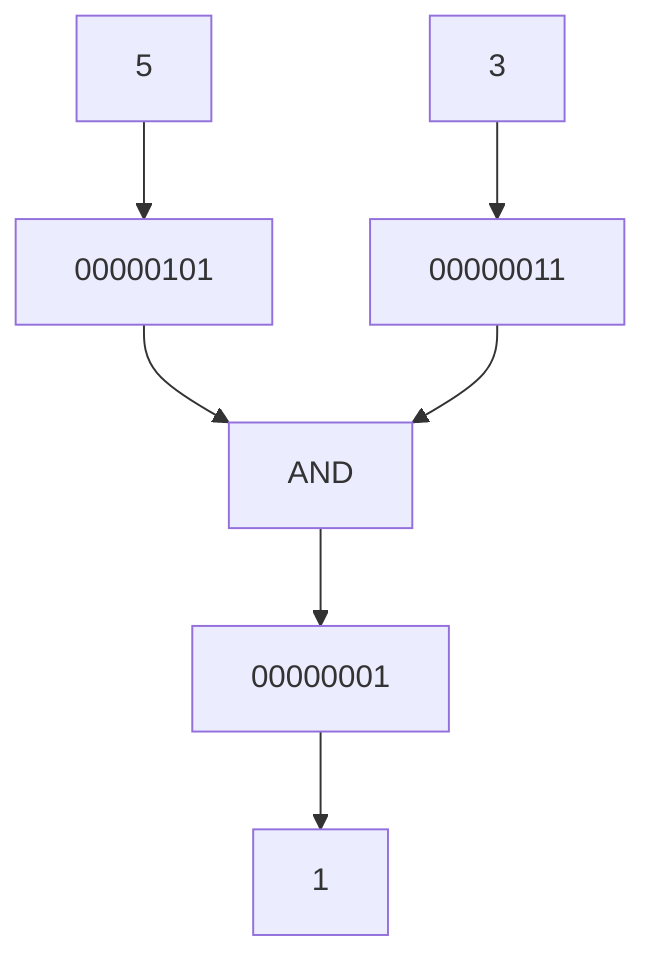

# Operadores Bitwise

## Introducción

Los operadores bitwise (o operadores a nivel de bits) permiten manipular directamente los bits que componen un valor entero.

Trabajan sobre la representación binaria de los números y suelen utilizarse en:

* Sistemas operativos.
* Programación embebida.
* Protocolos de red.
* Máscaras de bits.
* Control de hardware.

---

## Representación binaria

Los números enteros se almacenan internamente utilizando bits.

Por ejemplo:

```cpp
5
```

Representación binaria:

```text
00000101
```

---

```cpp
3
```

Representación binaria:

```text
00000011
```

Los operadores bitwise actúan directamente sobre estos bits.

---

## Operadores disponibles

| Operador | Nombre                        |
| -------- | ----------------------------- |
| `&`      | AND bit a bit                 |
| `\|`     | OR bit a bit                  |
| `^`      | XOR bit a bit                 |
| `~`      | NOT bit a bit                 |
| `<<`     | Desplazamiento a la izquierda |
| `>>`     | Desplazamiento a la derecha   |

---

## AND Bit a Bit (`&`)

Produce `1` únicamente cuando ambos bits son `1`.

Ejemplo:

```cpp
5 & 3
```

Representación:

```text
    00000101   (5)
&   00000011   (3)
------------------
    00000001
```

Resultado:

```cpp
1
```

### Tabla de verdad

| A | B | A & B |
| - | - | ----- |
| 0 | 0 | 0     |
| 0 | 1 | 0     |
| 1 | 0 | 0     |
| 1 | 1 | 1     |

---

### Visualización



---

## OR Bit a Bit (`|`)

Produce `1` cuando al menos uno de los bits es `1`.

Ejemplo:

```cpp
5 | 3
```

Representación:

```text
    00000101
|   00000011
------------------
    00000111
```

Resultado:

```cpp
7
```

### Tabla de verdad

| A | B | A | B |
| - | - | ----- |
| 0 | 0 | 0     |
| 0 | 1 | 1     |
| 1 | 0 | 1     |
| 1 | 1 | 1     |

---

## XOR Bit a Bit (`^`)

Produce `1` únicamente cuando los bits son diferentes.

Ejemplo:

```cpp
5 ^ 3
```

Representación:

```text
    00000101
^   00000011
------------------
    00000110
```

Resultado:

```cpp
6
```

### Tabla de verdad

| A | B | A ^ B |
| - | - | ----- |
| 0 | 0 | 0     |
| 0 | 1 | 1     |
| 1 | 0 | 1     |
| 1 | 1 | 0     |

---

## NOT Bit a Bit (`~`)

Invierte todos los bits.

Ejemplo:

```cpp
~5
```

Representación:

```text
00000101
```

Invertido:

```text
11111010
```

El resultado final depende del tamaño del tipo y de la representación interna utilizada por el sistema.

Por este motivo suele utilizarse con precaución.

---

## Desplazamiento a la Izquierda (`<<`)

Desplaza los bits hacia la izquierda.

Ejemplo:

```cpp
5 << 1
```

Representación:

```text
00000101
```

Después del desplazamiento:

```text
00001010
```

Resultado:

```cpp
10
```

### Nota

En muchos casos prácticos:

```cpp
x << n
```

produce un resultado equivalente a multiplicar por una potencia de dos.

Sin embargo, no debe considerarse una sustitución universal.

---

## Desplazamiento a la Derecha (`>>`)

Desplaza los bits hacia la derecha.

Ejemplo:

```cpp
20 >> 2
```

Representación:

```text
00010100
```

Después del desplazamiento:

```text
00000101
```

Resultado:

```cpp
5
```

### Nota

En muchos casos prácticos:

```cpp
x >> n
```

produce un resultado equivalente a dividir entre una potencia de dos.

Sin embargo, no debe considerarse una sustitución universal.

---

## Ejemplo completo

```cpp
#include <iostream>

int main()
{
    int a {5};
    int b {3};

    std::cout << (a & b) << '\n';
    std::cout << (a | b) << '\n';
    std::cout << (a ^ b) << '\n';

    return 0;
}
```

Salida:

```text
1
7
6
```

---

## Uso común: comprobar si un número es par

```cpp
int numero {10};

bool es_par {(numero & 1) == 0};
```

Resultado:

```cpp
true
```

La operación:

```cpp
numero & 1
```

permite inspeccionar el bit menos significativo.

---

## Advertencia

Los operadores bitwise suelen utilizarse con tipos enteros.

```cpp
unsigned int valor {5};
```

suele producir resultados más predecibles que:

```cpp
int valor {5};
```

cuando se realizan desplazamientos o manipulaciones avanzadas de bits.

---

## Precedencia

| Prioridad | Operadores     |
| --------- | -------------- |
| Alta      | `~`            |
| Media     | `<<`, `>>`     |
| Baja      | `&`, `^`, `\|` |

Cuando exista duda, utiliza paréntesis para hacer explícito el orden de evaluación.

---

## Cuándo utilizarlos

Son frecuentes en:

* Sistemas operativos.
* Programación embebida.
* Protocolos de comunicación.
* Máscaras de bits.
* Control de hardware.

En aplicaciones convencionales suelen utilizarse con mucha menos frecuencia.

---

## Resumen

* Los operadores bitwise trabajan directamente sobre bits.
* `&` realiza AND bit a bit.
* `|` realiza OR bit a bit.
* `^` realiza XOR bit a bit.
* `~` invierte todos los bits.
* `<<` desplaza bits hacia la izquierda.
* `>>` desplaza bits hacia la derecha.
* Requieren comprender la representación binaria de los datos.
* Son especialmente útiles en programación de sistemas y bajo nivel.
* En la mayoría de programas de aplicación su uso es menos frecuente.
