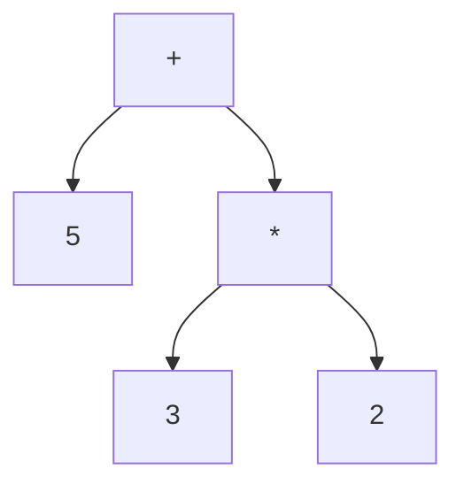

# Precedencia y Asociatividad

## Introducción

Cuando una expresión contiene varios operadores, el compilador necesita determinar cómo interpretarla.

Para ello utiliza dos conceptos fundamentales:

* **Precedencia**
* **Asociatividad**

Comprender ambos conceptos permite escribir expresiones correctas y evitar resultados inesperados.

---

## Precedencia vs Asociatividad

Aunque suelen mencionarse juntas, resuelven problemas distintos.

| Concepto      | Pregunta que responde                                             |
| ------------- | ----------------------------------------------------------------- |
| Precedencia   | ¿Qué operador se evalúa primero?                                  |
| Asociatividad | ¿En qué dirección se agrupan operadores con la misma precedencia? |

---

## ¿Qué es la precedencia?

La precedencia determina qué operador tiene prioridad sobre otro.

Ejemplo:

```cpp
5 + 3 * 2
```

Resultado:

```cpp
11
```

Proceso:

```text
3 * 2 = 6
5 + 6 = 11
```

La multiplicación tiene mayor precedencia que la suma.

---

## Visualización



Resultado:

```text
11
```

---

## ¿Qué es la asociatividad?

La asociatividad entra en juego cuando dos operadores tienen la misma precedencia.

Ejemplo:

```cpp
10 - 5 - 2
```

Resultado:

```cpp
3
```

Evaluación:

```text
(10 - 5) - 2
```

Proceso:

```text
10 - 5 = 5
5 - 2 = 3
```

---

## Asociatividad izquierda a derecha

La mayoría de operadores aritméticos utilizan esta regla.

Ejemplo:

```cpp
20 / 4 / 2
```

Se interpreta como:

```cpp
(20 / 4) / 2
```

Resultado:

```cpp
2
```

---

## Asociatividad derecha a izquierda

Los operadores de asignación utilizan esta regla.

Ejemplo:

```cpp
a = b = c = 10;
```

Se interpreta como:

```cpp
a = (b = (c = 10));
```

Proceso:

```text
c = 10
b = 10
a = 10
```

---

## El papel de los paréntesis

Los paréntesis permiten modificar explícitamente el orden de agrupación.

Sin paréntesis:

```cpp
2 + 3 * 4
```

Resultado:

```cpp
14
```

---

Con paréntesis:

```cpp
(2 + 3) * 4
```

Resultado:

```cpp
20
```

---

## Tabla práctica de precedencia

Para un curso inicial basta recordar:

| Nivel | Operadores              |   |   |
| ----- | ----------------------- | - | - |
| 1     | `()`                    |   |   |
| 2     | `++` `--` `!`           |   |   |
| 3     | `*` `/` `%`             |   |   |
| 4     | `+` `-`                 |   |   |
| 5     | `<<` `>>`               |   |   |
| 6     | `<` `<=` `>` `>=`       |   |   |
| 7     | `==` `!=`               |   |   |
| 8     | `&&`                    |   |   |
| 9     | `                       |   | ` |
| 10    | `=` `+=` `-=` `*=` `/=` |   |   |

No es necesario memorizar toda la tabla oficial del lenguaje.

---

## Ejemplo con operadores relacionales

```cpp
5 + 3 > 6
```

Proceso:

```text
5 + 3 = 8
8 > 6
```

Resultado:

```cpp
true
```

---

## Ejemplo con operadores lógicos

```cpp
true || false && false
```

Proceso:

```text
false && false
       ↓
     false

true || false
       ↓
      true
```

Resultado:

```cpp
true
```

---

## Ejemplo completo

```cpp
5 + 3 * 2 > 10 && 8 - 2 == 6
```

Evaluación:

```text
3 * 2 = 6
5 + 6 = 11
8 - 2 = 6

11 > 10 = true
6 == 6 = true

true && true = true
```

Resultado:

```cpp
true
```

---

## Precedencia NO significa orden de evaluación

Un error común es creer que la precedencia indica exactamente cuándo se ejecuta cada parte de una expresión.

Por ejemplo:

```cpp
funcionA() + funcionB()
```

La precedencia determina cómo se agrupa la expresión.

No necesariamente indica qué función será llamada primero.

Por ello es recomendable evitar expresiones excesivamente complejas.

---

## Buenas prácticas

### Utiliza paréntesis para expresar intención

Preferir:

```cpp
(a + b) * c
```

en lugar de depender de que otra persona recuerde la precedencia.

---

### Prioriza la legibilidad

Preferir:

```cpp
(edad >= 18) && (edad <= 65)
```

aunque los paréntesis no sean estrictamente necesarios.

---

### Evita expresiones complicadas

Evitar:

```cpp
resultado = a++ + --b * c;
```

Preferir:

```cpp
++a;
--b;

resultado = a + b * c;
```

---

## Reglas prácticas

```text
1. Paréntesis
2. Operadores unarios
3. Multiplicación, división y módulo
4. Suma y resta
5. Desplazamientos
6. Comparaciones
7. Operadores lógicos
8. Asignaciones
```

---

## Resumen

* La precedencia determina qué operador tiene prioridad.
* La asociatividad determina cómo se agrupan operadores con la misma prioridad.
* Los paréntesis tienen la mayor prioridad.
* Multiplicación y división tienen mayor precedencia que suma y resta.
* Los operadores de asignación se asocian de derecha a izquierda.
* Los operadores lógicos tienen menor precedencia que los aritméticos y relacionales.
* La precedencia no debe confundirse con el orden real de evaluación.
* Utilizar paréntesis mejora la legibilidad y reduce errores.
