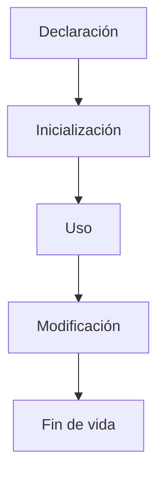

# ¿Qué es una Variable?

## Introducción

Una variable es un objeto con nombre que almacena un valor en memoria durante un determinado período de tiempo.

Las variables permiten que un programa conserve información, realice cálculos y modifique datos a medida que se ejecuta.

---

## Concepto Fundamental

Toda variable posee tres características principales:

| Elemento | Descripción                                   |
| -------- | --------------------------------------------- |
| Nombre   | Identificador utilizado para acceder al valor |
| Tipo     | Determina qué datos puede almacenar           |
| Valor    | Información almacenada actualmente            |

Ejemplo:

```cpp
int edad = 20;
```

| Elemento | Valor |
| -------- | ----- |
| Nombre   | edad  |
| Tipo     | int   |
| Valor    | 20    |

---

## Una Variable es un Objeto

En C++, una variable no es únicamente un valor.

Cuando declaramos:

```cpp
int edad = 20;
```

se crea un objeto que posee:

* Un tipo.
* Un valor.
* Una ubicación en memoria.
* Un tiempo de vida.

Representación conceptual:

```text
Variable
│
├── Nombre      → edad
├── Tipo        → int
├── Valor       → 20
├── Memoria     → reservada
└── Tiempo vida → hasta salir de su alcance
```

---

## Variables y Memoria

Al declarar una variable, el programa reserva memoria para almacenar su valor.

```cpp
int edad = 20;
```

Representación simplificada:

```text
Memoria

┌─────────────┐
│ edad = 20   │
└─────────────┘
```

La cantidad de memoria reservada depende del tipo de dato.

| Tipo     | Tamaño habitual* |
| -------- | ---------------- |
| `char`   | 1 byte           |
| `int`    | 4 bytes          |
| `double` | 8 bytes          |
| `bool`   | 1 byte           |

* El tamaño exacto depende de la plataforma y del compilador.

---

## Declarar una Variable

Declarar una variable significa indicar su tipo y nombre.

```cpp
int edad;
```

En este punto:

```text
Tipo  → int
Nombre → edad
Valor → indeterminado
```

---

## Inicializar una Variable

Inicializar una variable significa asignarle un valor en el momento de su creación.

```cpp
int edad = 20;
```

También:

```cpp
int edad{20};
```

La inicialización con llaves es la forma recomendada en C++ moderno.

---

## Leer una Variable

Podemos utilizar el valor almacenado.

```cpp
std::cout << edad;
```

Salida:

```text
20
```

---

## Modificar una Variable

El valor puede cambiar durante la ejecución.

```cpp
int edad = 20;

edad = 25;
```

Representación:

```text
Antes

edad
 │
 ▼
20

Después

edad
 │
 ▼
25
```

---

## Variables Independientes

Cada variable almacena su propio valor.

```cpp
int edad = 20;
int anio = 2025;
```

Representación:

```text
Memoria

┌─────────────┐
│ edad = 20   │
├─────────────┤
│ anio = 2025 │
└─────────────┘
```

---

## Variables como Etiquetas

Puede imaginarse una variable como una etiqueta asociada a una región de memoria.

```text
┌─────────────┐
│    edad     │
├─────────────┤
│     20      │
└─────────────┘
```

El nombre permite acceder al valor almacenado.

---

## Ejemplo Práctico

```cpp
#include <iostream>

int main()
{
    int precio = 100;
    int descuento = 20;

    int total = precio - descuento;

    std::cout << total << '\n';
}
```

Salida:

```text
80
```

---

## Error Común: Variable sin Inicializar

```cpp
int edad;

std::cout << edad;
```

Problema:

```text
El valor es indeterminado.
```

El programa podría mostrar cualquier valor.

Correcto:

```cpp
int edad{0};
```

o

```cpp
int edad = 0;
```

---

## Flujo de Vida de una Variable

Durante su existencia una variable atraviesa varias etapas.



---

## ¿Por Qué Son Importantes?

Las variables permiten:

* Almacenar información.
* Realizar cálculos.
* Recordar resultados.
* Interactuar con el usuario.
* Controlar el comportamiento del programa.
* Compartir datos entre diferentes partes del programa.

Sin variables, un programa solo podría trabajar con valores escritos directamente en el código.

---

## Resumen

* Una variable es un objeto con nombre que almacena un valor.
* Toda variable posee un nombre, un tipo y un valor.
* Las variables ocupan memoria.
* El tipo determina qué datos puede almacenar la variable.
* Una variable puede leerse y modificarse durante su tiempo de vida.
* La inicialización asigna un valor inicial a la variable.
* Utilizar variables sin inicializar puede producir errores difíciles de detectar.
* Las variables son uno de los componentes fundamentales de cualquier programa en C++.
