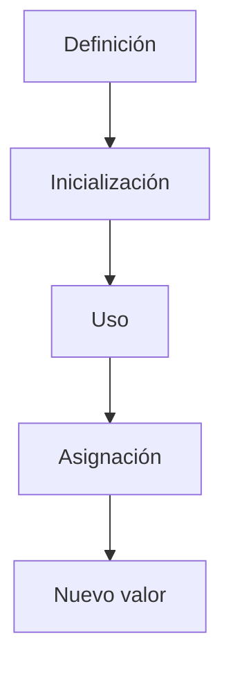

# Declaración e Inicialización

## Introducción

Antes de utilizar una variable es necesario crearla.

En C++ intervienen tres conceptos relacionados, pero diferentes:

* Declaración
* Definición
* Inicialización

Además, una vez creada, una variable puede recibir nuevos valores mediante asignación.

Comprender estas diferencias evita muchos errores y ayuda a interpretar correctamente el código.

---

## Declaración

Una declaración informa al compilador de la existencia de una entidad.

Por ejemplo:

```cpp
extern int edad;
```

Aquí se indica que existe una variable llamada `edad`, pero no se reserva memoria para ella.

Representación conceptual:

```text
Compilador
     │
     ▼
Existe una variable llamada edad
```

---

## Definición

Una definición crea realmente la variable y reserva memoria para ella.

```cpp
int edad;
```

Representación:

```text
Memoria

┌──────────┐
│   edad   │
└──────────┘
```

---

## Estado Inicial

```cpp
int edad;
```

La variable existe, pero su valor no está inicializado.

Representación conceptual:

```text
edad
 │
 ▼
?
```

Intentar leer este valor puede producir comportamiento incorrecto.

---

## Inicialización

La inicialización asigna un valor a la variable en el momento de su creación.

```cpp
int edad = 20;
```

Representación:

```text
edad
 │
 ▼
20
```

---

## Definición e Inicialización

La forma más habitual:

```cpp
int edad = 20;
```

Realiza dos acciones:

```text
Reservar memoria
       │
       ▼
Asignar valor inicial
```

---

## Asignación

La asignación modifica el valor de una variable que ya existe.

```cpp
int edad{20};

edad = 25;
```

Representación:

```text
Antes

edad
 │
 ▼
20

Después

edad
 │
 ▼
25
```

---

## Diferencias Fundamentales

| Concepto       | Ejemplo            | Acción                      |
| -------------- | ------------------ | --------------------------- |
| Declaración    | `extern int edad;` | Informa que existe          |
| Definición     | `int edad;`        | Crea la variable            |
| Inicialización | `int edad{20};`    | Asigna valor inicial        |
| Asignación     | `edad = 25;`       | Modifica un valor existente |

---

## Formas de Inicialización

C++ permite varias sintaxis.

### Inicialización con signo igual

```cpp
int edad = 20;
```

---

### Inicialización directa

```cpp
int edad(20);
```

---

### Inicialización uniforme

```cpp
int edad{20};
```

Introducida en C++11.

Actualmente es la forma más recomendada en la mayoría de situaciones.

---

## Comparación de Formas de Inicialización

| Forma             | Ejemplo          | Recomendada     |
| ----------------- | ---------------- | --------------- |
| Copia             | `int edad = 20;` | Sí              |
| Directa           | `int edad(20);`  | Sí              |
| Uniforme          | `int edad{20};`  | Preferida       |
| Valor por defecto | `int edad{};`    | Muy recomendada |

---

## Ventaja de la Inicialización Uniforme

Evita conversiones potencialmente peligrosas.

Correcto:

```cpp
int edad{20};
```

---

Error:

```cpp
int edad{20.5};
```

El compilador detecta la pérdida de información.

Sin llaves:

```cpp
int edad = 20.5;
```

Resultado:

```text
edad = 20
```

La parte decimal se pierde silenciosamente.

---

## Inicialización por Defecto

Podemos solicitar que el compilador inicialice el objeto con su valor por defecto.

```cpp
int numero{};
```

Resultado:

```text
numero = 0
```

---

```cpp
double precio{};
```

Resultado:

```text
precio = 0.0
```

---

```cpp
bool activo{};
```

Resultado:

```text
activo = false
```

---

## Inferencia de Tipos

También es posible utilizar `auto`.

```cpp
auto edad = 20;
```

El compilador deduce:

```cpp
int edad = 20;
```

---

## Variables Sin Inicializar

Evitar:

```cpp
int numero;

std::cout << numero;
```

La variable no tiene un valor definido.

Correcto:

```cpp
int numero{};
```

o

```cpp
int numero{0};
```

---

## Ejemplo Completo

```cpp
#include <iostream>

int main()
{
    int edad{20};

    std::cout << edad << '\n';

    edad = 25;

    std::cout << edad << '\n';
}
```

Salida:

```text
20
25
```

---

## Ciclo de Vida Inicial



---

## Buenas Prácticas

### Inicializar siempre las variables

Preferir:

```cpp
int edad{};
```

o

```cpp
int edad{20};
```

---

### Utilizar llaves por defecto

Preferir:

```cpp
double precio{19.99};
```

sobre:

```cpp
double precio = 19.99;
```

porque evita ciertas conversiones peligrosas.

---

### Evitar valores indeterminados

Evitar:

```cpp
int contador;
```

si la variable va a utilizarse inmediatamente.

---

## Resumen

* Declarar informa de la existencia de una entidad.
* Definir crea realmente la variable.
* Inicializar asigna un valor en el momento de la creación.
* Asignar modifica el valor posteriormente.
* C++ ofrece varias formas de inicialización.
* La inicialización uniforme (`{}`) es generalmente la opción más segura.
* Una variable debe inicializarse antes de ser utilizada.
* Comprender la diferencia entre definición, inicialización y asignación ayuda a evitar numerosos errores.
