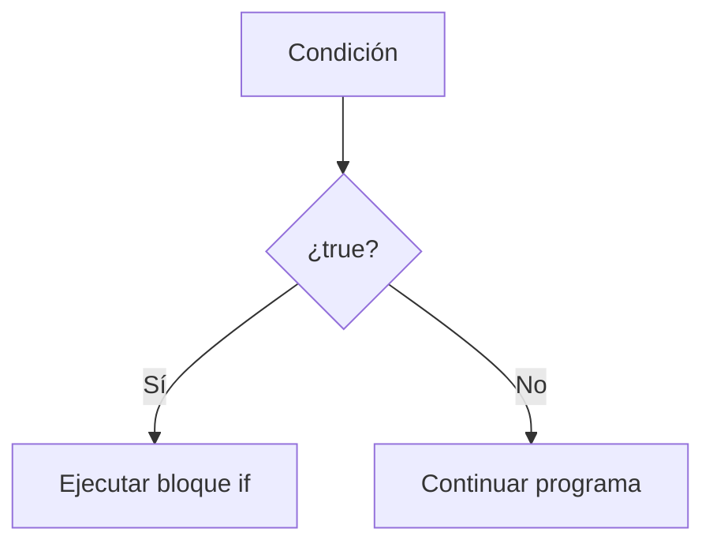

# if

## Introducción

Hasta ahora nuestros programas se ejecutaban de forma secuencial.

Ejemplo:

```cpp
std::cout << "Paso 1\n";
std::cout << "Paso 2\n";
std::cout << "Paso 3\n";
```

Salida:

```text
Paso 1
Paso 2
Paso 3
```

---

El flujo siempre es el mismo.

```text
Inicio
  │
  ▼
Paso 1
  │
  ▼
Paso 2
  │
  ▼
Paso 3
  │
  ▼
Fin
```

---

Sin embargo, los programas reales necesitan tomar decisiones.

Por ejemplo:

```text
Si el usuario es mayor de edad.
Si la contraseña es correcta.
Si la temperatura es alta.
Si existe un archivo.
```

Para ello C++ proporciona:

```cpp
if
```

---

# ¿Qué es if?

`if` permite ejecutar código únicamente cuando una condición es verdadera.

---

## Sintaxis

```cpp
if (condicion)
{
    // código
}
```

---

## Visualización

```text
Condición
    │
    ▼
 ¿true?
  ╱   ╲
Sí     No
│       │
▼       ▼
Ejecuta Nada
```

---

## Diagrama Mermaid



---

# Evaluación de la Condición

Antes de decidir si ejecuta el bloque, `if` evalúa la expresión entre paréntesis.

Ejemplo:

```cpp
if (10 > 5)
{
}
```

Evaluación:

```cpp
10 > 5
```

↓

```cpp
true
```

↓

```text
Se ejecuta el bloque
```

---

La condición debe producir un valor que pueda convertirse a:

```cpp
bool
```

Por ejemplo:

```cpp
if (5)
{
}
```

también es válido porque:

```cpp
5
```

se convierte implícitamente a:

```cpp
true
```

---

# Primer Ejemplo

```cpp
#include <iostream>

int main()
{
    if (true)
    {
        std::cout
            << "Hola\n";
    }

    return 0;
}
```

Salida:

```text
Hola
```

---

# Condición Falsa

```cpp
#include <iostream>

int main()
{
    if (false)
    {
        std::cout
            << "Hola\n";
    }

    return 0;
}
```

Salida:

```text
(nada)
```

---

## Visualización

```text
if (false)
      │
      ▼
 No ejecutar
```

---

# Condiciones con Variables

```cpp
int edad {20};

if (edad >= 18)
{
    std::cout
        << "Mayor de edad\n";
}
```

Salida:

```text
Mayor de edad
```

---

## Evaluación

```cpp
edad >= 18
```

↓

```cpp
20 >= 18
```

↓

```cpp
true
```

---

# Ejemplo

```cpp
int temperatura {35};

if (temperatura > 30)
{
    std::cout
        << "Hace calor\n";
}
```

Salida:

```text
Hace calor
```

---

# Operadores Relacionales

Normalmente las condiciones utilizan:

```cpp
==
!=
<
>
<=
>=
```

---

## Tabla de Operadores Relacionales

| Operador | Significado |
|-----------|-------------|
| `==` | Igual que |
| `!=` | Distinto de |
| `<` | Menor que |
| `>` | Mayor que |
| `<=` | Menor o igual que |
| `>=` | Mayor o igual que |

Todos producen un resultado:

```cpp
true
```

o

```cpp
false
```

---

## Ejemplo

```cpp
int numero {10};

if (numero == 10)
{
    std::cout
        << "Correcto\n";
}
```

Salida:

```text
Correcto
```

---

# Uso con bool

Las variables booleanas pueden utilizarse directamente.

```cpp
bool activo {true};

if (activo)
{
    std::cout
        << "Activo\n";
}
```

Salida:

```text
Activo
```

---

## Equivalente

```cpp
if (activo == true)
{
}
```

---

Pero normalmente se prefiere:

```cpp
if (activo)
{
}
```

---

# Uso con Strings

```cpp
#include <string>

std::string usuario {"admin"};

if (usuario == "admin")
{
    std::cout
        << "Acceso permitido\n";
}
```

Salida:

```text
Acceso permitido
```

---

# Bloque de Código

Todo el código entre llaves:

```cpp
{
}
```

pertenece al `if`.

---

Ejemplo:

```cpp
if (true)
{
    std::cout << "Linea 1\n";
    std::cout << "Linea 2\n";
    std::cout << "Linea 3\n";
}
```

Salida:

```text
Linea 1
Linea 2
Linea 3
```

---

# Sin Llaves

C++ permite:

```cpp
if (true)
    std::cout << "Hola\n";
```

---

Pero no es recomendable.

---

## Problema

```cpp
if (true)
    std::cout << "A\n";

std::cout << "B\n";
```

Muchos principiantes creen que ambas líneas pertenecen al `if`.

---

Realidad:

```cpp
if (true)
{
    std::cout << "A\n";
}

std::cout << "B\n";
```

---

# Recomendación

Utilizar siempre:

```cpp
if (condicion)
{
}
```

aunque exista una sola instrucción.

---

# Diagrama de Flujo

```text
      edad >= 18 ?
         ╱      ╲
      Sí         No
      │           │
      ▼           ▼
Mayor edad   Continuar
      │           │
      └─────┬─────┘
            ▼
           Fin
```

---

# Ejemplo Interactivo

```cpp
#include <iostream>

int main()
{
    int edad {};

    std::cout
        << "Edad: ";

    std::cin >> edad;

    if (edad >= 18)
    {
        std::cout
            << "Mayor de edad\n";
    }

    return 0;
}
```

Entrada:

```text
20
```

Salida:

```text
Mayor de edad
```

---

Entrada:

```text
15
```

Salida:

```text
(nada)
```

---

# Condiciones Compuestas

También pueden utilizarse operadores lógicos.

```cpp
int edad {25};

if (edad >= 18 && edad <= 65)
{
    std::cout
        << "Edad laboral\n";
}
```

Salida:

```text
Edad laboral
```

---

## Operadores Lógicos

| Operador | Significado |
|-----------|-------------|
| `&&` | Y lógico (AND) |
| `||` | O lógico (OR) |
| `!` | Negación lógica (NOT) |

Ejemplos:

```cpp
edad >= 18 && edad <= 65
```

---

```cpp
es_admin || es_supervisor
```

---

```cpp
!activo
```

---

# Buenas Prácticas

## Utilizar Llaves Siempre

Correcto:

```cpp
if (condicion)
{
}
```

---

## Escribir Condiciones Claras

Correcto:

```cpp
if (edad >= 18)
{
}
```

---

## Utilizar Variables Booleanas Directamente

Correcto:

```cpp
if (activo)
{
}
```

---

Evitar:

```cpp
if (activo == true)
{
}
```

---

# Error Común

Confundir:

```cpp
=
```

con:

```cpp
==
```

---

Incorrecto:

```cpp
if (edad = 18)
{
}
```

---

Correcto:

```cpp
if (edad == 18)
{
}
```

---

## ¿Por Qué es un Problema?

```cpp
edad = 18
```

realiza una asignación.

Después la expresión produce:

```cpp
18
```

que se convierte a:

```cpp
true
```

Por tanto, el bloque se ejecutará.

---

# Visualización General

```text
Condición
    │
    ▼
 ¿true?
  ╱   ╲
Sí     No
│       │
▼       ▼
Código  Saltar
```

---

## Resumen

- `if` permite ejecutar código de forma condicional.
- La condición debe producir un valor convertible a `bool`.
- Si la condición es verdadera, el bloque se ejecuta.
- Si es falsa, el bloque se omite.
- Las condiciones suelen utilizar operadores relacionales y lógicos.
- Es recomendable utilizar siempre llaves.
- Debe evitarse confundir `=` con `==`.
- `if` es la estructura fundamental para la toma de decisiones en C++.
