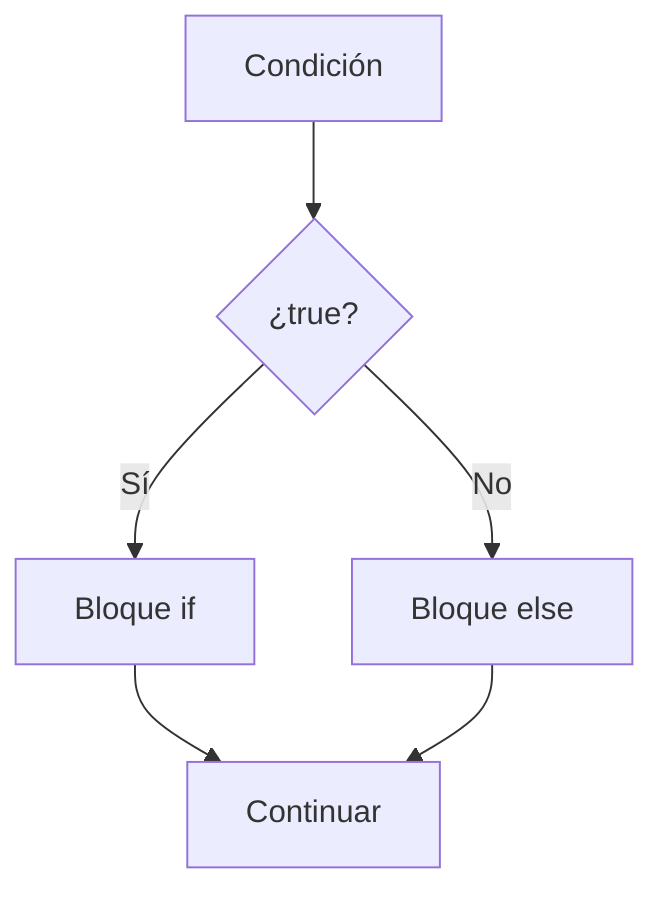
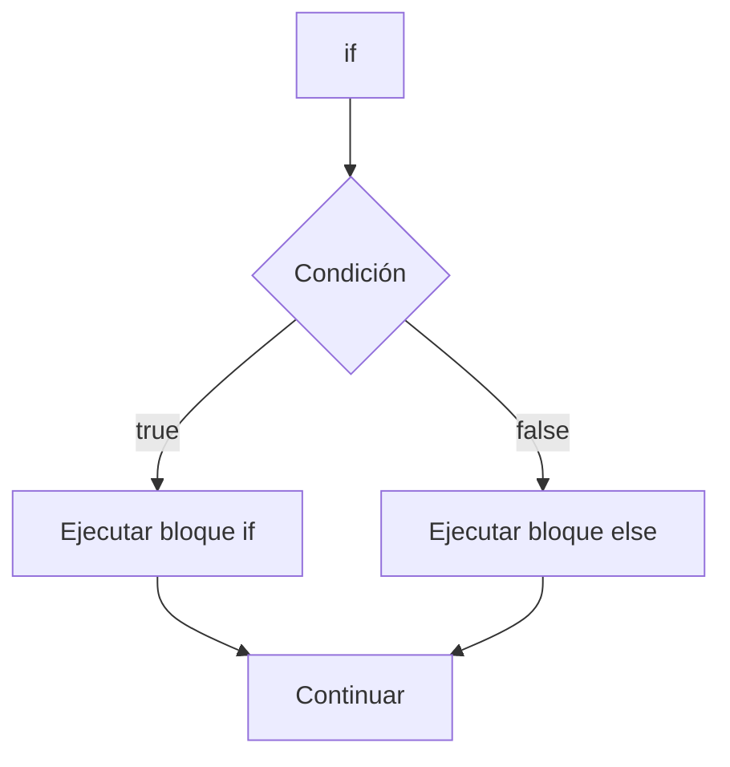

# if - else

## Introducción

En el tema anterior aprendimos que:

```cpp
if
```

permite ejecutar código cuando una condición es verdadera.

Ejemplo:

```cpp
if (edad >= 18)
{
    std::cout
        << "Mayor de edad\n";
}
```

---

Sin embargo, muchas veces también necesitamos indicar qué debe ocurrir cuando la condición es falsa.

Para ello utilizamos:

```cpp
else
```

---

# ¿Qué es else?

`else` define una alternativa para cuando la condición del `if` no se cumple.

---

## Sintaxis

```cpp
if (condicion)
{
    // condición verdadera
}
else
{
    // condición falsa
}
```

---

## Visualización

```text
Condición
    │
    ▼
 ¿true?
  ╱   ╲
Sí     No
│       │
▼       ▼
if     else
```

---

## Diagrama Mermaid



---

# Primer Ejemplo

```cpp
#include <iostream>

int main()
{
    int edad {20};

    if (edad >= 18)
    {
        std::cout
            << "Mayor de edad\n";
    }
    else
    {
        std::cout
            << "Menor de edad\n";
    }

    return 0;
}
```

Salida:

```text
Mayor de edad
```

---

# Ejemplo con Condición Falsa

```cpp
int edad {15};

if (edad >= 18)
{
    std::cout
        << "Mayor de edad\n";
}
else
{
    std::cout
        << "Menor de edad\n";
}
```

Salida:

```text
Menor de edad
```

---

# Flujo de Ejecución

Cuando existe una estructura:

```cpp
if (condicion)
{
}
else
{
}
```

siempre ocurre una de estas dos situaciones:

| Resultado de la condición | Bloque ejecutado |
|--------------------------|------------------|
| `true` | `if` |
| `false` | `else` |

Nunca se ejecutan ambos bloques.

---

## Visualización

```text
          edad >= 18 ?
             ╱    ╲
          Sí       No
          │         │
          ▼         ▼
     Mayor      Menor
     de edad    de edad
```

---

# Solo se Ejecuta un Bloque

Observa:

```cpp
if (condicion)
{
}
else
{
}
```

---

Nunca se ejecutan ambos bloques.

---

Se ejecuta:

```text
if
```

o

```text
else
```

pero no los dos.

---

# Ejemplo

```cpp
int numero {10};

if (numero > 0)
{
    std::cout
        << "Positivo\n";
}
else
{
    std::cout
        << "No positivo\n";
}
```

Salida:

```text
Positivo
```

---

# Uso con bool

```cpp
bool activo {true};

if (activo)
{
    std::cout
        << "Activo\n";
}
else
{
    std::cout
        << "Inactivo\n";
}
```

Salida:

```text
Activo
```

---

# Uso con Strings

```cpp
#include <iostream>
#include <string>

int main()
{
    std::string usuario {"admin"};

    if (usuario == "admin")
    {
        std::cout
            << "Acceso permitido\n";
    }
    else
    {
        std::cout
            << "Acceso denegado\n";
    }

    return 0;
}
```

Salida:

```text
Acceso permitido
```

---

# Asociación de else

Un `else` siempre pertenece al:

```text
if más cercano
```

que todavía no tenga un `else` asociado.

Más adelante veremos situaciones donde esto puede producir errores de lectura cuando existen varios `if` anidados.

---

# Ejemplo Interactivo

```cpp
#include <iostream>

int main()
{
    int edad {};

    std::cout
        << "Ingrese su edad: ";

    std::cin >> edad;

    if (edad >= 18)
    {
        std::cout
            << "Mayor de edad\n";
    }
    else
    {
        std::cout
            << "Menor de edad\n";
    }

    return 0;
}
```

---

Entrada:

```text
20
```

Salida:

```text
Mayor de edad
```

---

Entrada:

```text
15
```

Salida:

```text
Menor de edad
```

---

# Comparación de Números

```cpp
int a {10};
int b {20};

if (a > b)
{
    std::cout
        << "a es mayor\n";
}
else
{
    std::cout
        << "b es mayor o igual\n";
}
```

Salida:

```text
b es mayor o igual
```

---

# Alcance de los Bloques

Cada bloque crea un ámbito (*scope*) independiente.

```cpp
if (true)
{
    int x {10};
}
else
{
    int y {20};
}
```

Las variables:

```cpp
x
```

y

```cpp
y
```

solo existen dentro de sus respectivos bloques.

El siguiente código es incorrecto:

```cpp
std::cout << x;
```

porque `x` ya no existe fuera del bloque.

---

Más adelante estudiaremos:

```text
Scope
Lifetime
```

en profundidad.

---

# Diagrama de Flujo

```text
            Inicio
               │
               ▼
        temperatura > 30 ?
            ╱        ╲
         Sí           No
         │             │
         ▼             ▼
    Hace calor   Temperatura normal
         │             │
         └──────┬──────┘
                ▼
               Fin
```

---

# Comparación

| Estructura | Comportamiento |
|------------|----------------|
| `if` | Ejecuta código solo cuando la condición es verdadera |
| `if - else` | Ejecuta una alternativa cuando la condición es falsa |

---

## Solo if

```cpp
if (edad >= 18)
{
    std::cout
        << "Mayor\n";
}
```

Si no se cumple:

```text
No ocurre nada
```

---

## if - else

```cpp
if (edad >= 18)
{
    std::cout
        << "Mayor\n";
}
else
{
    std::cout
        << "Menor\n";
}
```

Siempre existe una respuesta.

---

# Buenas Prácticas

## Utilizar Llaves Siempre

Correcto:

```cpp
if (condicion)
{
}
else
{
}
```

---

## Mantener Condiciones Simples

Correcto:

```cpp
if (edad >= 18)
{
}
```

---

## Utilizar Mensajes Claros

Correcto:

```cpp
std::cout
    << "Acceso permitido\n";
```

---

## Utilizar else Cuando Exista una Alternativa Natural

Correcto:

```cpp
if (activo)
{
    std::cout << "Activo\n";
}
else
{
    std::cout << "Inactivo\n";
}
```

---

# Error Común

Escribir:

```cpp
if (edad >= 18)
{
    std::cout
        << "Mayor\n";
}
```

y olvidar manejar el caso contrario.

---

Cuando existan exactamente dos resultados posibles:

```cpp
if (...)
{
}
else
{
}
```

suele producir código más claro.

---

# Visualización General



---

## Resumen

- `else` define el camino alternativo cuando un `if` es falso.
- Solo uno de los bloques se ejecuta.
- `if` y `else` forman una estructura de decisión binaria.
- Un `else` se asocia al `if` más cercano que no tenga alternativa.
- Cada bloque posee su propio ámbito (*scope*).
- Es recomendable utilizar llaves siempre.
- `if - else` constituye una de las estructuras fundamentales de control de flujo en C++.
```**``**
