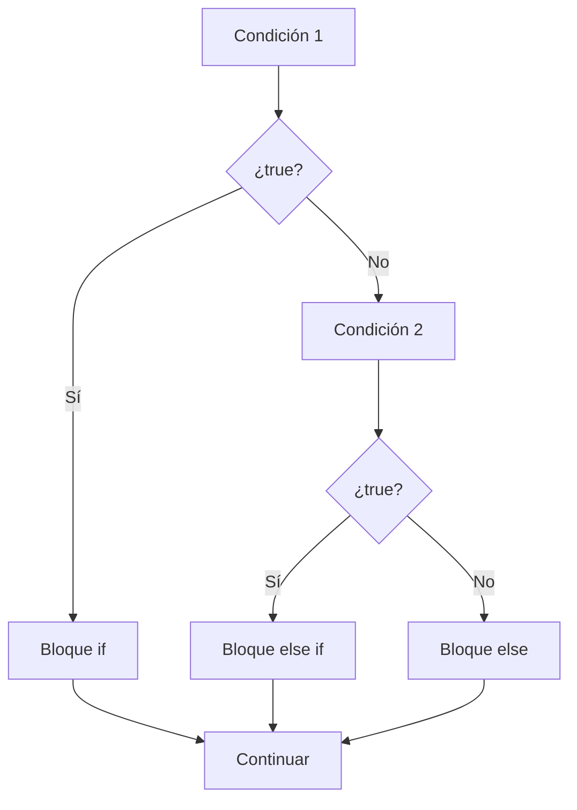
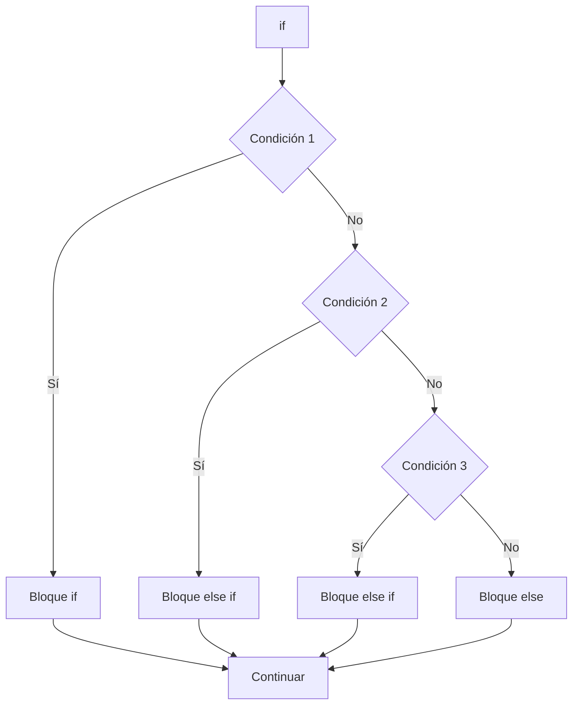

# if - else if

## Introducción

Hasta ahora hemos visto:

```cpp
if
```

---

y:

```cpp
if - else
```

---

Estas estructuras permiten tomar decisiones cuando existen uno o dos caminos posibles.

Sin embargo, muchas situaciones requieren más alternativas.

Por ejemplo:

```text
Calificaciones
Menús
Categorías de edad
Niveles de acceso
Estados de un sistema
```

Para ello utilizamos:

```cpp
else if
```

---

# Problema

Supongamos una calificación.

```text
90 - 100 → Excelente
70 - 89  → Aprobado
60 - 69  → Recuperación
0  - 59  → Reprobado
```

---

Con:

```cpp
if - else
```

solo tenemos:

```text
Dos caminos
```

---

Necesitamos:

```text
Múltiples caminos
```

---

# ¿Qué es else if?

Permite evaluar condiciones adicionales cuando las anteriores resultan falsas.

---

## Sintaxis

```cpp
if (condicion_1)
{
}
else if (condicion_2)
{
}
else if (condicion_3)
{
}
else
{
}
```

---

## Visualización

```text
Condición 1
     │
     ▼
 ¿true?
  ╱   ╲
Sí     No
│       │
▼       ▼
if   Condición 2
         │
         ▼
      ¿true?
       ╱  ╲
     Sí    No
     │      │
     ▼      ▼
 else if  else
```

---

## Diagrama Mermaid



---

# Flujo de Evaluación

Las condiciones se evalúan:

```text
De arriba hacia abajo
```

---

Cuando una condición resulta verdadera:

```text
La cadena termina
```

---

Las condiciones restantes:

```text
No se evalúan
```

---

## Tabla de Ejecución

| Situación | Resultado |
|------------|------------|
| Primera condición verdadera | Se ejecuta `if` |
| Segunda condición verdadera | Se ejecuta el primer `else if` correspondiente |
| Tercera condición verdadera | Se ejecuta el siguiente `else if` |
| Ninguna condición verdadera | Se ejecuta `else` |
| Varias condiciones podrían ser verdaderas | Solo se ejecuta la primera encontrada |

---

# Primer Ejemplo

```cpp
#include <iostream>

int main()
{
    int nota {85};

    if (nota >= 90)
    {
        std::cout
            << "Excelente\n";
    }
    else if (nota >= 70)
    {
        std::cout
            << "Aprobado\n";
    }
    else
    {
        std::cout
            << "Reprobado\n";
    }

    return 0;
}
```

Salida:

```text
Aprobado
```

---

# Evaluación Paso a Paso

```cpp
nota = 85
```

---

Primera condición:

```cpp
nota >= 90
```

↓

```cpp
85 >= 90
```

↓

```text
false
```

---

Segunda condición:

```cpp
nota >= 70
```

↓

```cpp
85 >= 70
```

↓

```text
true
```

---

Resultado:

```text
Aprobado
```

---

# Solo se Ejecuta un Bloque

Observa:

```cpp
if (...)
{
}
else if (...)
{
}
else if (...)
{
}
else
{
}
```

---

Cuando una condición resulta verdadera:

```text
Las demás ya no se evalúan
```

---

# Ejemplo

```cpp
int numero {100};

if (numero > 0)
{
    std::cout
        << "Positivo\n";
}
else if (numero > 50)
{
    std::cout
        << "Mayor que 50\n";
}
```

Salida:

```text
Positivo
```

---

La segunda condición nunca se evalúa.

---

# Orden Importa

El orden de las condiciones es fundamental.

---

## Correcto

```cpp
if (nota >= 90)
{
    std::cout
        << "Excelente\n";
}
else if (nota >= 70)
{
    std::cout
        << "Aprobado\n";
}
```

---

## Incorrecto

```cpp
if (nota >= 70)
{
    std::cout
        << "Aprobado\n";
}
else if (nota >= 90)
{
    std::cout
        << "Excelente\n";
}
```

---

Con:

```cpp
nota = 95
```

---

Resultado:

```text
Aprobado
```

---

Porque la primera condición ya era verdadera.

---

## Regla General

Las condiciones más específicas suelen colocarse primero.

Las condiciones más generales suelen colocarse después.

---

# Ejemplo de Edad

```cpp
int edad {15};

if (edad < 13)
{
    std::cout
        << "Niño\n";
}
else if (edad < 18)
{
    std::cout
        << "Adolescente\n";
}
else
{
    std::cout
        << "Adulto\n";
}
```

Salida:

```text
Adolescente
```

---

# Diagrama de Flujo

```text
             edad < 13 ?
              ╱      ╲
           Sí         No
           │           │
           ▼           ▼
         Niño      edad < 18 ?
                     ╱     ╲
                  Sí        No
                  │          │
                  ▼          ▼
             Adolescente   Adulto
                  │          │
                  └────┬─────┘
                       ▼
                      Fin
```

---

# Uso con Strings

```cpp
#include <iostream>
#include <string>

int main()
{
    std::string rol {"editor"};

    if (rol == "admin")
    {
        std::cout
            << "Acceso total\n";
    }
    else if (rol == "editor")
    {
        std::cout
            << "Puede editar\n";
    }
    else
    {
        std::cout
            << "Solo lectura\n";
    }

    return 0;
}
```

Salida:

```text
Puede editar
```

---

# Uso con Rangos

Muy habitual.

```cpp
int temperatura {35};

if (temperatura < 10)
{
    std::cout
        << "Frio\n";
}
else if (temperatura < 25)
{
    std::cout
        << "Templado\n";
}
else
{
    std::cout
        << "Calor\n";
}
```

Salida:

```text
Calor
```

---

# else Final

El bloque:

```cpp
else
```

es opcional.

---

Ejemplo:

```cpp
if (valor > 0)
{
}
else if (valor < 0)
{
}
```

---

Es válido.

---

Pero muchas veces es útil para manejar:

```text
Todos los casos restantes
```

---

## Ventajas de else

Permite:

- Capturar casos no previstos.
- Reducir condiciones redundantes.
- Hacer el código más claro.
- Cubrir todos los escenarios posibles.

---

# Ejemplo Completo

```cpp
#include <iostream>

int main()
{
    int nota {};

    std::cout
        << "Ingrese una nota: ";

    std::cin >> nota;

    if (nota >= 90)
    {
        std::cout
            << "Excelente\n";
    }
    else if (nota >= 70)
    {
        std::cout
            << "Aprobado\n";
    }
    else if (nota >= 60)
    {
        std::cout
            << "Recuperacion\n";
    }
    else
    {
        std::cout
            << "Reprobado\n";
    }

    return 0;
}
```

---

Entrada:

```text
95
```

Salida:

```text
Excelente
```

---

Entrada:

```text
75
```

Salida:

```text
Aprobado
```

---

Entrada:

```text
50
```

Salida:

```text
Reprobado
```

---

# Comparación

| Estructura | Alternativas |
|------------|-------------|
| `if` | 1 |
| `if - else` | 2 |
| `if - else if` | 3 o más |

---

## Visualización

```text
if
│
└── Una decisión
```

---

```text
if - else
│
├── Opción A
└── Opción B
```

---

```text
if - else if
│
├── Opción A
├── Opción B
├── Opción C
└── Otras
```

---

# Buenas Prácticas

## Ordenar de Más Específico a Más General

Correcto:

```cpp
if (nota >= 90)
{
}
else if (nota >= 70)
{
}
```

---

## Evitar Condiciones Duplicadas

Incorrecto:

```cpp
if (edad > 18)
{
}
else if (edad > 18)
{
}
```

---

## Utilizar else para Casos Restantes

Permite cubrir todos los escenarios posibles.

---

## Mantener la Legibilidad

Si la cadena de condiciones es demasiado larga:

```cpp
if (...)
else if (...)
else if (...)
else if (...)
else if (...)
```

quizás exista una mejor alternativa.

Más adelante veremos:

```cpp
switch
```

---

# Error Común

Pensar que todas las condiciones se ejecutan.

---

Realidad:

```text
Se detiene en la primera condición verdadera.
```

---

Ejemplo:

```cpp
if (true)
{
}
else if (true)
{
}
```

---

Solo se ejecuta:

```text
El primer bloque
```

---

# Visualización General



---

## Resumen

- `else if` permite evaluar múltiples condiciones.
- Las condiciones se evalúan de arriba hacia abajo.
- Solo se ejecuta el primer bloque cuya condición sea verdadera.
- Cuando una condición se cumple, las restantes ya no se evalúan.
- El orden de las condiciones es importante.
- Las condiciones más específicas suelen colocarse antes.
- `else` puede utilizarse para manejar todos los casos restantes.
- Esta estructura permite implementar decisiones con múltiples alternativas.
- Es una de las herramientas más utilizadas en programación.
