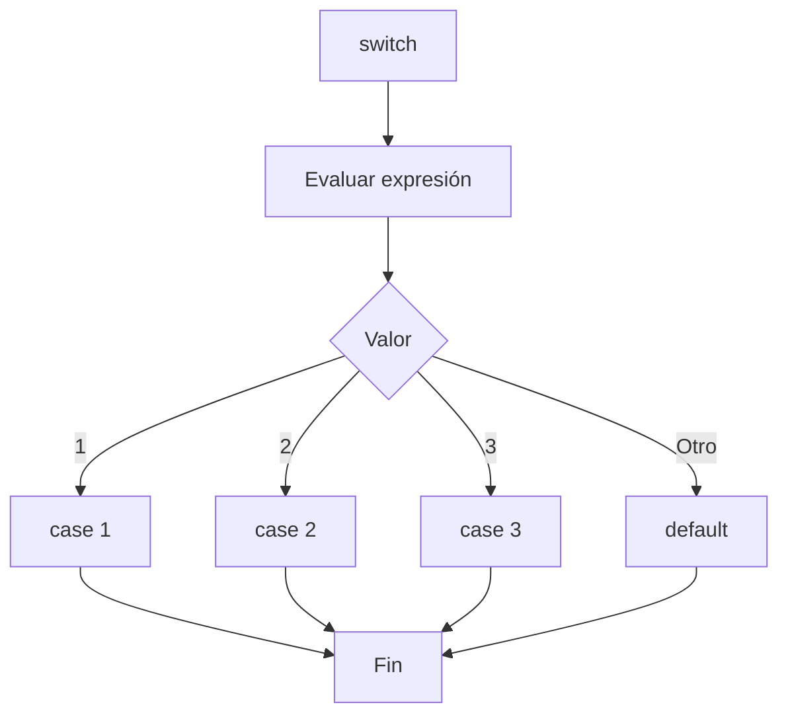

# switch

## Introducción

En el tema anterior vimos:

```cpp
if
```

---

```cpp
if - else
```

---

```cpp
if - else if
```

---

Estas estructuras permiten tomar decisiones basadas en condiciones.

Sin embargo, existe una situación muy común:

```text
Comparar una misma variable
contra varios valores posibles.
```

---

Ejemplo:

```cpp
opcion = 1
opcion = 2
opcion = 3
opcion = 4
```

---

Con:

```cpp
if - else if
```

podemos hacerlo, pero el código puede volverse repetitivo.

Para estos casos C++ proporciona:

```cpp
switch
```

---

# ¿Qué es switch?

`switch` permite seleccionar un bloque de código entre múltiples alternativas basándose en el valor de una expresión.

---

## Sintaxis

```cpp
switch (expresion)
{
    case valor_1:
        break;

    case valor_2:
        break;

    default:
        break;
}
```

---

## Visualización

```text
        switch
           │
           ▼
        valor
           │
   ┌───────┼───────┐
   ▼       ▼       ▼
case1   case2   case3
```

---

## Diagrama de Flujo



---

# Primer Ejemplo

```cpp
#include <iostream>

int main()
{
    int opcion {2};

    switch (opcion)
    {
        case 1:
            std::cout
                << "Opcion 1\n";
            break;

        case 2:
            std::cout
                << "Opcion 2\n";
            break;

        case 3:
            std::cout
                << "Opcion 3\n";
            break;
    }

    return 0;
}
```

Salida:

```text
Opcion 2
```

---

# ¿Cómo Funciona?

```cpp
switch (opcion)
```

↓

```cpp
switch (2)
```

↓

```cpp
case 2:
```

↓

```text
Coincidencia encontrada
```

---

# case

Cada:

```cpp
case
```

representa un valor posible.

---

Ejemplo:

```cpp
case 1:
```

---

```cpp
case 2:
```

---

```cpp
case 3:
```

---

Visualización:

```text
switch (valor)

1 → case 1
2 → case 2
3 → case 3
```

---

# break

Después de ejecutar un caso normalmente utilizamos:

```cpp
break;
```

---

Su función es:

```text
Salir del switch
```

---

## Ejemplo

```cpp
case 2:
    std::cout
        << "Opcion 2\n";

    break;
```

---

Visualización:

```text
case 2
   │
   ▼
 Ejecutar
   │
   ▼
 break
   │
   ▼
 Salir
```

---

# ¿Qué Pasa Sin break?

Observa:

```cpp
switch (2)
{
    case 1:
        std::cout << "Uno\n";

    case 2:
        std::cout << "Dos\n";

    case 3:
        std::cout << "Tres\n";
}
```

Salida:

```text
Dos
Tres
```

---

¿Por qué?

Porque la ejecución continúa hacia los siguientes casos.

Este comportamiento se denomina:

```text
Fallthrough
```

---

# Fallthrough

Visualización:

```text
case 2
   │
   ▼
"Dos"
   │
   ▼
case 3
   │
   ▼
"Tres"
```

---

Por eso normalmente se utiliza:

```cpp
break;
```

---

# Fallthrough Intencional

En ocasiones se desea continuar deliberadamente al siguiente `case`.

Desde C++17 puede indicarse explícitamente mediante:

```cpp
[[fallthrough]];
```

---

Ejemplo:

```cpp
switch (nivel)
{
    case 1:
        std::cout
            << "Basico\n";

        [[fallthrough]];

    case 2:
        std::cout
            << "Intermedio\n";
        break;
}
```

---

Esto informa al compilador de que el comportamiento es intencional.

---

# Agrupar Casos

Varios valores pueden compartir el mismo bloque.

---

## Ejemplo

```cpp
switch (opcion)
{
    case 1:
    case 2:
    case 3:
        std::cout
            << "Opcion valida\n";
        break;
}
```

Salida:

```text
Opcion valida
```

---

## Visualización

```text
case 1 ┐
case 2 ├──► mismo bloque
case 3 ┘
```

---

# default

Equivale conceptualmente a:

```cpp
else
```

---

Se ejecuta cuando ningún caso coincide.

---

## Ejemplo

```cpp
switch (opcion)
{
    case 1:
        std::cout
            << "Uno\n";
        break;

    case 2:
        std::cout
            << "Dos\n";
        break;

    default:
        std::cout
            << "Opcion invalida\n";
        break;
}
```

---

Entrada:

```cpp
opcion = 10
```

Salida:

```text
Opcion invalida
```

---

## Visualización

```text
      switch
         │
         ▼
 Coincidencia?
    ╱      ╲
  Sí        No
  │          │
  ▼          ▼
case      default
```

---

# Ejemplo de Menú

```cpp
#include <iostream>

int main()
{
    int opcion {};

    std::cout
        << "1. Crear\n";

    std::cout
        << "2. Editar\n";

    std::cout
        << "3. Eliminar\n";

    std::cin >> opcion;

    switch (opcion)
    {
        case 1:
            std::cout
                << "Crear\n";
            break;

        case 2:
            std::cout
                << "Editar\n";
            break;

        case 3:
            std::cout
                << "Eliminar\n";
            break;

        default:
            std::cout
                << "Opcion invalida\n";
            break;
    }

    return 0;
}
```

---

# Tipos Permitidos

`switch` funciona con tipos integrales y enumeraciones.

---

| Tipo | Permitido |
|--------|-----------|
| `int` | Si |
| `char` | Si |
| `bool` | Si |
| `enum` | Si |
| `std::string` | No |
| `float` | No |
| `double` | No |

---

# Ejemplo con char

```cpp
char opcion {'A'};

switch (opcion)
{
    case 'A':
        std::cout
            << "Agregar\n";
        break;

    case 'B':
        std::cout
            << "Buscar\n";
        break;
}
```

---

# Limitaciones

No puede utilizarse directamente con:

```cpp
std::string
```

---

Incorrecto:

```cpp
std::string opcion {"admin"};

switch (opcion)
{
}
```

---

Tampoco puede utilizar rangos.

---

Incorrecto:

```cpp
case > 10:
```

---

```cpp
case 1..10:
```

---

# Cuándo No Utilizar switch

No es adecuado para:

- Rangos de valores.
- Comparaciones complejas.
- Condiciones lógicas.
- Comparaciones de strings.

---

Ejemplos:

```cpp
if (edad >= 18)
{
}
```

---

```cpp
if (usuario == "admin")
{
}
```

---

En estos casos `if` suele ser una mejor alternativa.

---

# switch vs if

| Característica | switch | if |
|----------------|---------|----|
| Valores exactos | Si | Si |
| Rangos | No | Si |
| Condiciones lógicas | No | Si |
| Comparar strings | No | Si |
| Muchos valores constantes | Adecuado | Menos adecuado |
| Legibilidad en menús | Alta | Media |

---

## switch

Ideal para:

```text
Comparar una variable
contra valores exactos.
```

---

Ejemplo:

```cpp
switch (opcion)
{
    case 1:
    case 2:
    case 3:
}
```

---

## if

Ideal para:

```text
Rangos
Comparaciones complejas
Condiciones lógicas
```

---

Ejemplo:

```cpp
if (edad >= 18)
{
}
```

---

```cpp
if (temperatura > 30)
{
}
```

---

# Ejemplo Completo

```cpp
#include <iostream>

int main()
{
    int dia {3};

    switch (dia)
    {
        case 1:
            std::cout
                << "Lunes\n";
            break;

        case 2:
            std::cout
                << "Martes\n";
            break;

        case 3:
            std::cout
                << "Miercoles\n";
            break;

        default:
            std::cout
                << "Dia invalido\n";
            break;
    }

    return 0;
}
```

Salida:

```text
Miercoles
```

---

# Buenas Prácticas

## Utilizar break

Correcto:

```cpp
case 1:
    break;
```

---

## Utilizar default

Correcto:

```cpp
default:
    break;
```

---

## Utilizar switch para Valores Exactos

Correcto:

```cpp
switch (opcion)
{
}
```

---

## Utilizar if para Rangos

Correcto:

```cpp
if (edad >= 18)
{
}
```

---

## Documentar Fallthrough Intencionales

Correcto:

```cpp
[[fallthrough]];
```

---

# Error Común

Olvidar:

```cpp
break;
```

---

Ejemplo:

```cpp
case 1:
    std::cout
        << "Uno\n";

case 2:
    std::cout
        << "Dos\n";
```

---

Salida:

```text
Uno
Dos
```

---

Cuando probablemente se esperaba:

```text
Uno
```

---

# Visualización General

```text
switch
   │
   ▼
 Valor
   │
   ├── case 1
   ├── case 2
   ├── case 3
   └── default
```

---

# Resumen

| Elemento | Función |
|-----------|----------|
| `switch` | Seleccionar una alternativa |
| `case` | Valor específico |
| `break` | Salir del switch |
| `fallthrough` | Continuar al siguiente case |
| `default` | Caso por defecto |

---

## Resumen General

- `switch` permite seleccionar entre múltiples alternativas.
- Cada alternativa se define mediante `case`.
- `break` finaliza la ejecución del switch.
- Sin `break` ocurre fallthrough.
- `[[fallthrough]]` documenta un fallthrough intencional.
- `default` maneja los casos no contemplados.
- `switch` es ideal para comparar valores exactos.
- Para rangos y condiciones complejas suele ser mejor utilizar `if`.
- Es una herramienta muy utilizada para menús y selección de opciones.
