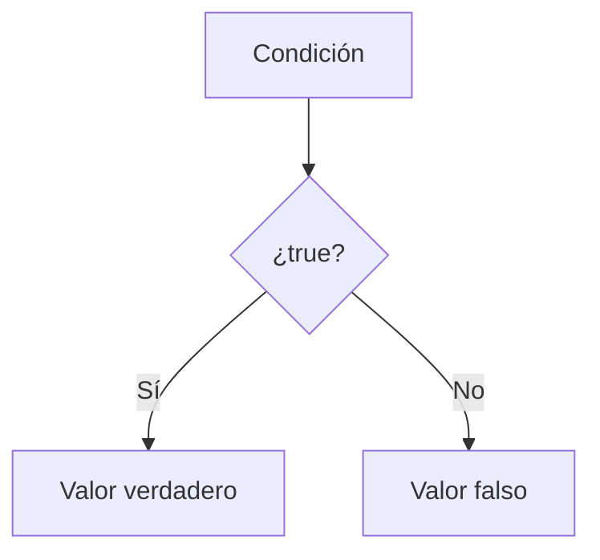
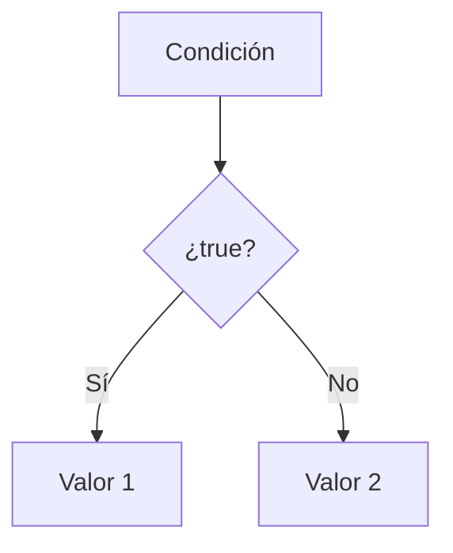

# Operador Ternario

## Introducción

Hasta ahora hemos utilizado:

```cpp
if
```

---

```cpp
if - else
```

---

para tomar decisiones.

Ejemplo:

```cpp
int edad {20};

if (edad >= 18)
{
    std::cout
        << "Mayor";
}
else
{
    std::cout
        << "Menor";
}
```

---

Sin embargo, cuando la decisión es simple, C++ ofrece una forma más compacta:

```cpp
? :
```

conocida como:

```text
Operador Ternario
```

---

# ¿Qué es el Operador Ternario?

Es un operador condicional que permite elegir entre dos valores.

---

## ¿Operador o Estructura de Control?

A diferencia de:

```cpp
if
```

y

```cpp
if - else
```

que son estructuras de control,

```cpp
? :
```

es un operador.

Esto significa que produce un valor y puede utilizarse dentro de expresiones.

Ejemplo:

```cpp
int mayor =
    a > b
        ? a
        : b;
```

El resultado de toda la expresión es:

```cpp
a
```

o

```cpp
b
```

según la condición.

---

## Sintaxis

```cpp
condicion
    ? valor_si_true
    : valor_si_false
```

---

## Visualización



---

# Primer Ejemplo

```cpp
#include <iostream>

int main()
{
    int edad {20};

    auto resultado =
        edad >= 18
            ? "Mayor"
            : "Menor";

    std::cout
        << resultado
        << '\n';

    return 0;
}
```

Salida:

```text
Mayor
```

---

## Evaluación

```cpp
edad >= 18
```

↓

```cpp
20 >= 18
```

↓

```cpp
true
```

↓

```cpp
"Mayor"
```

↓

```cpp
resultado = "Mayor"
```

---

# Equivalencia con if - else

## if - else

```cpp
std::string mensaje {};

if (edad >= 18)
{
    mensaje = "Mayor";
}
else
{
    mensaje = "Menor";
}
```

---

## Operador Ternario

```cpp
std::string mensaje =
    edad >= 18
        ? "Mayor"
        : "Menor";
```

---

Resultado:

```text
Exactamente el mismo
```

---

# ¿Por Qué se Llama Ternario?

Porque trabaja con tres elementos:

```text
Condición
Valor verdadero
Valor falso
```

---

Representación:

```cpp
condicion
    ? valor_true
    : valor_false
```

---

# El Operador Produce un Valor

La característica más importante del operador ternario es que produce un resultado.

Por ello puede utilizarse en:

```cpp
asignaciones
```

---

```cpp
inicializaciones
```

---

```cpp
expresiones
```

---

Ejemplo:

```cpp
int mayor =
    a > b
        ? a
        : b;
```

---

También:

```cpp
std::cout
    << (a > b ? a : b);
```

---

# Ejemplo con Números

```cpp
int a {10};
int b {20};

int mayor =
    a > b
        ? a
        : b;
```

Resultado:

```text
20
```

---

## Visualización

```text
a > b ?
 │
 ▼
false
 │
 ▼
b
```

---

# Uso con Strings

```cpp
std::string usuario {"admin"};

std::string acceso =
    usuario == "admin"
        ? "Permitido"
        : "Denegado";
```

Salida:

```text
Permitido
```

---

# Uso con bool

```cpp
bool activo {true};

std::string estado =
    activo
        ? "Activo"
        : "Inactivo";
```

Salida:

```text
Activo
```

---

# Uso Directamente en cout

No es obligatorio almacenar el resultado.

---

Ejemplo:

```cpp
std::cout
    << (edad >= 18
            ? "Mayor"
            : "Menor")
    << '\n';
```

Salida:

```text
Mayor
```

---

# Ejemplo Completo

```cpp
#include <iostream>

int main()
{
    int numero {15};

    std::cout
        << (numero % 2 == 0
                ? "Par"
                : "Impar")
        << '\n';

    return 0;
}
```

Salida:

```text
Impar
```

---

# Comparación

## if - else

```cpp
if (edad >= 18)
{
    mensaje = "Mayor";
}
else
{
    mensaje = "Menor";
}
```

Ventajas:

* Más legible.
* Mejor para lógica compleja.
* Permite múltiples instrucciones.

---

## Operador Ternario

```cpp
mensaje =
    edad >= 18
        ? "Mayor"
        : "Menor";
```

Ventajas:

* Más compacto.
* Ideal para decisiones simples.
* Produce un valor directamente.

---

# Tabla Comparativa

| Característica                   | if - else       | Operador Ternario |
| -------------------------------- | --------------- | ----------------- |
| Selección entre dos alternativas | Sí              | Sí                |
| Produce un valor                 | No directamente | Sí                |
| Permite bloques grandes          | Sí              | No                |
| Ideal para asignaciones          | No              | Sí                |
| Fácil de anidar                  | Sí              | No recomendable   |
| Legibilidad en lógica compleja   | Alta            | Baja              |

---

# Casos Adecuados

## Seleccionar un Valor

```cpp
int mayor =
    a > b
        ? a
        : b;
```

---

## Construir Mensajes

```cpp
std::string estado =
    activo
        ? "Activo"
        : "Inactivo";
```

---

## Mostrar Información

```cpp
std::cout
    << (es_par
            ? "Par"
            : "Impar");
```

---

# Casos No Recomendados

Evitar lógica compleja.

---

Incorrecto:

```cpp
resultado =
    condicion_1
        ? valor_1
        : condicion_2
            ? valor_2
            : condicion_3
                ? valor_3
                : valor_4;
```

---

Difícil de leer.

---

Preferir:

```cpp
if (...)
{
}
else if (...)
{
}
else
{
}
```

---

# Operadores Ternarios Anidados

Es posible escribir:

```cpp
auto resultado =
    nota >= 90
        ? "Excelente"
        : nota >= 70
            ? "Aprobado"
            : "Reprobado";
```

---

Pero normalmente:

```text
Reduce la legibilidad
```

---

Equivalente más legible:

```cpp
if (nota >= 90)
{
    resultado = "Excelente";
}
else if (nota >= 70)
{
    resultado = "Aprobado";
}
else
{
    resultado = "Reprobado";
}
```

---

# Precedencia y Paréntesis

Cuando el operador ternario aparece dentro de expresiones más grandes puede ser recomendable utilizar paréntesis.

Ejemplo:

```cpp
std::cout
    << (edad >= 18
            ? "Mayor"
            : "Menor");
```

Esto mejora la legibilidad y evita confusiones.

---

# Ejemplo de Selección

```cpp
int temperatura {35};

std::string mensaje =
    temperatura > 30
        ? "Hace calor"
        : "Temperatura normal";
```

Salida:

```text
Hace calor
```

---

# Buenas Prácticas

## Utilizarlo para Decisiones Simples

Correcto:

```cpp
auto mayor =
    a > b
        ? a
        : b;
```

---

## Evitar Ternarios Anidados

Preferir:

```cpp
if - else if
```

cuando existan muchas condiciones.

---

## Priorizar la Legibilidad

Si el código resulta difícil de leer:

```cpp
if
```

es una mejor opción.

---

## Utilizar Paréntesis en Expresiones Complejas

Correcto:

```cpp
std::cout
    << (condicion
            ? valor1
            : valor2);
```

---

# Error Común

Intentar reemplazar cualquier:

```cpp
if
```

por un operador ternario.

---

Aunque es válido escribir:

```cpp
condicion
    ? ejecutar_algo()
    : ejecutar_otra_cosa();
```

normalmente resulta menos legible que:

```cpp
if (condicion)
{
    ejecutar_algo();
}
else
{
    ejecutar_otra_cosa();
}
```

cuando las acciones son complejas.

---

# Visualización General



---

## Resumen

* El operador ternario utiliza la sintaxis `condición ? valor_true : valor_false`.
* Permite seleccionar entre dos valores.
* Es equivalente a un `if - else` simple.
* Produce un valor que puede utilizarse en expresiones.
* Resulta útil para asignaciones y expresiones cortas.
* Debe utilizarse cuando mejora la legibilidad.
* No es recomendable para lógica compleja o múltiples condiciones.
* Su principal ventaja es escribir decisiones simples de forma compacta.
