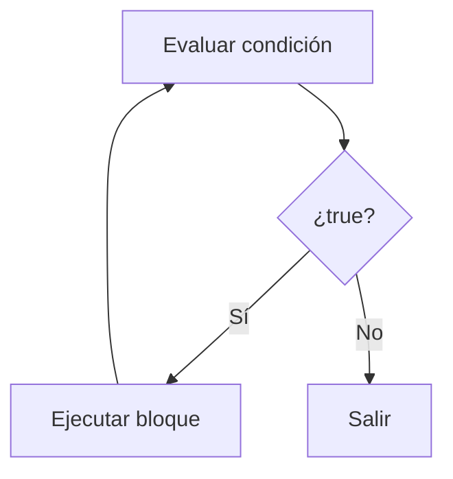
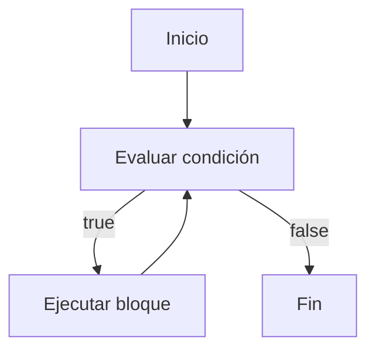
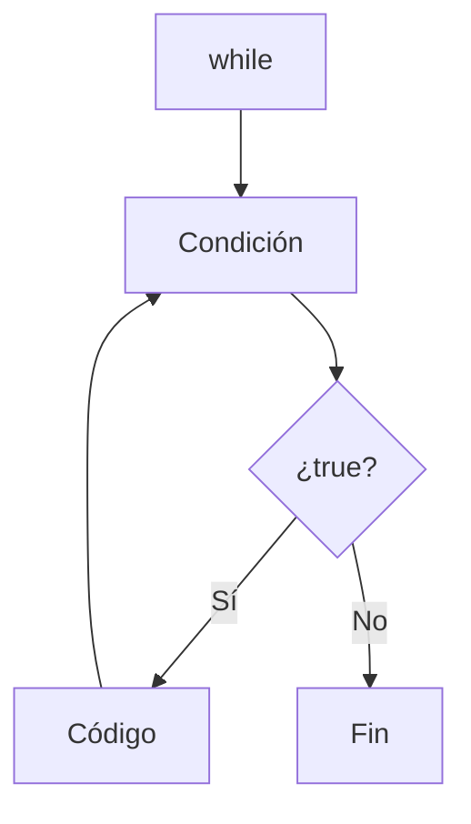

# while

## Introducción

Hasta ahora hemos estudiado estructuras de decisión:

```cpp
if
```

---

```cpp
if - else
```

---

```cpp
if - else if
```

---

```cpp
switch
```

---

Estas estructuras permiten elegir entre distintos caminos.

Sin embargo, muchas veces necesitamos repetir instrucciones.

Por ejemplo:

```text
Mostrar números.
Leer datos hasta que sean válidos.
Procesar elementos.
Repetir un menú.
```

Para ello C++ proporciona:

```cpp
while
```

---

# ¿Qué es while?

`while` ejecuta un bloque de código mientras una condición sea verdadera.

---

## Sintaxis

```cpp
while (condicion)
{
    // código
}
```

---

## Visualización



---

# Componentes de un while

La mayoría de los bucles `while` poseen tres elementos:

1. Inicialización.
2. Condición.
3. Actualización.

Ejemplo:

```cpp
int contador {1};      // Inicialización

while (contador <= 5)  // Condición
{
    std::cout
        << contador
        << '\n';

    ++contador;        // Actualización
}
```

---

# Primer Ejemplo

```cpp
#include <iostream>

int main()
{
    int contador {1};

    while (contador <= 5)
    {
        std::cout
            << contador
            << '\n';

        ++contador;
    }

    return 0;
}
```

Salida:

```text
1
2
3
4
5
```

---

# ¿Cómo Funciona?

Inicialmente:

```cpp
contador = 1
```

---

Primera evaluación:

```cpp
contador <= 5
```

↓

```cpp
1 <= 5
```

↓

```text
true
```

---

Se ejecuta el bloque.

---

Luego:

```cpp
++contador;
```

↓

```cpp
contador = 2
```

---

El proceso se repite.

---

## Tabla de Ejecución

| Iteración | contador | condición |
| --------- | -------- | --------- |
| 1         | 1        | true      |
| 2         | 2        | true      |
| 3         | 3        | true      |
| 4         | 4        | true      |
| 5         | 5        | true      |
| 6         | 6        | false     |

---

# Flujo de Ejecución

```text
contador = 1

1 <= 5 → true
Mostrar 1

2 <= 5 → true
Mostrar 2

3 <= 5 → true
Mostrar 3

4 <= 5 → true
Mostrar 4

5 <= 5 → true
Mostrar 5

6 <= 5 → false

Fin
```

---

# Contador

La variable que controla el bucle suele llamarse:

```text
contador
```

o

```text
indice
```

---

Ejemplo:

```cpp
int contador {0};
```

---

# Bucle Infinito

Observa:

```cpp
int contador {1};

while (contador <= 5)
{
    std::cout
        << contador
        << '\n';
}
```

---

Problema:

```cpp
contador
```

nunca cambia.

---

Resultado:

```text
1
1
1
1
1
...
```

---

El programa nunca termina.

---

## ¿Por Qué Ocurre?

La condición depende de:

```cpp
contador
```

pero el valor de:

```cpp
contador
```

nunca cambia.

Como consecuencia:

```cpp
contador <= 5
```

permanece siempre en:

```cpp
true
```

y el bucle continúa indefinidamente.

---

# Importancia de la Actualización

Normalmente un bucle necesita:

```text
Inicialización
Condición
Actualización
```

---

Ejemplo:

```cpp
int contador {1};

while (contador <= 5)
{
    std::cout
        << contador
        << '\n';

    ++contador;
}
```

---

Visualización:

```text
Inicializar
     │
     ▼
Evaluar
     │
     ▼
Ejecutar
     │
     ▼
Actualizar
     │
     └────► Evaluar
```

---

# Ejemplo Descendente

```cpp
int contador {5};

while (contador > 0)
{
    std::cout
        << contador
        << '\n';

    --contador;
}
```

Salida:

```text
5
4
3
2
1
```

---

# Uso con bool

```cpp
bool activo {true};

while (activo)
{
    std::cout
        << "Ejecutando\n";

    activo = false;
}
```

Salida:

```text
Ejecutando
```

---

# Leer Datos del Usuario

```cpp
int numero {};

while (numero != 10)
{
    std::cout
        << "Ingrese 10: ";

    std::cin >> numero;
}
```

---

Entrada:

```text
5
8
3
10
```

---

Salida:

```text
Ingrese 10:
Ingrese 10:
Ingrese 10:
Ingrese 10:
```

---

Cuando el usuario introduce:

```text
10
```

el bucle finaliza.

---

# Ejemplo de Menú

```cpp
int opcion {};

while (opcion != 4)
{
    std::cout
        << "1. Crear\n";

    std::cout
        << "2. Editar\n";

    std::cout
        << "3. Eliminar\n";

    std::cout
        << "4. Salir\n";

    std::cin >> opcion;
}
```

---

El menú se repite hasta seleccionar:

```text
4
```

---

# Condición Inicialmente Falsa

```cpp
int contador {10};

while (contador < 5)
{
    std::cout
        << contador
        << '\n';
}
```

---

Salida:

```text
(nada)
```

---

Porque:

```cpp
10 < 5
```

↓

```text
false
```

---

El bloque nunca se ejecuta.

---

# Condiciones Siempre Verdaderas

Ejemplo:

```cpp
while (true)
{
}
```

---

La condición nunca se vuelve falsa.

Por tanto:

```text
El bucle es infinito.
```

---

Este patrón se utiliza en algunos programas avanzados, pero debe emplearse con cuidado.

---

# Ejemplo Completo

```cpp
#include <iostream>

int main()
{
    int contador {1};

    while (contador <= 10)
    {
        std::cout
            << contador
            << '\n';

        ++contador;
    }

    return 0;
}
```

Salida:

```text
1
2
3
4
5
6
7
8
9
10
```

---

# while vs if

## if

```cpp
if (condicion)
{
}
```

---

Ejecuta:

```text
0 o 1 vez
```

---

## while

```cpp
while (condicion)
{
}
```

---

Ejecuta:

```text
0, 1 o muchas veces
```

---

# while vs for

## while

```cpp
while (contador <= 10)
{
    ++contador;
}
```

---

Se utiliza cuando:

```text
No sabemos cuántas iteraciones serán necesarias.
```

---

## for

```cpp
for (int i {1};
     i <= 10;
     ++i)
{
}
```

---

Se utiliza cuando:

```text
Conocemos la cantidad aproximada de iteraciones.
```

---

# Comparación

| Característica                  | if | while |
| ------------------------------- | -- | ----- |
| Evalúa condición                | Sí | Sí    |
| Repite código                   | No | Sí    |
| Puede ejecutarse 0 veces        | Sí | Sí    |
| Puede ejecutarse muchas veces   | No | Sí    |
| Puede producir bucles infinitos | No | Sí    |

---

# Diagrama de Flujo



---

# Buenas Prácticas

## Actualizar la Variable de Control

Correcto:

```cpp
++contador;
```

---

## Mantener Condiciones Claras

Correcto:

```cpp
while (contador <= 10)
{
}
```

---

## Evitar Bucles Infinitos Accidentales

Verificar siempre:

```text
¿La condición llegará a ser falsa?
```

---

## Utilizar Nombres Descriptivos

Correcto:

```cpp
int contador {};
```

---

```cpp
int intentos {};
```

---

# Error Común

Olvidar actualizar la condición.

---

Incorrecto:

```cpp
while (contador < 10)
{
    std::cout
        << contador
        << '\n';
}
```

---

Resultado:

```text
Bucle infinito
```

---

Correcto:

```cpp
while (contador < 10)
{
    std::cout
        << contador
        << '\n';

    ++contador;
}
```

---

# Visualización General



---

## Resumen

* `while` repite un bloque mientras una condición sea verdadera.
* La condición se evalúa antes de cada iteración.
* Un `while` puede ejecutarse cero veces.
* Un bucle suele estar formado por inicialización, condición y actualización.
* Si la condición nunca se vuelve falsa, se produce un bucle infinito.
* Si la condición es falsa desde el inicio, el bloque no se ejecuta.
* Olvidar actualizar la condición puede producir bucles infinitos.
* `while` es especialmente útil cuando la cantidad de iteraciones no se conoce de antemano.
* `for` suele ser más apropiado cuando el número de iteraciones es conocido.
* Es una de las estructuras fundamentales de repetición en C++.
