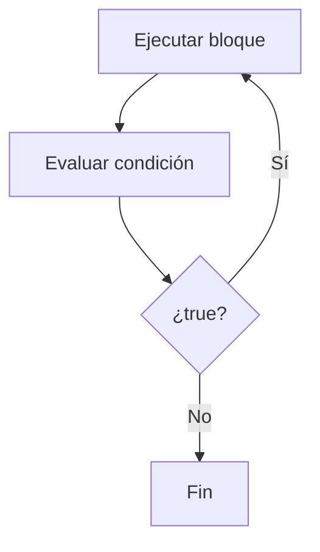
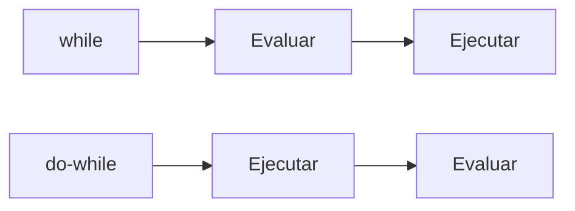
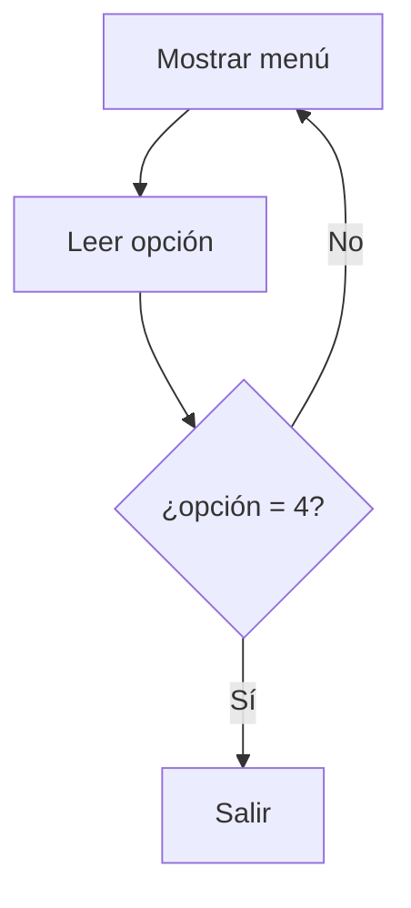

# do - while

## Introducción

En el tema anterior estudiamos:

```cpp
while
```

---

Recordemos su funcionamiento:

```cpp
while (condicion)
{
    // código
}
```

La condición se evalúa antes de ejecutar el bloque.

---

Esto significa que el cuerpo del bucle puede ejecutarse:

```text
0 veces
1 vez
muchas veces
```

---

Sin embargo, existen situaciones donde necesitamos ejecutar el bloque al menos una vez.

Para ello C++ proporciona:

```cpp
do - while
```

---

# ¿Qué es do - while?

`do - while` es una estructura de repetición que ejecuta primero el bloque y evalúa la condición después.

---

## Sintaxis

```cpp
do
{
    // código
}
while (condicion);
```

---

## Visualización



---

# Componentes de un do - while

La mayoría de los bucles `do - while` poseen tres elementos:

1. Inicialización.
2. Actualización.
3. Condición.

Ejemplo:

```cpp
int contador {1}; // Inicialización

do
{
    std::cout
        << contador
        << '\n';

    ++contador;   // Actualización
}
while (contador <= 5); // Condición
```

---

# Diferencia con while

## while

```cpp
while (condicion)
{
    // código
}
```

---

Primero:

```text
Evalúa
```

Luego:

```text
Ejecuta
```

---

## do - while

```cpp
do
{
    // código
}
while (condicion);
```

---

Primero:

```text
Ejecuta
```

Luego:

```text
Evalúa
```

---

# Comparación Visual



---

# Primer Ejemplo

```cpp
#include <iostream>

int main()
{
    int contador {1};

    do
    {
        std::cout
            << contador
            << '\n';

        ++contador;
    }
    while (contador <= 5);

    return 0;
}
```

Salida:

```text
1
2
3
4
5
```

---

# Flujo de Ejecución

Inicialmente:

```cpp
contador = 1
```

---

Se ejecuta el bloque:

```text
Mostrar 1
```

---

Luego:

```cpp
contador = 2
```

---

Se evalúa:

```cpp
contador <= 5
```

↓

```cpp
2 <= 5
```

↓

```text
true
```

---

El ciclo continúa.

---

## Tabla de Ejecución

| Iteración | contador mostrado | condición |
| --------- | ----------------- | --------- |
| 1         | 1                 | true      |
| 2         | 2                 | true      |
| 3         | 3                 | true      |
| 4         | 4                 | true      |
| 5         | 5                 | true      |
| 6         | —                 | false     |

---

# Ejecución Garantizada

La característica más importante de `do - while` es:

```text
El bloque se ejecuta al menos una vez.
```

---

Observa:

```cpp
int contador {10};

do
{
    std::cout
        << contador
        << '\n';
}
while (contador < 5);
```

Salida:

```text
10
```

---

Aunque:

```cpp
contador < 5
```

sea falso.

---

¿Por qué?

Porque la condición se evalúa después de ejecutar el bloque.

---

# Comparación Directa

## while

```cpp
int contador {10};

while (contador < 5)
{
    std::cout
        << contador
        << '\n';
}
```

Salida:

```text
(nada)
```

---

## do - while

```cpp
int contador {10};

do
{
    std::cout
        << contador
        << '\n';
}
while (contador < 5);
```

Salida:

```text
10
```

---

# Ejemplo de Menú

Uno de los usos más habituales.

```cpp
int opcion {};

do
{
    std::cout
        << "1. Crear\n";

    std::cout
        << "2. Editar\n";

    std::cout
        << "3. Eliminar\n";

    std::cout
        << "4. Salir\n";

    std::cin >> opcion;
}
while (opcion != 4);
```

---

## Flujo



---

# Validación de Datos

Otro uso frecuente.

```cpp
int edad {};

do
{
    std::cout
        << "Edad: ";

    std::cin >> edad;
}
while (edad < 0);
```

---

Entrada:

```text
-5
-2
10
```

---

Salida:

```text
Edad:
Edad:
Edad:
```

---

El bucle termina cuando la edad es válida.

---

# Bucle Infinito

Al igual que con `while`, es posible crear un bucle infinito.

---

Ejemplo:

```cpp
do
{
    std::cout
        << "Hola\n";
}
while (true);
```

---

Resultado:

```text
Hola
Hola
Hola
...
```

---

Nunca termina.

---

# Punto y Coma Final

Observa cuidadosamente:

```cpp
while (condicion);
```

---

Existe un:

```cpp
;
```

al final.

---

Es obligatorio.

---

Incorrecto:

```cpp
while (condicion)
```

---

Correcto:

```cpp
while (condicion);
```

---

# Ejemplo Completo

```cpp
#include <iostream>

int main()
{
    int numero {};

    do
    {
        std::cout
            << "Ingrese un numero positivo: ";

        std::cin >> numero;
    }
    while (numero <= 0);

    std::cout
        << "Numero valido\n";

    return 0;
}
```

---

Entrada:

```text
-10
0
5
```

---

Salida:

```text
Ingrese un numero positivo:
Ingrese un numero positivo:
Ingrese un numero positivo:
Numero valido
```

---

# do - while vs while

| Característica           | while         | do - while      |
| ------------------------ | ------------- | --------------- |
| Evalúa primero           | Sí            | No              |
| Ejecuta primero          | No            | Sí              |
| Puede ejecutarse 0 veces | Sí            | No              |
| Garantiza una ejecución  | No            | Sí              |
| Uso habitual             | Muy frecuente | Menos frecuente |
| Menús                    | Posible       | Muy común       |
| Validación de datos      | Posible       | Muy común       |

---

# ¿Cuándo Utilizar do - while?

Cuando el bloque de código deba ejecutarse al menos una vez.

---

Ejemplos:

```text
Menús
Validación de entradas
Solicitudes de confirmación
Reintentos
```

---

# Buenas Prácticas

## Utilizarlo Cuando la Primera Ejecución Sea Obligatoria

Correcto:

```cpp
do
{
}
while (...);
```

---

## Actualizar la Condición

Correcto:

```cpp
++contador;
```

---

## Recordar el Punto y Coma Final

Correcto:

```cpp
while (condicion);
```

---

## Evitar Bucles Infinitos Accidentales

Verificar siempre:

```text
¿La condición llegará a ser falsa?
```

---

# Error Común

Olvidar que la condición se evalúa al final.

---

Muchos principiantes esperan:

```cpp
do
{
}
while (false);
```

↓

```text
0 ejecuciones
```

---

Realidad:

```text
1 ejecución
```

---

Porque el bloque se ejecuta antes de comprobar la condición.

---

# Visualización General

```mermaid
flowchart TD
    A[do]
    B[Código]
    C[while(condición)]
    D{¿true?}
    E[Fin]

    A --> B
    B --> C
    C --> D
    D -->|Sí| B
    D -->|No| E
```

---

## Resumen

* `do - while` es una estructura de repetición.
* El bloque se ejecuta antes de evaluar la condición.
* Garantiza al menos una ejecución.
* Puede utilizarse para menús, validación y reintentos.
* La condición se encuentra al final del bucle.
* Requiere un punto y coma después del `while`.
* Puede producir bucles infinitos si la condición nunca se vuelve falsa.
* Su principal diferencia con `while` es que nunca ejecuta el bloque cero veces.
