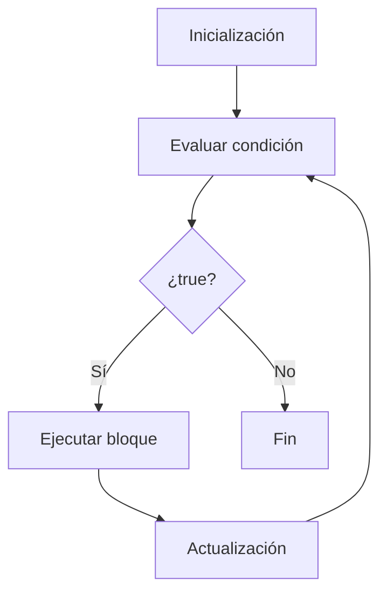
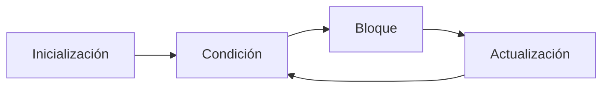

# for

## Introducción

En los temas anteriores estudiamos:

```cpp
while
```

---

y

```cpp
do - while
```

---

Ambos permiten repetir instrucciones.

Sin embargo, existe un patrón extremadamente común:

```text
Inicializar una variable
Comprobar una condición
Actualizar la variable
```

---

Ejemplo:

```cpp
int contador {1};

while (contador <= 5)
{
    std::cout
        << contador
        << '\n';

    ++contador;
}
```

---

Este patrón es tan frecuente que C++ proporciona una estructura específica:

```cpp
for
```

---

# ¿Qué es for?

`for` es una estructura de repetición que agrupa:

```text
Inicialización
Condición
Actualización
```

en una sola línea.

---

## Sintaxis

```cpp
for (inicializacion;
     condicion;
     actualizacion)
{
    // código
}
```

---

## Visualización



---

# Componentes del for

La cabecera del bucle contiene tres partes.

---

## Inicialización

```cpp
int contador {1};
```

Se ejecuta una sola vez al comenzar el bucle.

---

## Condición

```cpp
contador <= 5
```

Se evalúa antes de cada iteración.

Si es falsa:

```text
El bucle termina.
```

---

## Actualización

```cpp
++contador
```

Se ejecuta después de cada iteración.

---

# Primer Ejemplo

```cpp
#include <iostream>

int main()
{
    for (int contador {1};
         contador <= 5;
         ++contador)
    {
        std::cout
            << contador
            << '\n';
    }

    return 0;
}
```

Salida:

```text
1
2
3
4
5
```

---

# Flujo de Ejecución

Inicialmente:

```cpp
contador = 1
```

---

Se evalúa:

```cpp
contador <= 5
```

↓

```cpp
1 <= 5
```

↓

```text
true
```

---

Se ejecuta el bloque.

---

Después:

```cpp
++contador
```

↓

```cpp
contador = 2
```

---

El proceso continúa hasta que:

```cpp
contador <= 5
```

sea falso.

---

## Tabla de Iteraciones

| Iteración | contador | condición |
| --------- | -------- | --------- |
| 1         | 1        | true      |
| 2         | 2        | true      |
| 3         | 3        | true      |
| 4         | 4        | true      |
| 5         | 5        | true      |
| 6         | 6        | false     |

---

# Contar hacia Adelante

```cpp
for (int i {1};
     i <= 10;
     ++i)
{
    std::cout
        << i
        << '\n';
}
```

Salida:

```text
1
2
3
4
5
6
7
8
9
10
```

---

# Contar hacia Atrás

```cpp
for (int i {10};
     i >= 1;
     --i)
{
    std::cout
        << i
        << '\n';
}
```

Salida:

```text
10
9
8
7
6
5
4
3
2
1
```

---

# Saltos Personalizados

No es obligatorio avanzar de uno en uno.

---

Ejemplo:

```cpp
for (int i {0};
     i <= 10;
     i += 2)
{
    std::cout
        << i
        << '\n';
}
```

Salida:

```text
0
2
4
6
8
10
```

---

## Visualización

```text
0 → 2 → 4 → 6 → 8 → 10
```

---

# Tabla de Multiplicar

```cpp
for (int i {1};
     i <= 10;
     ++i)
{
    std::cout
        << "5 x "
        << i
        << " = "
        << 5 * i
        << '\n';
}
```

Salida:

```text
5 x 1 = 5
5 x 2 = 10
...
5 x 10 = 50
```

---

# Alcance de la Variable

La variable declarada dentro del `for` existe únicamente dentro del bucle.

---

Ejemplo:

```cpp
for (int i {0};
     i < 5;
     ++i)
{
}
```

---

Fuera del bucle:

```cpp
std::cout << i;
```

---

Resultado:

```text
Error de compilación
```

---

## Visualización

```text
for
│
├── i existe aquí
│
└── fuera del for
      i no existe
```

---

# Condición Inicialmente Falsa

```cpp
for (int i {10};
     i < 5;
     ++i)
{
    std::cout
        << i
        << '\n';
}
```

Salida:

```text
(nada)
```

---

Porque:

```cpp
10 < 5
```

↓

```text
false
```

---

El bloque nunca se ejecuta.

---

# Bucle Infinito

```cpp
for (;;)
{
    std::cout
        << "Hola\n";
}
```

---

Visualización:

```text
Sin condición
     │
     ▼
Siempre true
```

---

Resultado:

```text
Hola
Hola
Hola
...
```

---

Nunca termina.

---

# Recorrer un String

```cpp
std::string nombre {"Juan"};
```

---

```cpp
for (std::size_t i {0};
     i < nombre.size();
     ++i)
{
    std::cout
        << nombre[i]
        << '\n';
}
```

Salida:

```text
J
u
a
n
```

---

## Visualización

| Índice | Carácter |
| ------ | -------- |
| 0      | J        |
| 1      | u        |
| 2      | a        |
| 3      | n        |

---

# Ejemplo Completo

```cpp
#include <iostream>

int main()
{
    for (int i {1};
         i <= 5;
         ++i)
    {
        std::cout
            << "Iteracion "
            << i
            << '\n';
    }

    return 0;
}
```

Salida:

```text
Iteracion 1
Iteracion 2
Iteracion 3
Iteracion 4
Iteracion 5
```

---

# Comparación

## while

```cpp
int i {0};

while (i < 10)
{
    ++i;
}
```

---

## for

```cpp
for (int i {0};
     i < 10;
     ++i)
{
}
```

---

Ambos producen el mismo resultado.

---

# for vs while vs do - while

| Característica           | for | while   | do - while    |
| ------------------------ | --- | ------- | ------------- |
| Evalúa antes             | Sí  | Sí      | No            |
| Puede ejecutarse 0 veces | Sí  | Sí      | No            |
| Garantiza una ejecución  | No  | No      | Sí            |
| Tiene contador integrado | Sí  | No      | No            |
| Ideal para contadores    | Sí  | Posible | Poco habitual |
| Ideal para menús         | No  | Sí      | Sí            |
| Ideal para validación    | No  | Sí      | Sí            |

---

# ¿Cuándo Utilizar for?

Cuando conocemos:

```text
Cantidad de iteraciones
```

o existe un:

```text
Contador
```

---

Ejemplos:

* Mostrar números.
* Recorrer strings.
* Recorrer arreglos.
* Recorrer colecciones.

---

# ¿Cuándo Utilizar while?

Cuando no conocemos cuántas iteraciones serán necesarias.

---

Ejemplos:

* Menús.
* Validación de datos.
* Esperar una condición.

---

# Buenas Prácticas

## Mantener Simples las Tres Partes

Correcto:

```cpp
for (int i {0};
     i < 10;
     ++i)
{
}
```

---

## Utilizar ++i

Convención habitual:

```cpp
++i
```

---

## Evitar Bucles Infinitos Accidentales

Preguntarse siempre:

```text
¿La condición llegará a ser falsa?
```

---

## Utilizar Nombres Descriptivos

Correcto:

```cpp
for (int indice {0};
     indice < total;
     ++indice)
{
}
```

---

# Error Común

Escribir:

```cpp
for (int i {0};
     i <= 10;
     ++i)
{
}
```

cuando realmente se necesitan:

```text
10 iteraciones
```

---

Porque produce:

```text
11 iteraciones
```

---

Comparación:

```cpp
i < 10
```

↓

```text
10 iteraciones
```

---

```cpp
i <= 10
```

↓

```text
11 iteraciones
```

---

# Visualización General



---

## Resumen

* `for` es una estructura de repetición.
* Agrupa inicialización, condición y actualización.
* Es ideal cuando existe un contador.
* La condición se evalúa antes de cada iteración.
* Si la condición es falsa inicialmente, el bloque no se ejecuta.
* Puede utilizarse para recorrer strings y colecciones.
* Permite expresar de forma clara los bucles controlados por contador.
* Es uno de los bucles más utilizados en C++ moderno.
