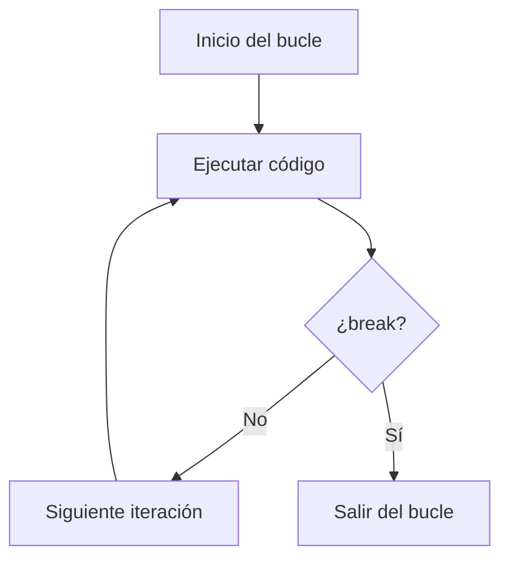
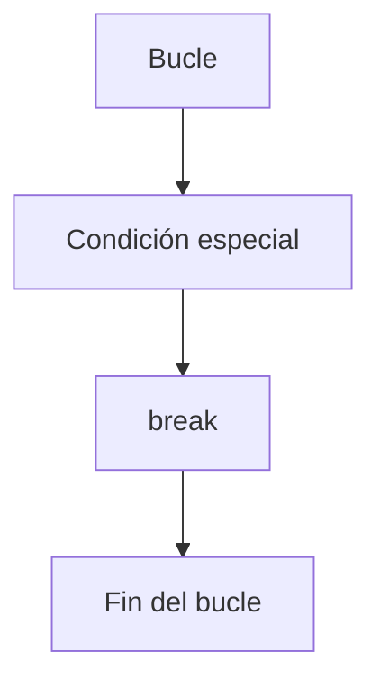

# break

## Introducción

Hasta ahora hemos estudiado:

```cpp
while
```

---

```cpp
do - while
```

---

```cpp
for
```

---

Normalmente un bucle finaliza cuando su condición se vuelve falsa.

Ejemplo:

```cpp
for (int i {1};
     i <= 5;
     ++i)
{
    std::cout
        << i
        << '\n';
}
```

Salida:

```text
1
2
3
4
5
```

---

Sin embargo, en algunas situaciones necesitamos terminar un bucle antes de que la condición se vuelva falsa.

Para ello C++ proporciona:

```cpp
break
```

---

# ¿Qué es break?

`break` finaliza inmediatamente el bucle actual.

Cuando se ejecuta:

```cpp
break;
```

la ejecución abandona el bucle y continúa con la siguiente instrucción después del mismo.

---

## Sintaxis

```cpp
break;
```

---

## Visualización

```text
Bucle
  │
  ▼
break
  │
  ▼
Salir del bucle
```

---

## Diagrama General



---

# Primer Ejemplo

```cpp
#include <iostream>

int main()
{
    for (int i {1};
         i <= 10;
         ++i)
    {
        if (i == 5)
        {
            break;
        }

        std::cout
            << i
            << '\n';
    }

    return 0;
}
```

Salida:

```text
1
2
3
4
```

---

# ¿Qué Ocurrió?

Cuando:

```cpp
i == 5
```

---

se ejecuta:

```cpp
break;
```

---

y el bucle termina inmediatamente.

---

## Flujo de Ejecución

```text
i = 1
Mostrar 1

i = 2
Mostrar 2

i = 3
Mostrar 3

i = 4
Mostrar 4

i = 5
break

Fin
```

---

## Tabla de Iteraciones

| Iteración | i | ¿i == 5? | Acción    |
| --------- | - | -------- | --------- |
| 1         | 1 | No       | Mostrar 1 |
| 2         | 2 | No       | Mostrar 2 |
| 3         | 3 | No       | Mostrar 3 |
| 4         | 4 | No       | Mostrar 4 |
| 5         | 5 | Sí       | `break`   |

---

# break en while

También puede utilizarse en:

```cpp
while
```

---

## Ejemplo

```cpp
int contador {1};

while (true)
{
    std::cout
        << contador
        << '\n';

    if (contador == 5)
    {
        break;
    }

    ++contador;
}
```

Salida:

```text
1
2
3
4
5
```

---

## Visualización

```text
while(true)
     │
     ▼
contador == 5 ?
     │
  No ▼ Sí
     │
     └──► break
```

---

# break en do - while

```cpp
int contador {1};

do
{
    std::cout
        << contador
        << '\n';

    if (contador == 3)
    {
        break;
    }

    ++contador;
}
while (true);
```

Salida:

```text
1
2
3
```

---

# Salida Anticipada

Una característica importante de `break` es que permite abandonar un bucle antes de completar todas sus iteraciones.

Esto se conoce como:

```text
Salida anticipada
```

---

Ejemplo:

```cpp
for (int i {1};
     i <= 1000;
     ++i)
{
    if (i == 3)
    {
        break;
    }
}
```

---

Aunque el bucle estaba preparado para:

```text
1000 iteraciones
```

---

solo ejecuta:

```text
3 iteraciones
```

---

# Búsqueda

Uno de los usos más frecuentes.

---

Supongamos:

```cpp
std::string texto {"Hola"};
```

---

Queremos encontrar:

```text
o
```

---

```cpp
for (char caracter : texto)
{
    if (caracter == 'o')
    {
        std::cout
            << "Encontrado\n";

        break;
    }
}
```

Salida:

```text
Encontrado
```

---

¿Por qué usar break?

Porque una vez encontrado:

```text
No es necesario seguir buscando
```

---

## Visualización

```text
Hola

H o l a
│
▼

¿Es 'o'?
No

H o l a
  │
  ▼

¿Es 'o'?
Sí

break
```

---

# Menús

Otro uso habitual.

---

```cpp
int opcion {};

while (true)
{
    std::cin >> opcion;

    if (opcion == 0)
    {
        break;
    }
}
```

---

El bucle termina cuando el usuario introduce:

```text
0
```

---

# break Solo Afecta al Bucle Actual

Observa:

```cpp
for (int i {1};
     i <= 3;
     ++i)
{
    for (int j {1};
         j <= 3;
         ++j)
    {
        break;
    }
}
```

---

El:

```cpp
break
```

solo termina:

```cpp
for (int j ...)
```

---

No termina:

```cpp
for (int i ...)
```

---

## Visualización

```text
for externo
    │
    └── for interno
             │
             ▼
           break
             │
             ▼
     sale del interno
```

---

# Ejemplo con Bucles Anidados

```cpp
for (int i {1};
     i <= 3;
     ++i)
{
    for (int j {1};
         j <= 3;
         ++j)
    {
        if (j == 2)
        {
            break;
        }

        std::cout
            << i
            << ", "
            << j
            << '\n';
    }
}
```

Salida:

```text
1, 1
2, 1
3, 1
```

---

Porque el `break` únicamente finaliza el bucle interno.

---

# Bucle Infinito Controlado

A veces se utiliza:

```cpp
while (true)
{
}
```

---

junto con:

```cpp
break;
```

---

Ejemplo:

```cpp
while (true)
{
    int numero {};

    std::cin >> numero;

    if (numero == 0)
    {
        break;
    }
}
```

---

Visualización:

```text
while(true)
     │
     ▼
¿numero == 0?
     │
  No ▼ Sí
     │
     └──► break
```

---

# break vs return

Es importante no confundir ambos.

---

## break

```cpp
while (true)
{
    break;
}
```

Resultado:

```text
Sale del bucle
El programa continúa
```

---

## return

```cpp
while (true)
{
    return 0;
}
```

Resultado:

```text
Termina la función
Termina el programa
```

---

## Comparación

| Instrucción     | Sale del bucle | Sale de la función |
| --------------- | -------------- | ------------------ |
| Condición falsa | Sí             | No                 |
| `break`         | Sí             | No                 |
| `return`        | Sí             | Sí                 |

---

# break y switch

Recordemos:

```cpp
switch (opcion)
{
    case 1:
        break;
}
```

---

En un `switch`:

```cpp
break
```

sale del bloque `switch`.

---

En un bucle:

```cpp
break
```

sale del bucle.

---

## Visualización

```text
switch
   │
   ▼
case 2
   │
   ▼
"Dos"
   │
   ▼
break
   │
   ▼
Salir del switch
```

---

# Ejemplo Completo

```cpp
#include <iostream>

int main()
{
    for (int i {1};
         i <= 10;
         ++i)
    {
        if (i == 6)
        {
            break;
        }

        std::cout
            << i
            << '\n';
    }

    return 0;
}
```

Salida:

```text
1
2
3
4
5
```

---

# ¿Cuándo Utilizar break?

Cuando:

* Se encuentra un resultado.
* Se detecta un error.
* El usuario desea salir.
* La tarea ya está completada.

---

Ejemplos:

```text
Buscar un elemento
Salir de un menú
Cancelar una operación
Detener una lectura
```

---

# ¿Cuándo Evitar break?

Si el bucle puede expresarse claramente mediante su condición.

---

Menos claro:

```cpp
while (true)
{
    if (contador > 10)
    {
        break;
    }
}
```

---

Más claro:

```cpp
while (contador <= 10)
{
}
```

---

# Buenas Prácticas

## Utilizar break para Salidas Excepcionales

Correcto:

```cpp
if (error)
{
    break;
}
```

---

## Mantener la Legibilidad

El objetivo del bucle debe seguir siendo evidente.

---

## No Abusar de break

Demasiados:

```cpp
break;
break;
break;
```

pueden dificultar la comprensión del flujo.

---

## Preferir Condiciones Claras

Si la condición del bucle expresa correctamente cuándo debe terminar, suele ser mejor que depender exclusivamente de `break`.

---

# Error Común

Pensar que:

```cpp
break;
```

termina el programa.

---

Realidad:

```text
Solo termina el bucle o switch actual.
```

---

Para terminar una función se utiliza:

```cpp
return;
```

---

# Visualización General



---

## Resumen

* `break` finaliza inmediatamente el bucle actual.
* Puede utilizarse en `for`, `while` y `do - while`.
* También se utiliza en estructuras `switch`.
* Permite realizar salidas anticipadas.
* Solo afecta al bucle o switch más cercano.
* No finaliza el programa completo.
* Debe utilizarse cuando mejora la claridad del código.
* Es una herramienta fundamental para controlar la ejecución de bucles.
