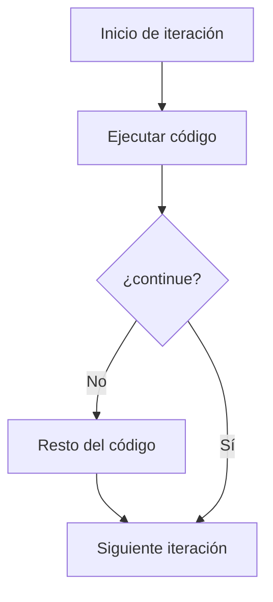
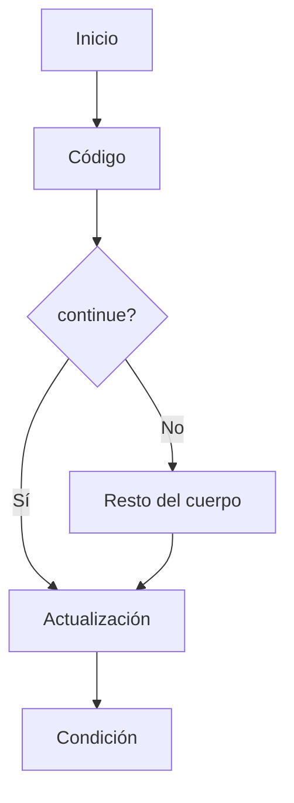
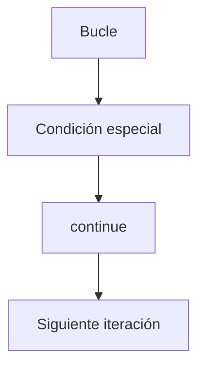

# continue

## Introducción

En el tema anterior estudiamos:

```cpp
break
```

---

Recordemos:

```cpp
break;
```

↓

```text
Finaliza el bucle inmediatamente.
```

---

Sin embargo, existe otra situación muy común.

Queremos:

```text
Ignorar una iteración
```

pero continuar ejecutando el resto del bucle.

Para ello C++ proporciona:

```cpp
continue
```

---

# ¿Qué es continue?

`continue` finaliza la iteración actual y pasa directamente a la siguiente.

Cuando se ejecuta:

```cpp
continue;
```

el resto del código de la iteración actual se omite.

---

## Sintaxis

```cpp
continue;
```

---

## Visualización

```text
Iteración actual
       │
       ▼
   continue
       │
       ▼
Siguiente iteración
```

---

## Diagrama General



---

# Diferencia con break

## break

```cpp
break;
```

↓

```text
Sale completamente del bucle.
```

---

## continue

```cpp
continue;
```

↓

```text
Salta a la siguiente iteración.
```

---

## Comparación Visual

### break

```text
Bucle
  │
  ▼
break
  │
  ▼
Fin del bucle
```

---

### continue

```text
Bucle
  │
  ▼
continue
  │
  ▼
Siguiente iteración
```

---

# Primer Ejemplo

```cpp
#include <iostream>

int main()
{
    for (int i {1};
         i <= 5;
         ++i)
    {
        if (i == 3)
        {
            continue;
        }

        std::cout
            << i
            << '\n';
    }

    return 0;
}
```

Salida:

```text
1
2
4
5
```

---

# ¿Qué Ocurrió?

Cuando:

```cpp
i == 3
```

---

se ejecuta:

```cpp
continue;
```

---

Por lo tanto:

```cpp
std::cout << i;
```

no se ejecuta.

---

El bucle continúa normalmente con:

```cpp
i == 4
```

---

# Flujo de Ejecución

```text
i = 1
Mostrar 1

i = 2
Mostrar 2

i = 3
continue

i = 4
Mostrar 4

i = 5
Mostrar 5
```

---

## Tabla de Iteraciones

| Iteración | i | ¿i == 3? | Acción    |
| --------- | - | -------- | --------- |
| 1         | 1 | No       | Mostrar 1 |
| 2         | 2 | No       | Mostrar 2 |
| 3         | 3 | Sí       | continue  |
| 4         | 4 | No       | Mostrar 4 |
| 5         | 5 | No       | Mostrar 5 |

---

# continue en for

Cuando se ejecuta `continue` dentro de un `for`:

1. Se omite el resto del cuerpo.
2. Se ejecuta la actualización.
3. Se evalúa nuevamente la condición.

---

## Visualización



---

# continue en while

También puede utilizarse en:

```cpp
while
```

---

## Ejemplo

```cpp
int contador {0};

while (contador < 5)
{
    ++contador;

    if (contador == 3)
    {
        continue;
    }

    std::cout
        << contador
        << '\n';
}
```

Salida:

```text
1
2
4
5
```

---

## Flujo

Cuando:

```cpp
contador == 3
```

↓

```cpp
continue;
```

↓

```text
Se vuelve a evaluar la condición del while.
```

---

# continue en do - while

```cpp
int contador {0};

do
{
    ++contador;

    if (contador == 3)
    {
        continue;
    }

    std::cout
        << contador
        << '\n';
}
while (contador < 5);
```

Salida:

```text
1
2
4
5
```

---

# Filtrar Valores

Uno de los usos más comunes.

---

Mostrar solamente números impares:

```cpp
for (int i {1};
     i <= 10;
     ++i)
{
    if (i % 2 == 0)
    {
        continue;
    }

    std::cout
        << i
        << '\n';
}
```

Salida:

```text
1
3
5
7
9
```

---

## Visualización

```text
1 → mostrar
2 → continue
3 → mostrar
4 → continue
5 → mostrar
...
```

---

# Procesar Solo Algunos Elementos

```cpp
std::string texto {"Hola Mundo"};
```

---

Ignorar espacios:

```cpp
for (char caracter : texto)
{
    if (caracter == ' ')
    {
        continue;
    }

    std::cout
        << caracter
        << '\n';
}
```

Salida:

```text
H
o
l
a
M
u
n
d
o
```

---

# Validaciones

```cpp
for (int i {1};
     i <= 10;
     ++i)
{
    if (i < 5)
    {
        continue;
    }

    std::cout
        << i
        << '\n';
}
```

Salida:

```text
5
6
7
8
9
10
```

---

# continue No Sale del Bucle

Observa:

```cpp
for (int i {1};
     i <= 5;
     ++i)
{
    if (i == 3)
    {
        continue;
    }

    std::cout
        << i
        << '\n';
}
```

---

El bucle sigue ejecutándose.

---

Resultado:

```text
1
2
4
5
```

---

No termina en:

```text
3
```

---

# Comparación Directa

## break

```cpp
for (int i {1};
     i <= 5;
     ++i)
{
    if (i == 3)
    {
        break;
    }

    std::cout
        << i
        << '\n';
}
```

Salida:

```text
1
2
```

---

## continue

```cpp
for (int i {1};
     i <= 5;
     ++i)
{
    if (i == 3)
    {
        continue;
    }

    std::cout
        << i
        << '\n';
}
```

Salida:

```text
1
2
4
5
```

---

# break vs continue

| Instrucción | Sale del bucle | Salta iteración | Continúa ejecutando el bucle |
| ----------- | -------------- | --------------- | ---------------------------- |
| `break`     | Sí             | No              | No                           |
| `continue`  | No             | Sí              | Sí                           |

---

# Ejemplo Completo

```cpp
#include <iostream>

int main()
{
    for (int i {1};
         i <= 10;
         ++i)
    {
        if (i % 2 == 0)
        {
            continue;
        }

        std::cout
            << i
            << '\n';
    }

    return 0;
}
```

Salida:

```text
1
3
5
7
9
```

---

# ¿Cuándo Utilizar continue?

Cuando:

* Deseamos ignorar ciertos casos.
* Estamos filtrando elementos.
* Queremos evitar bloques anidados innecesarios.
* Solo algunos valores deben procesarse.

---

Ejemplos:

```text
Ignorar números pares
Ignorar espacios
Ignorar datos inválidos
Ignorar registros vacíos
```

---

# ¿Cuándo Evitar continue?

Si hace que el flujo sea difícil de seguir.

---

Menos claro:

```cpp
if (...)
{
    continue;
}

if (...)
{
    continue;
}

if (...)
{
    continue;
}
```

---

Más claro:

```cpp
if (condicion_valida)
{
    // procesar
}
```

---

# Buenas Prácticas

## Utilizar continue para Filtrado

Correcto:

```cpp
if (valor_invalido)
{
    continue;
}
```

---

## Mantener la Legibilidad

El objetivo del bucle debe seguir siendo evidente.

---

## No Abusar de continue

Demasiados puntos de salida pueden dificultar la comprensión del flujo.

---

## Revisar while con Cuidado

En `while` y `do-while`, verificar siempre que la variable de control siga actualizándose.

---

# Error Común

Olvidar actualizar la variable de control en un `while`.

---

Incorrecto:

```cpp
while (contador < 10)
{
    if (contador == 5)
    {
        continue;
    }

    ++contador;
}
```

---

Problema:

```text
Bucle infinito
```

---

Porque cuando:

```cpp
contador == 5
```

---

se ejecuta:

```cpp
continue;
```

---

y nunca se alcanza:

```cpp
++contador;
```

---

Correcto:

```cpp
++contador;

if (contador == 5)
{
    continue;
}
```

---

# Visualización General



---

## Resumen

* `continue` finaliza la iteración actual.
* El bucle continúa ejecutándose normalmente.
* Puede utilizarse en `for`, `while` y `do-while`.
* Es útil para ignorar elementos o casos específicos.
* No finaliza el bucle completo.
* Su comportamiento es diferente al de `break`.
* En un `for`, pasa directamente a la actualización.
* En un `while` o `do-while`, vuelve a evaluar la condición.
* Debe utilizarse cuando mejora la claridad de la lógica del bucle.
* Es una herramienta fundamental para controlar el flujo dentro de las iteraciones.
