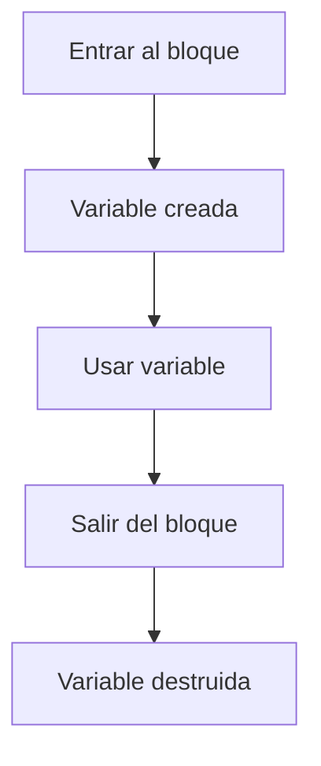
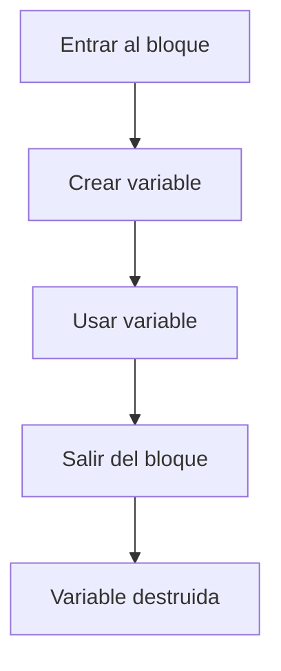

# Scope en Estructuras de Control

## Introducción

En el módulo de variables estudiamos:

```cpp
scope
```

o

```text
alcance
```

---

Recordemos:

```text
El alcance determina dónde una variable puede utilizarse.
```

---

Ahora veremos cómo funciona el alcance dentro de:

```cpp
if
else
switch
for
while
do-while
```

---

# ¿Qué es el Scope?

El *scope* define la región del programa donde un nombre es visible.

---

Ejemplo:

```cpp
int edad {20};
```

Mientras la variable esté dentro de su alcance:

```cpp
std::cout << edad;
```

es válido.

---

Fuera de su alcance:

```cpp
std::cout << edad;
```

produce:

```text
Error de compilación
```

---

# Regla Fundamental

Toda variable declarada dentro de un bloque:

```cpp
{
}
```

solo existe dentro de ese bloque.

---

## Visualización

```cpp
{
    int valor {10};
}
```

↓

```text
valor existe aquí
```

---

Fuera:

```text
valor no existe
```

---

## Diagrama General



---

# Scope en if

## Ejemplo

```cpp
if (true)
{
    int numero {10};

    std::cout
        << numero
        << '\n';
}
```

Correcto.

---

## Visualización

```text
if
{
    numero
}
```

---

Dentro:

```text
Visible
```

---

Fuera:

```text
Invisible
```

---

# Error Común

```cpp
if (true)
{
    int numero {10};
}

std::cout
    << numero
    << '\n';
```

---

Resultado:

```text
Error de compilación
```

---

Porque:

```cpp
numero
```

fue destruida al salir del bloque.

---

# Scope en if - else

Cada bloque tiene su propio alcance.

---

## Ejemplo

```cpp
if (true)
{
    int a {10};
}
else
{
    int b {20};
}
```

---

Visualización:

```text
if
{
    a
}

else
{
    b
}
```

---

Las variables:

```cpp
a
```

y

```cpp
b
```

solo existen dentro de sus respectivos bloques.

---

# Variables con el Mismo Nombre

Es posible declarar variables con el mismo nombre en distintos bloques.

---

## Ejemplo

```cpp
if (true)
{
    int valor {10};
}
else
{
    int valor {20};
}
```

---

Esto es válido.

---

Porque cada bloque posee un alcance independiente.

---

# Scope en for

Una característica importante.

---

## Ejemplo

```cpp
for (int i {0};
     i < 5;
     ++i)
{
    std::cout
        << i
        << '\n';
}
```

---

La variable:

```cpp
i
```

solo existe durante la ejecución del `for`.

---

## Error Común

```cpp
for (int i {0};
     i < 5;
     ++i)
{
}

std::cout
    << i;
```

---

Resultado:

```text
Error de compilación
```

---

Porque:

```cpp
i
```

ya no existe.

---

## Visualización

```text
for
{
    i
}
```

↓

```text
Fin del for
```

↓

```text
i destruida
```

---

# Scope en while

Depende de dónde se declare la variable.

---

## Declaración Externa

```cpp
int contador {0};

while (contador < 5)
{
    ++contador;
}
```

---

Después del bucle:

```cpp
std::cout
    << contador;
```

---

Es válido.

---

Visualización:

```text
contador
│
├── while
│
└── sigue existiendo
```

---

## Declaración Interna

```cpp
while (true)
{
    int valor {10};
}
```

---

La variable:

```cpp
valor
```

se crea al comenzar cada iteración y se destruye al finalizarla.

---

# Scope en do - while

Funciona igual que cualquier bloque.

---

## Ejemplo

```cpp
do
{
    int valor {10};
}
while (false);
```

---

Fuera del bloque:

```cpp
valor
```

no existe.

---

# Scope en switch

Este caso requiere atención especial.

---

## Importante

Los bloques:

```cpp
case
```

no crean automáticamente un alcance independiente.

---

Ejemplo problemático:

```cpp
switch (opcion)
{
    case 1:
        int valor {10};
        break;

    case 2:
        int otro {20};
        break;
}
```

---

Esto puede generar errores de compilación.

---

# Recomendación

Crear bloques explícitos.

---

Correcto:

```cpp
switch (opcion)
{
    case 1:
    {
        int valor {10};

        break;
    }

    case 2:
    {
        int valor {20};

        break;
    }
}
```

---

Ahora cada `case` tiene su propio alcance.

---

## Visualización

```text
switch
{
    case 1
    {
        valor
    }

    case 2
    {
        valor
    }
}
```

---

# Shadowing

Es posible ocultar una variable mediante otra con el mismo nombre.

---

## Ejemplo

```cpp
int valor {100};

if (true)
{
    int valor {10};

    std::cout
        << valor
        << '\n';
}
```

Salida:

```text
10
```

---

La variable interna oculta temporalmente a la externa.

---

## Visualización

```text
valor = 100

if
{
    valor = 10
}
```

---

Dentro del bloque:

```text
Se utiliza 10
```

---

Fuera del bloque:

```text
Se utiliza 100
```

---

# ¿Es Recomendable?

Generalmente:

```text
No
```

---

Porque puede generar confusión.

---

Preferir:

```cpp
int valor_total {100};

if (true)
{
    int valor_local {10};
}
```

---

# Scope y Lifetime

Son conceptos relacionados pero distintos.

---

## Scope

```text
Dónde puede utilizarse.
```

---

## Lifetime

```text
Cuánto tiempo existe.
```

---

## Ejemplo

```cpp
{
    int numero {10};
}
```

---

Mientras el bloque está activo:

```text
Scope: visible
Lifetime: existe
```

---

Al salir:

```text
Scope: no visible
Lifetime: finalizado
```

---

# Comparación

| Concepto | Significado                       |
| -------- | --------------------------------- |
| Scope    | Dónde puede usarse una variable   |
| Lifetime | Cuánto tiempo existe una variable |

---

# Ejemplo Completo

```cpp
#include <iostream>

int main()
{
    for (int i {1};
         i <= 3;
         ++i)
    {
        int cuadrado {i * i};

        std::cout
            << cuadrado
            << '\n';
    }

    return 0;
}
```

Salida:

```text
1
4
9
```

---

Variables:

```cpp
i
```

y

```cpp
cuadrado
```

desaparecen al finalizar el bucle.

---

# Buenas Prácticas

## Declarar Variables en el Menor Scope Posible

Correcto:

```cpp
if (condicion)
{
    int resultado {};
}
```

---

Evitar:

```cpp
int resultado {};

if (condicion)
{
}
```

cuando no sea necesario.

---

## Evitar Shadowing

Preferir nombres distintos.

---

## Limitar la Vida de las Variables

Mientras menos alcance tengan:

```text
Menos errores potenciales.
```

---

## Utilizar Variables de Control Locales

Correcto:

```cpp
for (int i {0};
     i < 10;
     ++i)
{
}
```

---

# Error Común

Pensar que una variable declarada dentro de:

```cpp
if
```

o

```cpp
for
```

existe fuera del bloque.

---

Incorrecto:

```cpp
if (true)
{
    int edad {20};
}

std::cout
    << edad;
```

---

Resultado:

```text
Error de compilación
```

---

# Visualización General



---

# Tabla Resumen

| Estructura | Variable declarada dentro | Visible fuera |
| ---------- | ------------------------- | ------------- |
| `if`       | Sí                        | No            |
| `else`     | Sí                        | No            |
| `for`      | Sí                        | No            |
| `while`    | Sí                        | No            |
| `do-while` | Sí                        | No            |
| `switch`   | Sí (si se crea un bloque) | No            |

---

## Resumen

* El *scope* determina dónde una variable es visible.
* Las variables declaradas dentro de un bloque solo pueden utilizarse dentro de ese bloque.
* `if`, `else`, `for`, `while` y `do-while` crean nuevos ámbitos mediante sus llaves.
* La variable de control de un `for` desaparece al finalizar el bucle.
* Los `case` de un `switch` no crean scopes independientes automáticamente.
* El *shadowing* ocurre cuando una variable interna oculta a otra externa.
* Se recomienda declarar variables en el menor alcance posible.
* El *lifetime* determina cuánto tiempo existe una variable.
* Comprender el *scope* es fundamental para escribir código seguro, claro y mantenible.
