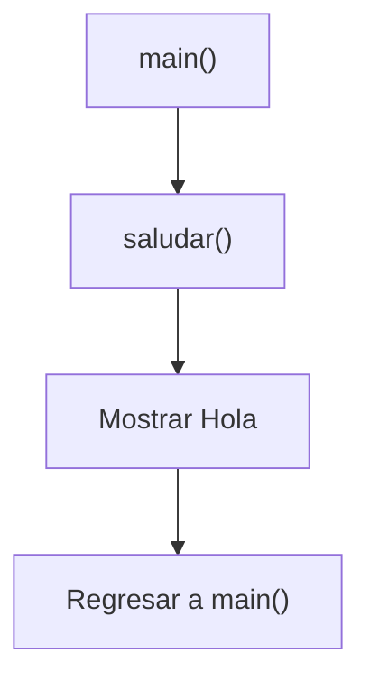
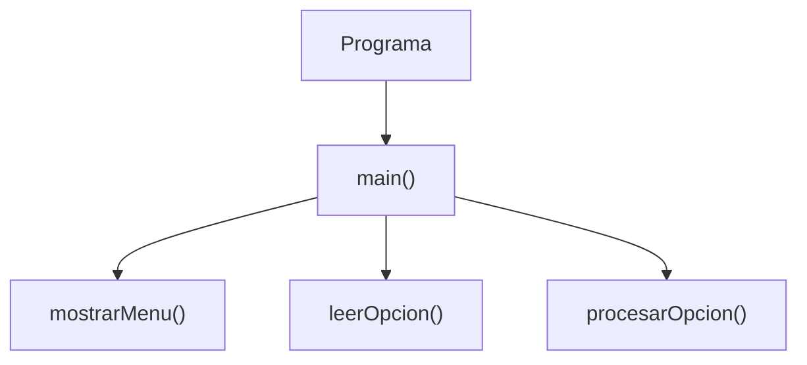

# ¿Qué es una Función?

## Introducción

Hasta ahora todos nuestros programas tenían una estructura similar:

```cpp
#include <iostream>

int main()
{
    std::cout << "Hola mundo\n";

    return 0;
}
```

---

Todo el código se encontraba dentro de:

```cpp
main()
```

---

Esto funciona para programas pequeños.

Sin embargo, a medida que los programas crecen aparecen problemas:

- Código repetido.
- Archivos difíciles de leer.
- Mantenimiento complicado.
- Mayor probabilidad de errores.

---

Para resolver estos problemas utilizamos:

```cpp
funciones
```

---

# ¿Qué es una Función?

Una función es una unidad de código con nombre que realiza una tarea específica y puede ejecutarse cuando es llamada desde otra parte del programa.

---

## Idea General

```text
Entrada (opcional)
      │
      ▼
   Función
      │
      ▼
Resultado (opcional)
```

---

Una función puede:

- Recibir datos.
- Devolver resultados.
- Hacer ambas cosas.
- Simplemente ejecutar acciones.

---

Ejemplos:

```text
Calcular un impuesto
Mostrar un menú
Validar un dato
Convertir unidades
Ordenar elementos
```

---

# Analogía

Imagina una calculadora.

Cuando presionas:

```text
5 + 3
```

la calculadora realiza una tarea específica:

```text
Sumar
```

---

Podemos pensar en esa operación como una función:

```cpp
sumar()
```

---

# Primera Función

```cpp
#include <iostream>

void saludar()
{
    std::cout << "Hola\n";
}

int main()
{
    saludar();

    return 0;
}
```

Salida:

```text
Hola
```

---

# Visualización



---

# ¿Qué Ocurre?

Cuando el programa encuentra:

```cpp
saludar();
```

ocurre lo siguiente:

```text
main()
    │
    ▼
saludar()
    │
    ▼
ejecutar código
    │
    ▼
volver a main()
```

---

La ejecución "salta" temporalmente a la función y, cuando esta termina, regresa al punto donde fue llamada.

---

# Definir No es Ejecutar

Observa:

```cpp
void saludar()
{
    std::cout << "Hola\n";
}
```

---

Esto solamente define la función.

---

La función no se ejecuta automáticamente.

---

Para ejecutarla debemos llamarla:

```cpp
saludar();
```

---

# Reutilización

Una función puede ejecutarse múltiples veces.

---

Ejemplo:

```cpp
int main()
{
    saludar();
    saludar();
    saludar();

    return 0;
}
```

Salida:

```text
Hola
Hola
Hola
```

---

# Evitar Código Duplicado

Sin funciones:

```cpp
std::cout << "Hola\n";
std::cout << "Hola\n";
std::cout << "Hola\n";
```

---

Con funciones:

```cpp
saludar();
saludar();
saludar();
```

---

Resultado:

```text
Código más limpio
```

---

# Componentes de una Función

Ejemplo:

```cpp
void saludar()
{
    std::cout << "Hola\n";
}
```

---

## Tipo de Retorno

```cpp
void
```

Indica qué devuelve la función.

---

## Nombre

```cpp
saludar
```

Es el identificador utilizado para llamarla.

---

## Paréntesis

```cpp
()
```

Contienen los parámetros (los estudiaremos más adelante).

---

## Cuerpo

```cpp
{
    std::cout << "Hola\n";
}
```

Contiene las instrucciones que ejecutará la función.

---

# ¿Qué Significa void?

Significa:

```text
No devuelve ningún valor.
```

---

La función puede ejecutar instrucciones, pero no entrega un resultado al código que la llamó.

---

Ejemplo:

```cpp
void saludar()
{
    std::cout << "Hola\n";
}
```

---

Visualización:

```text
Llamada
   │
   ▼
saludar()
   │
   ▼
Mostrar "Hola"
   │
   ▼
Regresar
```

---

# Llamar una Función

Para ejecutar una función:

```cpp
saludar();
```

---

Los paréntesis son obligatorios.

---

Incorrecto:

```cpp
saludar;
```

---

Correcto:

```cpp
saludar();
```

---

# Flujo de Ejecución

Ejemplo:

```cpp
#include <iostream>

void saludar()
{
    std::cout << "Hola\n";
}

int main()
{
    std::cout << "Inicio\n";

    saludar();

    std::cout << "Fin\n";

    return 0;
}
```

Salida:

```text
Inicio
Hola
Fin
```

---

Visualización:

```text
main()
 │
 ▼
Inicio
 │
 ▼
saludar()
 │
 ▼
Hola
 │
 ▼
main()
 │
 ▼
Fin
```

---

# Beneficios de las Funciones

## Reutilización

Una vez escritas:

```cpp
saludar();
```

pueden utilizarse muchas veces.

---

## Organización

Permiten dividir programas grandes en partes pequeñas.

---

## Legibilidad

Esto:

```cpp
mostrarMenu();
```

es más claro que decenas de líneas repetidas.

---

## Mantenimiento

Si necesitamos modificar el comportamiento:

```cpp
saludar()
```

solo cambiamos un lugar.

---

# Ejemplo Real

Sin funciones:

```cpp
int main()
{
    std::cout << "================\n";

    std::cout << "MENU PRINCIPAL\n";

    std::cout << "================\n";

    return 0;
}
```

---

Con funciones:

```cpp
mostrarMenu();
```

---

Mucho más expresivo.

---

# Funciones y main()

Recordemos:

```cpp
int main()
{
}
```

también es una función.

---

De hecho:

```cpp
main()
```

es la función especial donde comienza la ejecución del programa.

---

## Organización de un Programa



---

# Orden de Definición

Observa:

```cpp
int main()
{
    saludar();

    return 0;
}

void saludar()
{
    std::cout << "Hola\n";
}
```

---

Esto produce un error de compilación.

---

¿Por qué?

Porque cuando el compilador analiza:

```cpp
saludar();
```

todavía no conoce la existencia de esa función.

---

Una solución es declarar la función antes:

```cpp
void saludar();

int main()
{
    saludar();

    return 0;
}

void saludar()
{
    std::cout << "Hola\n";
}
```

---

Más adelante estudiaremos:

```text
Declaraciones de funciones
(Function Prototypes)
```

---

# Buenas Prácticas

## Una Función = Una Responsabilidad

Correcto:

```cpp
mostrarMenu();
```

---

```cpp
leerOpcion();
```

---

```cpp
validarDatos();
```

---

## Utilizar Nombres Descriptivos

Correcto:

```cpp
mostrarMenu();
```

---

Evitar:

```cpp
func1();
```

---

## Evitar Funciones Gigantes

Preferir varias funciones pequeñas.

---

## Reutilizar Código

Si una tarea se repite varias veces:

```text
Crear una función suele ser una buena idea.
```

---

# Error Común

Pensar que definir una función la ejecuta.

---

Ejemplo:

```cpp
void saludar()
{
    std::cout << "Hola\n";
}
```

---

Esto solamente la define.

---

Para ejecutarla:

```cpp
saludar();
```

---

# Visualización General

```text
Llamada
   │
   ▼
Función
   │
   ▼
Ejecutar código
   │
   ▼
Regresar
```

---

# Tabla Resumen

| Concepto | Descripción |
|-----------|-------------|
| Función | Bloque de código reutilizable |
| Llamada | Ejecución de una función |
| Nombre | Identificador de la función |
| `void` | No devuelve valor |
| Cuerpo | Instrucciones de la función |
| `main()` | Punto de entrada del programa |

---

## Resumen

- Una función es un bloque de código reutilizable que realiza una tarea específica.
- Permite organizar programas en partes más pequeñas y fáciles de mantener.
- Una función se ejecuta mediante una llamada.
- `void` indica que la función no devuelve ningún valor.
- Definir una función no implica ejecutarla.
- `main()` también es una función y representa el punto de inicio del programa.
- Las funciones favorecen la reutilización, la legibilidad y el mantenimiento del código.
- Son una de las herramientas más importantes para construir programas de cualquier tamaño.
