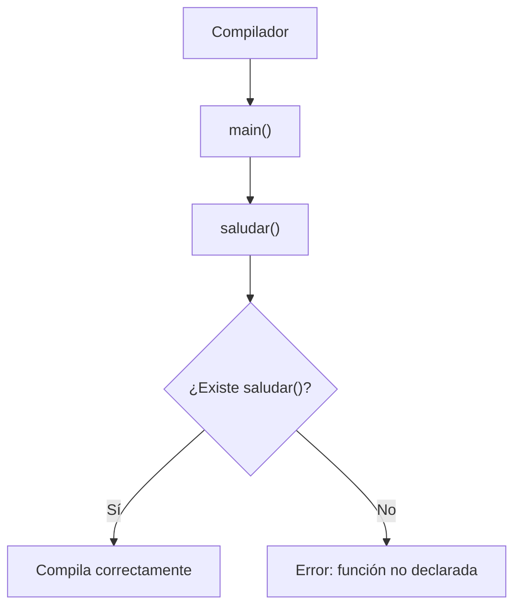
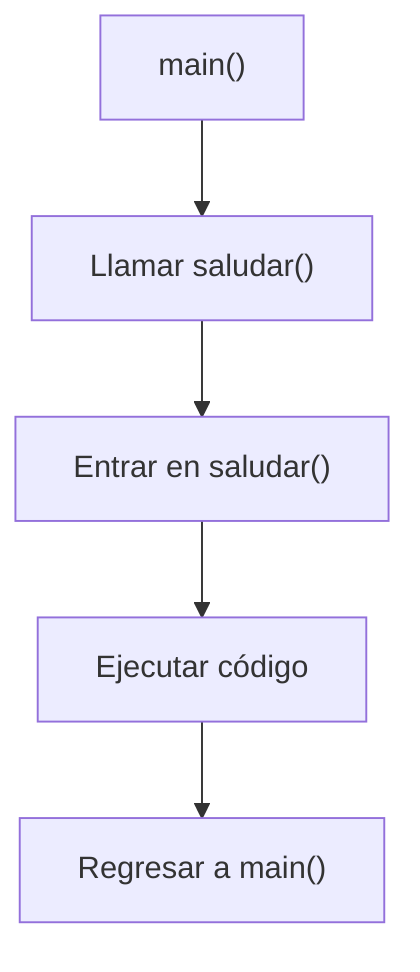
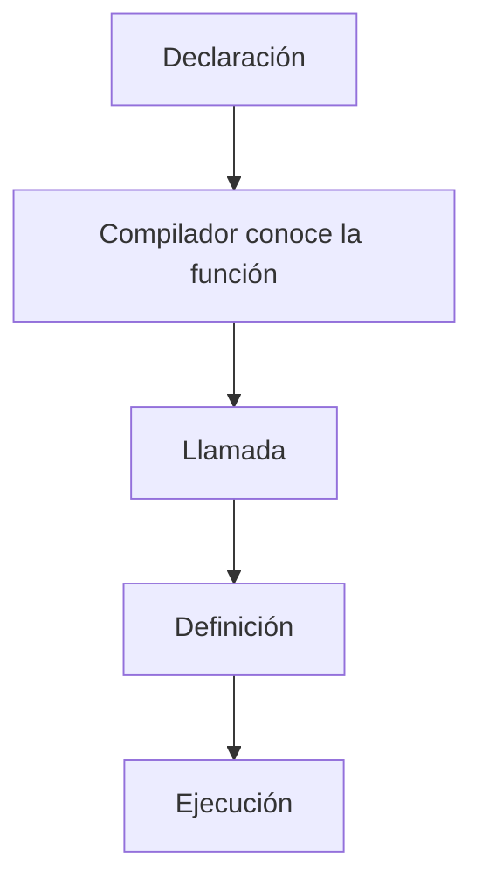

# Declaración y Definición de Funciones

## Introducción

En el tema anterior aprendimos que una función es un bloque de código reutilizable.

Por ejemplo:

```cpp
void saludar()
{
    std::cout << "Hola\n";
}
```

---

y que podemos ejecutarla mediante:

```cpp
saludar();
```

---

Sin embargo, existe una pregunta importante:

```text
¿Cómo sabe el compilador que una función existe?
```

---

Para responderla debemos entender dos conceptos fundamentales:

```text
Declaración
Definición
```

---

# El Problema

Observa este programa:

```cpp
#include <iostream>

int main()
{
    saludar();

    return 0;
}

void saludar()
{
    std::cout << "Hola\n";
}
```

---

Resultado:

```text
Error de compilación
```

---

¿Por qué?

Porque cuando el compilador llega a:

```cpp
saludar();
```

todavía no conoce esa función.

---

## Visualización



---

# Solución 1

Definir la función antes de usarla.

---

## Ejemplo

```cpp
#include <iostream>

void saludar()
{
    std::cout << "Hola\n";
}

int main()
{
    saludar();

    return 0;
}
```

---

Ahora funciona correctamente.

---

# Declaración

Una declaración informa al compilador que una función existe.

---

## Sintaxis

```cpp
tipo nombre();
```

---

Ejemplo:

```cpp
void saludar();
```

---

Observa:

```cpp
void saludar();
```

---

No existe cuerpo.

---

Solo informa:

```text
Existe una función llamada saludar.
```

---

## Visualización

```text
void saludar();
     │
     ▼
Declaración
     │
     ▼
El compilador conoce
la existencia de la función
```

---

# Definición

La definición contiene la implementación real.

---

## Ejemplo

```cpp
void saludar()
{
    std::cout << "Hola\n";
}
```

---

Aquí aparece:

```cpp
{
}
```

---

y el código que ejecutará la función.

---

## Visualización

```text
void saludar()
{
    ...
}
     │
     ▼
Definición
     │
     ▼
Implementación real
```

---

# Declaración vs Definición

| Concepto | Contiene código | Informa al compilador | Ejecuta trabajo |
|-----------|----------------|----------------------|----------------|
| Declaración | No | Sí | No |
| Definición | Sí | Sí | Sí |

---

# Declaración + Definición

Forma habitual:

```cpp
#include <iostream>

void saludar();

int main()
{
    saludar();

    return 0;
}

void saludar()
{
    std::cout << "Hola\n";
}
```

---

Ahora el compilador sabe que:

```cpp
saludar()
```

existe.

---

Aunque su implementación aparezca después.

---

# Flujo Completo



---

# Prototipo

También se suele llamar:

```text
Prototipo de función
```

a la declaración.

---

Ejemplo:

```cpp
void saludar();
```

---

```cpp
int sumar(int a, int b);
```

---

Son prototipos.

---

# Ejemplo con Parámetros

Declaración:

```cpp
int sumar(int a, int b);
```

---

Definición:

```cpp
int sumar(int a, int b)
{
    return a + b;
}
```

---

Uso:

```cpp
int resultado = sumar(10, 20);
```

---

## Visualización

```text
10, 20
   │
   ▼
sumar()
   │
   ▼
30
```

---

# ¿Qué Debe Coincidir?

La declaración y la definición deben describir exactamente la misma función.

---

Correcto:

```cpp
int sumar(int a, int b);
```

---

```cpp
int sumar(int a, int b)
{
    return a + b;
}
```

---

# Incorrecto

```cpp
int sumar(int a, int b);
```

---

```cpp
double sumar(int a, int b)
{
    return a + b;
}
```

---

Resultado:

```text
Error de compilación
```

---

Porque el tipo de retorno no coincide.

---

# Nombres de Parámetros

Los nombres son opcionales en la declaración.

---

Correcto:

```cpp
int sumar(int, int);
```

---

También correcto:

```cpp
int sumar(int a, int b);
```

---

La definición normalmente sí incluye nombres.

---

```cpp
int sumar(int a, int b)
{
    return a + b;
}
```

---

# Organización Habitual

En programas pequeños suele utilizarse:

```text
Declaraciones
      │
      ▼
main()
      │
      ▼
Definiciones
```

---

Ejemplo:

```cpp
void saludar();

int main()
{
    saludar();
}

void saludar()
{
}
```

---

# ¿Por Qué se Utilizan Prototipos?

## Permiten Leer Primero main()

```cpp
int main()
{
}
```

---

sin necesidad de recorrer cientos de líneas para encontrar las funciones utilizadas.

---

## Facilitan la Organización

Separan:

```text
Qué existe
```

de

```text
Cómo funciona
```

---

## Preparan el Camino para Múltiples Archivos

Más adelante veremos:

```text
Archivos de cabecera (.hpp)
Archivos fuente (.cpp)
```

---

donde declaraciones y definiciones suelen estar separadas.

---

# Ejemplo Completo

```cpp
#include <iostream>

void mostrarMenu();

int main()
{
    mostrarMenu();

    return 0;
}

void mostrarMenu()
{
    std::cout << "1. Crear\n";
    std::cout << "2. Editar\n";
    std::cout << "3. Eliminar\n";
}
```

Salida:

```text
1. Crear
2. Editar
3. Eliminar
```

---

# Error Común

Pensar que:

```cpp
void saludar();
```

ejecuta la función.

---

No.

---

Esto solamente:

```text
La declara.
```

---

Para ejecutarla:

```cpp
saludar();
```

---

# Otro Error Común

Confundir:

```cpp
void saludar();
```

---

con:

```cpp
void saludar()
{
}
```

---

La primera:

```text
Declaración
(Prototipo)
```

---

La segunda:

```text
Definición
(Implementación)
```

---

# Visualización General



---

# Buenas Prácticas

## Declarar Antes de Utilizar

Correcto:

```cpp
void saludar();
```

---

## Mantener Declaración y Definición Consistentes

Correcto:

```cpp
int sumar(int, int);
```

---

```cpp
int sumar(int a, int b)
{
    return a + b;
}
```

---

## Utilizar Nombres Claros

Correcto:

```cpp
mostrarMenu();
```

---

Evitar:

```cpp
f1();
```

---

## Agrupar Declaraciones al Inicio

Facilita la lectura del programa.

---

## Prepararse para Headers

Las declaraciones serán fundamentales cuando trabajemos con:

```cpp
.hpp
```

---

# Tabla Resumen

| Concepto | Descripción |
|-----------|-------------|
| Declaración | Informa que una función existe |
| Definición | Contiene la implementación |
| Prototipo | Otro nombre para la declaración |
| Llamada | Ejecución de la función |
| Parámetros | Datos que recibe la función |
| Tipo de retorno | Valor que devuelve la función |

---

## Resumen

- Una declaración informa al compilador que una función existe.
- Una definición contiene la implementación real de la función.
- La declaración también se conoce como prototipo.
- El compilador debe conocer una función antes de que sea utilizada.
- Declaración y definición deben coincidir exactamente.
- Los prototipos permiten organizar mejor el código.
- Son la base para trabajar con múltiples archivos en C++.
- Comprender esta diferencia es fundamental para desarrollar programas reales.
