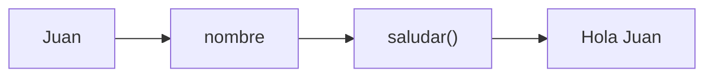
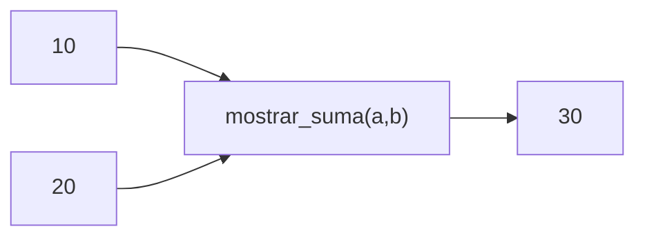
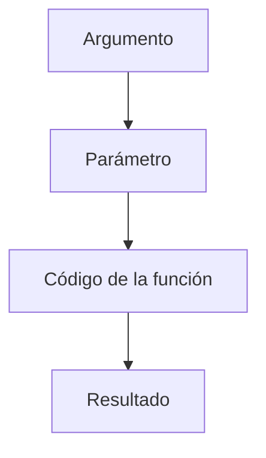

# Parámetros

## Introducción

En los temas anteriores aprendimos a crear funciones y a llamarlas.

Ejemplo:

```cpp
void saludar()
{
    std::cout
        << "Hola\n";
}
```

---

y ejecutarlas mediante:

```cpp
saludar();
```

---

Sin embargo, esta función siempre hace exactamente lo mismo.

```text
Hola
```

---

¿Qué ocurre si queremos saludar a distintas personas?

```text
Hola Juan
Hola Ana
Hola Pedro
```

---

Necesitamos enviar información a la función.

Para ello utilizamos:

```cpp
parámetros
```

---

# ¿Qué es un Parámetro?

Un parámetro es una variable que recibe datos cuando se llama una función.

---

## Idea General

```text
Argumento
    │
    ▼
Parámetro
    │
    ▼
Función
    │
    ▼
Resultado
```

---

Ejemplo:

```cpp
saludar("Juan");
```

↓

```text
"Juan"
```

entra en la función.

---

# Primer Ejemplo

```cpp
#include <iostream>
#include <string>

void saludar(std::string nombre)
{
    std::cout
        << "Hola "
        << nombre
        << '\n';
}

int main()
{
    saludar("Juan");

    return 0;
}
```

Salida:

```text
Hola Juan
```

---

# ¿Qué Ocurrió?

La llamada:

```cpp
saludar("Juan");
```

envía:

```text
"Juan"
```

---

La función recibe:

```cpp
std::string nombre
```

---

y ejecuta:

```cpp
std::cout
    << "Hola "
    << nombre;
```

---

## Visualización



---

# Múltiples Llamadas

```cpp
saludar("Juan");
saludar("Ana");
saludar("Pedro");
```

Salida:

```text
Hola Juan
Hola Ana
Hola Pedro
```

---

La misma función sirve para distintos datos.

---

# Sintaxis General

```cpp
tipoRetorno nombreFuncion(tipo parametro)
{
}
```

---

Ejemplo:

```cpp
void saludar(std::string nombre)
{
}
```

---

# Parámetro vs Argumento

Aunque suelen confundirse, no son exactamente lo mismo.

---

## Parámetro

Variable declarada en la función.

```cpp
void saludar(std::string nombre)
```

---

```cpp
nombre
```

es un parámetro.

---

## Argumento

Valor enviado en la llamada.

```cpp
saludar("Juan");
```

---

```cpp
"Juan"
```

es un argumento.

---

## Comparación

| Concepto | Ubicación | Ejemplo |
|-----------|------------|----------|
| Parámetro | Declaración de la función | `std::string nombre` |
| Argumento | Llamada de la función | `"Juan"` |

---

## Visualización

```text
Argumento
    │
    ▼
Parámetro
```

---

# Parámetros Numéricos

```cpp
#include <iostream>

void mostrarNumero(int numero)
{
    std::cout
        << numero
        << '\n';
}

int main()
{
    mostrarNumero(10);

    return 0;
}
```

Salida:

```text
10
```

---

# Más de un Parámetro

Una función puede recibir varios datos.

---

## Ejemplo

```cpp
void mostrarSuma(int a, int b)
{
    std::cout
        << a + b
        << '\n';
}
```

---

Llamada:

```cpp
mostrarSuma(10, 20);
```

Salida:

```text
30
```

---

## Visualización



---

# Orden de los Parámetros

El orden importa.

---

Ejemplo:

```cpp
void mostrar(int a, int b)
{
    std::cout
        << a
        << ' '
        << b
        << '\n';
}
```

---

Llamada:

```cpp
mostrar(10, 20);
```

Salida:

```text
10 20
```

---

Llamada:

```cpp
mostrar(20, 10);
```

Salida:

```text
20 10
```

---

# Tipos Diferentes

Los parámetros pueden tener tipos distintos.

---

Ejemplo:

```cpp
void mostrarPersona(
    std::string nombre,
    int edad)
{
    std::cout
        << nombre
        << " "
        << edad
        << '\n';
}
```

---

Llamada:

```cpp
mostrarPersona(
    "Juan",
    25);
```

Salida:

```text
Juan 25
```

---

# Variables como Argumentos

No es obligatorio enviar valores literales.

---

Ejemplo:

```cpp
std::string nombre {"Ana"};

saludar(nombre);
```

---

Resultado:

```text
Hola Ana
```

---

# Expresiones como Argumentos

También podemos enviar expresiones.

---

```cpp
mostrarNumero(5 + 5);
```

---

Resultado:

```text
10
```

---

```cpp
mostrarNumero(2 * 3);
```

---

Resultado:

```text
6
```

---

# ¿Qué Debe Coincidir?

Los argumentos deben ser compatibles con los parámetros.

---

Correcto:

```cpp
void mostrarNumero(int numero);
```

---

```cpp
mostrarNumero(10);
```

---

Incorrecto:

```cpp
mostrarNumero("Hola");
```

---

Resultado:

```text
Error de compilación
```

---

Porque:

```cpp
"Hola"
```

no es un:

```cpp
int
```

---

# Parámetros Locales

Los parámetros existen únicamente dentro de la función.

---

Ejemplo:

```cpp
void saludar(std::string nombre)
{
}
```

---

Fuera de la función:

```cpp
nombre
```

no existe.

---

## Visualización

```text
saludar()
{
    nombre
}
```

↓

```text
Scope local
```

---

Al salir de la función:

```text
nombre desaparece
```

---

# Flujo de Datos



---

# Ejemplo Completo

```cpp
#include <iostream>
#include <string>

void mostrarProducto(
    std::string nombre,
    double precio)
{
    std::cout
        << nombre
        << ": "
        << precio
        << '\n';
}

int main()
{
    mostrarProducto(
        "Teclado",
        49.99);

    mostrarProducto(
        "Mouse",
        19.99);

    return 0;
}
```

Salida:

```text
Teclado: 49.99
Mouse: 19.99
```

---

# Beneficios

## Reutilización

Una sola función sirve para muchos datos.

---

## Flexibilidad

El comportamiento cambia según los argumentos.

---

## Menos Código

Evita duplicar lógica.

---

## Mayor Abstracción

La función describe:

```text
Qué hace
```

y los argumentos indican:

```text
Con qué datos trabaja
```

---

# Buenas Prácticas

## Utilizar Nombres Descriptivos

Correcto:

```cpp
void saludar(
    std::string nombre)
{
}
```

---

Evitar:

```cpp
void saludar(
    std::string x)
{
}
```

---

## Mantener Pocos Parámetros

Si una función tiene demasiados parámetros:

```cpp
funcion(
    a,
    b,
    c,
    d,
    e,
    f,
    g);
```

---

quizás esté haciendo demasiadas cosas.

---

## Utilizar Tipos Adecuados

Correcto:

```cpp
int edad
```

---

```cpp
std::string nombre
```

---

## Mantener un Orden Lógico

Correcto:

```cpp
mostrarPersona(
    nombre,
    edad);
```

---

# Error Común

Confundir parámetro con argumento.

---

```cpp
void saludar(std::string nombre)
```

↓

```text
Parámetro
```

---

```cpp
saludar("Juan");
```

↓

```text
Argumento
```

---

# Otro Error Común

Pensar que los parámetros existen fuera de la función.

---

Incorrecto:

```cpp
void saludar(std::string nombre)
{
}

std::cout
    << nombre;
```

---

Resultado:

```text
Error de compilación
```

---

Porque:

```cpp
nombre
```

solo existe dentro de la función.

---

# Visualización General

```text
Argumentos
     │
     ▼
Parámetros
     │
     ▼
Función
     │
     ▼
Resultado
```

---

# Tabla Resumen

| Concepto | Descripción |
|-----------|-------------|
| Parámetro | Variable definida en la función |
| Argumento | Valor enviado durante la llamada |
| Un parámetro | Recibe un dato |
| Varios parámetros | Reciben múltiples datos |
| Scope | Los parámetros son locales a la función |

---

## Resumen

- Los parámetros permiten que una función reciba datos.
- Los argumentos son los valores enviados durante la llamada.
- Una función puede tener cero, uno o varios parámetros.
- El orden de los argumentos es importante.
- Los argumentos deben ser compatibles con los tipos de los parámetros.
- Los parámetros son variables locales de la función.
- Pueden utilizarse distintos tipos de datos.
- Los parámetros hacen que las funciones sean reutilizables y flexibles.
- Son uno de los mecanismos fundamentales de la programación modular.
