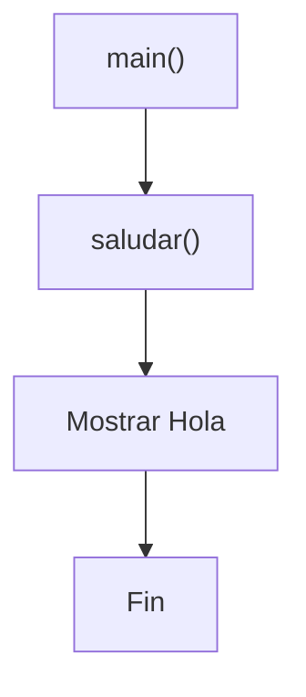
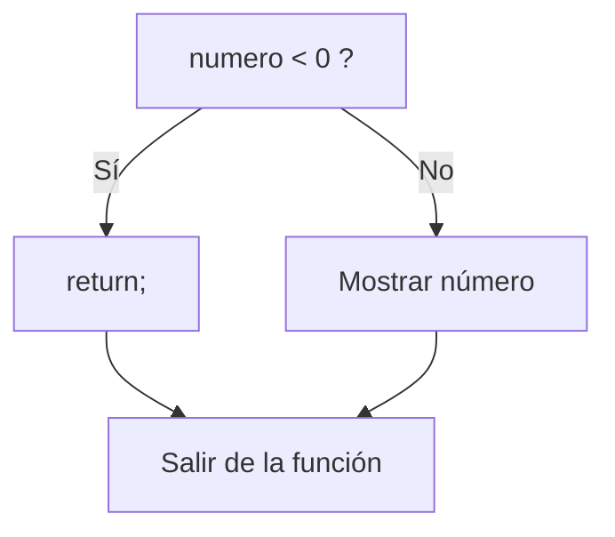
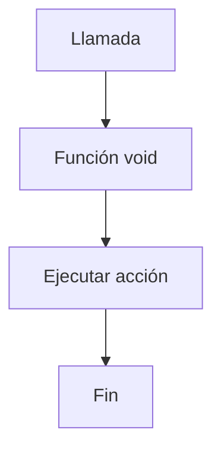
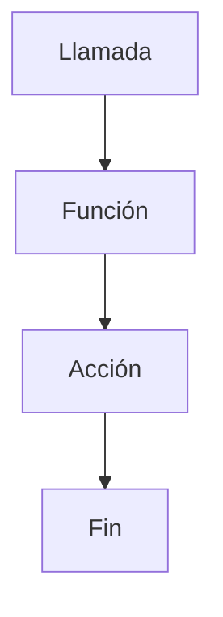
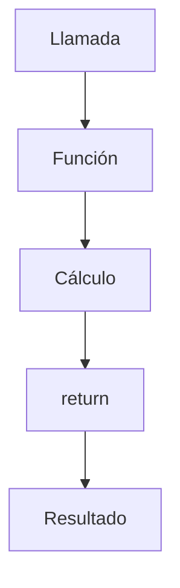

# Funciones void

## Introducción

En el tema anterior aprendimos que una función puede devolver resultados mediante:

```cpp
return
```

---

Ejemplo:

```cpp
int sumar(int a, int b)
{
    return a + b;
}
```

---

Sin embargo, no todas las funciones necesitan devolver información.

Muchas funciones simplemente realizan una acción.

Por ejemplo:

```text
Mostrar un menú
Imprimir un mensaje
Registrar información
Guardar datos
```

---

Para estos casos utilizamos:

```cpp
void
```

---

# ¿Qué Significa void?

La palabra:

```cpp
void
```

significa:

```text
Sin valor
```

---

Cuando una función utiliza:

```cpp
void
```

indica que:

```text
No devuelve ningún resultado.
```

---

## Comparación

| Tipo de retorno | Significado |
|---------------|-------------|
| `int` | Devuelve un entero |
| `double` | Devuelve un decimal |
| `std::string` | Devuelve texto |
| `void` | No devuelve ningún valor |

---

# Primera Función void

```cpp
#include <iostream>

void saludar()
{
    std::cout << "Hola\n";
}

int main()
{
    saludar();

    return 0;
}
```

Salida:

```text
Hola
```

---

# Visualización



---

# ¿Qué Ocurre?

Cuando el programa ejecuta:

```cpp
saludar();
```

ocurre lo siguiente:

```text
main()
    │
    ▼
saludar()
    │
    ▼
ejecutar código
    │
    ▼
volver a main()
```

---

Observa que:

```cpp
saludar()
```

no devuelve ningún valor.

---

# Comparación con una Función que Retorna

## Función void

```cpp
void saludar()
{
    std::cout << "Hola\n";
}
```

---

Produce:

```text
Una acción
```

---

## Función con retorno

```cpp
int sumar(int a, int b)
{
    return a + b;
}
```

---

Produce:

```text
Un resultado
```

---

## Comparación Visual


---


---

# Funciones void con Parámetros

Una función puede recibir datos aunque no devuelva nada.

---

## Ejemplo

```cpp
#include <iostream>
#include <string>

void saludar(std::string nombre)
{
    std::cout << "Hola " << nombre << '\n';
}

int main()
{
    saludar("Juan");

    return 0;
}
```

Salida:

```text
Hola Juan
```

---

# Visualización


---

# return en Funciones void

Una función `void` puede utilizar:

```cpp
return;
```

---

pero sin devolver ningún valor.

---

Ejemplo:

```cpp
void verificar(int numero)
{
    if (numero < 0)
    {
        return;
    }

    std::cout << numero << '\n';
}
```

---

## Visualización



---

# Correcto

```cpp
void saludar()
{
    return;
}
```

---

También es válido:

```cpp
void saludar()
{
}
```

---

Porque al llegar al final de la función:

```text
La ejecución termina automáticamente.
```

---

# Incorrecto

```cpp
void saludar()
{
    return 10;
}
```

---

Resultado:

```text
Error de compilación
```

---

Porque una función `void` no devuelve valores.

---

# Uso Habitual

Las funciones `void` suelen utilizarse para:

---

## Mostrar Información

```cpp
void mostrarMenu()
{
}
```

---

## Imprimir Resultados

```cpp
void mostrarTotal()
{
}
```

---

## Registrar Eventos

```cpp
void registrarLog()
{
}
```

---

## Ejecutar Tareas

```cpp
void guardarArchivo()
{
}
```

---

# Ejemplo Completo

```cpp
#include <iostream>

void mostrarMenu()
{
    std::cout << "1. Crear\n";
    std::cout << "2. Editar\n";
    std::cout << "3. Salir\n";
}

int main()
{
    mostrarMenu();

    return 0;
}
```

Salida:

```text
1. Crear
2. Editar
3. Salir
```

---

# ¿Cuándo Utilizar void?

Cuando la función:

```text
Hace algo
```

pero no necesita:

```text
Devolver algo
```

---

Ejemplos:

```cpp
mostrarMenu();
```

---

```cpp
imprimirReporte();
```

---

```cpp
registrarEvento();
```

---

```cpp
guardarArchivo();
```

---

# ¿Cuándo NO Utilizar void?

Cuando exista un resultado útil que pueda reutilizarse.

---

Menos flexible:

```cpp
void sumar(int a, int b)
{
    std::cout << a + b;
}
```

---

Más reutilizable:

```cpp
int sumar(int a, int b)
{
    return a + b;
}
```

---

Ahora podemos hacer:

```cpp
int resultado = sumar(10, 20);
```

---

o incluso:

```cpp
std::cout << sumar(10, 20);
```

---

# Mostrar vs Devolver

Es importante no confundir estos conceptos.

---

## Mostrar

```cpp
std::cout << valor;
```

↓

```text
Aparece en pantalla
```

---

## Devolver

```cpp
return valor;
```

↓

```text
Regresa a quien llamó la función
```

---

## Comparación

| Acción | Resultado |
|----------|------------|
| `std::cout << valor;` | Muestra información |
| `return valor;` | Devuelve información |

---

# Analogía

Una función `void` es como presionar:

```text
Imprimir
```

en una impresora.

---

Produce una acción.

---

Una función con retorno es como una calculadora:

```text
5 + 3
```

↓

```text
8
```

---

Produce un resultado.

---

# Procedimientos y Funciones

En algunos lenguajes existe la distinción:

```text
Procedimiento
```

↓

```text
No devuelve valor
```

---

```text
Función
```

↓

```text
Devuelve valor
```

---

En C++:

```text
Todo son funciones.
```

---

Simplemente algunas utilizan:

```cpp
void
```

como tipo de retorno.

---

# Flujo General



---

# Buenas Prácticas

## Utilizar void para Acciones

Correcto:

```cpp
void mostrarMenu()
{
}
```

---

## Utilizar Retornos para Resultados

Correcto:

```cpp
double calcularTotal()
{
}
```

---

## No Imprimir si Necesitas Reutilizar el Valor

Preferir:

```cpp
return resultado;
```

---

en lugar de:

```cpp
std::cout << resultado;
```

---

## Utilizar Nombres Descriptivos

Correcto:

```cpp
mostrarMenu();
```

---

```cpp
guardarArchivo();
```

---

Evitar:

```cpp
func1();
```

---

# Error Común

Confundir:

```cpp
std::cout
```

con:

```cpp
return
```

---

Esto:

```cpp
std::cout << valor;
```

↓

```text
Muestra
```

---

Esto:

```cpp
return valor;
```

↓

```text
Devuelve
```

---

Son conceptos completamente distintos.

---

# Tabla Comparativa

| Característica | void | Con retorno |
|---------------|-------|-------------|
| Devuelve valor | No | Sí |
| Puede usar `return;` | Sí | Sí |
| Puede usar `return valor;` | No | Sí |
| Ejecuta acciones | Sí | Sí |
| Produce resultados reutilizables | No | Sí |

---

# Visualización General



---



---

## Resumen

- `void` indica que una función no devuelve valores.
- Las funciones `void` suelen utilizarse para ejecutar acciones.
- Pueden recibir parámetros.
- Pueden utilizar `return;` sin valor para finalizar anticipadamente.
- No pueden devolver datos mediante `return valor;`.
- Mostrar información y devolver información son conceptos distintos.
- En C++ todas son funciones, incluso las que utilizan `void`.
- Deben utilizarse cuando no exista un resultado que devolver.
- Son ideales para mostrar información, ejecutar tareas y coordinar operaciones.
