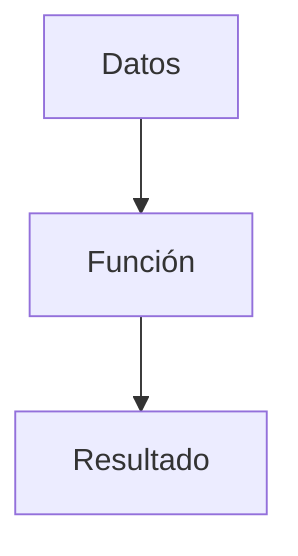
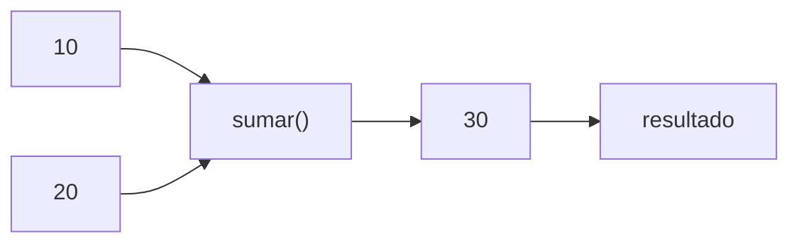
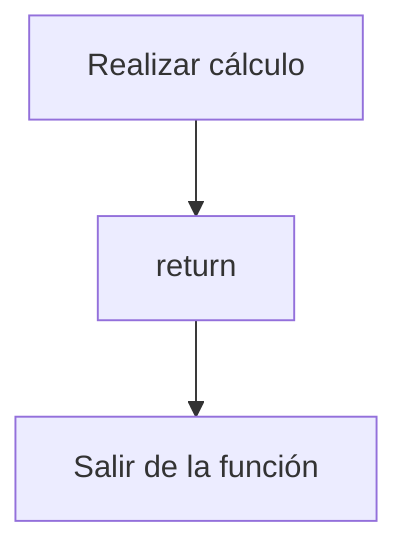
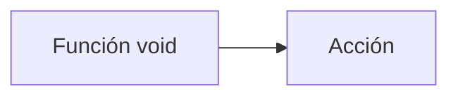
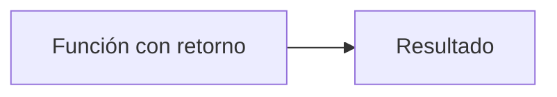
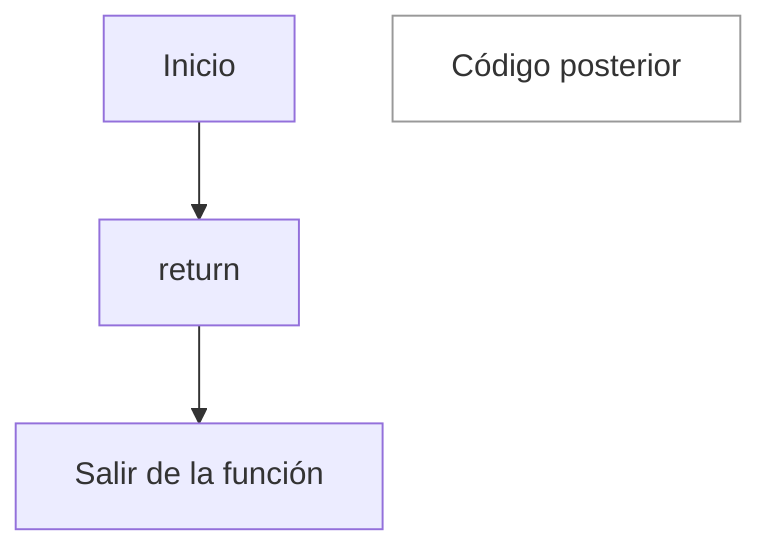
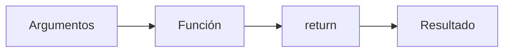

# Retorno de Funciones

## Introducción

En los temas anteriores aprendimos que las funciones pueden recibir información mediante parámetros.

Ejemplo:

```cpp
void saludar(std::string nombre)
{
    std::cout
        << "Hola "
        << nombre
        << '\n';
}
```

---

Sin embargo, muchas funciones necesitan hacer algo más que ejecutar código.

Necesitan:

```text
Producir un resultado
```

---

Por ejemplo:

```text
Sumar números
Calcular impuestos
Obtener una longitud
Validar datos
Calcular áreas
```

---

Para ello utilizamos:

```cpp
return
```

---

# ¿Qué es un Retorno?

El retorno es el valor que una función devuelve al lugar desde donde fue llamada.

---

## Visualización



---

Ejemplo:

```cpp
int sumar(int a, int b)
{
    return a + b;
}
```

---

```cpp
sumar(10, 20)
```

↓

```text
30
```

---

# Primera Función con Retorno

```cpp
#include <iostream>

int sumar(int a, int b)
{
    return a + b;
}

int main()
{
    int resultado =
        sumar(10, 20);

    std::cout
        << resultado
        << '\n';

    return 0;
}
```

Salida:

```text
30
```

---

# ¿Qué Ocurrió?

Llamada:

```cpp
sumar(10, 20)
```

---

Dentro de la función:

```cpp
10 + 20
```

↓

```cpp
30
```

---

La instrucción:

```cpp
return 30;
```

envía el resultado al lugar donde se llamó la función.

---

# Visualización



---

# Tipo de Retorno

Observa:

```cpp
int sumar(...)
```

---

El:

```cpp
int
```

indica que la función devuelve un entero.

---

## Ejemplos

```cpp
double calcularArea(...)
```

↓

```text
Devuelve un double
```

---

```cpp
bool esPar(...)
```

↓

```text
Devuelve un bool
```

---

```cpp
std::string obtenerNombre(...)
```

↓

```text
Devuelve un string
```

---

# Tabla de Tipos de Retorno

| Tipo | Ejemplo de valor |
|--------|------------------|
| `int` | `42` |
| `double` | `3.14` |
| `bool` | `true` |
| `char` | `'A'` |
| `std::string` | `"Hola"` |
| `void` | No devuelve nada |

---

# return

La palabra clave:

```cpp
return
```

finaliza la función y devuelve un valor.

---

Ejemplo:

```cpp
return a + b;
```

---

## Visualización



---

# Retorno de double

```cpp
double dividir(
    double a,
    double b)
{
    return a / b;
}
```

---

Uso:

```cpp
double resultado =
    dividir(10.0, 2.0);
```

---

Resultado:

```text
5.0
```

---

# Retorno de bool

```cpp
bool esPar(int numero)
{
    return numero % 2 == 0;
}
```

---

Uso:

```cpp
bool resultado =
    esPar(10);
```

---

Resultado:

```text
true
```

---

# Retorno de String

```cpp
#include <string>

std::string obtenerSaludo()
{
    return "Hola";
}
```

---

Uso:

```cpp
std::string mensaje =
    obtenerSaludo();
```

---

Resultado:

```text
Hola
```

---

# Utilizar el Resultado Directamente

No es obligatorio almacenarlo.

---

Ejemplo:

```cpp
std::cout
    << sumar(10, 20)
    << '\n';
```

Salida:

```text
30
```

---

También podemos utilizarlo dentro de expresiones:

```cpp
int total =
    sumar(10, 20)
    + sumar(5, 5);
```

Resultado:

```text
40
```

---

# Función Sin Retorno

Recordemos:

```cpp
void saludar()
{
}
```

---

El tipo:

```cpp
void
```

significa:

```text
No devuelve ningún valor.
```

---

# Comparación

## Función void

```cpp
void saludar()
{
    std::cout
        << "Hola\n";
}
```

---

Produce:

```text
Una acción
```

---

## Función con retorno

```cpp
int sumar(int a, int b)
{
    return a + b;
}
```

---

Produce:

```text
Un resultado
```

---

## Comparación Visual



---



---

# Múltiples return

Una función puede tener varios puntos de retorno.

---

Ejemplo:

```cpp
bool esPositivo(int numero)
{
    if (numero > 0)
    {
        return true;
    }

    return false;
}
```

---

Salida:

```text
true o false
```

---

# Simplificación

El ejemplo anterior puede escribirse:

```cpp
bool esPositivo(int numero)
{
    return numero > 0;
}
```

---

Resultado idéntico.

---

# Error Común

Olvidar devolver un valor.

---

Incorrecto:

```cpp
int sumar(int a, int b)
{
}
```

---

Problema:

```text
La función promete devolver un int,
pero no devuelve nada.
```

---

Correcto:

```cpp
int sumar(int a, int b)
{
    return a + b;
}
```

---

# Retorno y Fin de la Función

Observa:

```cpp
int sumar(int a, int b)
{
    return a + b;

    std::cout
        << "Hola\n";
}
```

---

La línea:

```cpp
std::cout
    << "Hola\n";
```

nunca se ejecuta.

---

Porque:

```cpp
return
```

termina la función inmediatamente.

---

## Visualización



---

# Ejemplo Completo

```cpp
#include <iostream>

int cuadrado(int numero)
{
    return numero * numero;
}

int main()
{
    int resultado =
        cuadrado(5);

    std::cout
        << resultado
        << '\n';

    return 0;
}
```

Salida:

```text
25
```

---

# Beneficios

## Reutilización

```cpp
sumar()
```

puede utilizarse en cualquier lugar.

---

## Separación de Responsabilidades

La función calcula.

El código que la llama decide qué hacer con el resultado.

---

## Legibilidad

```cpp
double area = calcularArea(radio);
```

es más expresivo que repetir la fórmula.

---

## Composición

Podemos combinar funciones.

```cpp
int resultado = cuadrado(sumar(2, 3));
```

---

Visualización:

```text
sumar(2, 3)
      ↓
      5

cuadrado(5)
      ↓
      25
```

---

# Flujo General



---

# Buenas Prácticas

## Devolver un Resultado Cuando Corresponda

Correcto:

```cpp
int sumar(...)
```

---

## Utilizar void Solo Cuando No Exista Resultado

Correcto:

```cpp
void mostrarMenu()
```

---

## Mantener Tipos Coherentes

Correcto:

```cpp
double dividir(...)
```

↓

```cpp
return 5.5;
```

---

## Utilizar Nombres Claros

Correcto:

```cpp
calcularTotal()
```

---

```cpp
esValido()
```

---

## Mantener Funciones Enfocadas

Correcto:

```cpp
double calcularImpuesto(...)
```

---

Evitar funciones que hagan demasiadas tareas.

---

# Error Común

Confundir:

```cpp
std::cout
```

con:

```cpp
return
```

---

Esto:

```cpp
std::cout
    << resultado;
```

↓

```text
Muestra información
```

---

Esto:

```cpp
return resultado;
```

↓

```text
Devuelve información
```

---

Son conceptos diferentes.

---

# Tabla Resumen

| Concepto | Descripción |
|-----------|-------------|
| Tipo de retorno | Tipo de dato que devuelve la función |
| `return` | Devuelve un valor y finaliza la función |
| `void` | No devuelve ningún valor |
| Resultado | Valor recibido por quien llamó la función |
| Argumentos | Datos enviados a la función |

---

# Comparación General

| Característica | Función void | Función con retorno |
|---------------|-------------|---------------------|
| Devuelve valor | No | Sí |
| Usa `return valor;` | No | Sí |
| Ejecuta acciones | Sí | Sí |
| Produce resultados reutilizables | No | Sí |
| Puede participar en expresiones | No | Sí |

---

## Resumen

- Una función puede devolver un resultado.
- El tipo de retorno se especifica antes del nombre de la función.
- `return` devuelve un valor y finaliza la función.
- Las funciones `void` no devuelven resultados.
- El valor retornado puede almacenarse o utilizarse directamente.
- El tipo devuelto debe coincidir con el tipo declarado.
- Una vez ejecutado `return`, la función termina inmediatamente.
- Las funciones con retorno son fundamentales para construir programas reutilizables.
- `return` es una de las instrucciones más importantes de C++.
