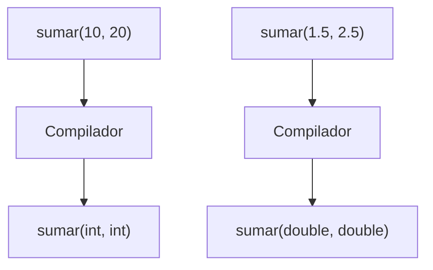

# Sobrecarga de Funciones

## Introducción

Hasta ahora hemos creado funciones como:

```cpp
int sumar(int a, int b)
{
    return a + b;
}
```

---

Cada función tenía un nombre único.

Sin embargo, en muchos casos queremos realizar la misma operación con distintos tipos de datos.

Por ejemplo:

```text
Sumar enteros
Sumar decimales
Sumar tres números
```

---

Una posibilidad sería crear funciones con nombres diferentes:

```cpp
sumarInt()
```

---

```cpp
sumarDouble()
```

---

```cpp
sumarTres()
```

---

Pero C++ ofrece una solución más elegante:

```cpp
Sobrecarga de funciones
```

---

# ¿Qué es la Sobrecarga?

La sobrecarga permite definir varias funciones con el mismo nombre.

---

Siempre que tengan:

```text
Parámetros diferentes
```

---

## Visualización

```text
sumar()
 │
 ├── int, int
 ├── double, double
 └── int, int, int
```

---

Todas se llaman:

```cpp
sumar()
```

---

Pero representan funciones distintas.

---

# Primer Ejemplo

```cpp
#include <iostream>

int sumar(int a, int b)
{
    return a + b;
}

double sumar(double a, double b)
{
    return a + b;
}

int main()
{
    std::cout
        << sumar(10, 20)
        << '\n';

    std::cout
        << sumar(1.5, 2.5)
        << '\n';

    return 0;
}
```

Salida:

```text
30
4
```

---

# ¿Cómo Funciona?

Llamada:

```cpp
sumar(10, 20);
```

---

Argumentos:

```cpp
int
int
```

---

Coincide con:

```cpp
int sumar(int, int)
```

---

Llamada:

```cpp
sumar(1.5, 2.5);
```

---

Argumentos:

```cpp
double
double
```

---

Coincide con:

```cpp
double sumar(double, double)
```

---

# Firma de una Función

La firma (*signature*) está formada por:

```text
Nombre
+
Parámetros
```

---

Ejemplos:

```cpp
sumar(int, int)
```

---

```cpp
sumar(double, double)
```

---

```cpp
sumar(int, int, int)
```

---

Son firmas diferentes.

---

# Sobrecarga por Cantidad de Parámetros

```cpp
int sumar(int a, int b)
{
    return a + b;
}
```

---

```cpp
int sumar(
    int a,
    int b,
    int c)
{
    return a + b + c;
}
```

---

Uso:

```cpp
sumar(1, 2);
```

↓

```text
3
```

---

```cpp
sumar(1, 2, 3);
```

↓

```text
6
```

---

# Sobrecarga por Tipo

```cpp
void mostrar(int valor)
{
    std::cout
        << "Entero\n";
}
```

---

```cpp
void mostrar(double valor)
{
    std::cout
        << "Double\n";
}
```

---

Uso:

```cpp
mostrar(10);
```

Salida:

```text
Entero
```

---

Uso:

```cpp
mostrar(10.5);
```

Salida:

```text
Double
```

---

# Visualización

```text
mostrar(10)
      │
      ▼
mostrar(int)
```

---

```text
mostrar(10.5)
       │
       ▼
mostrar(double)
```

---

# Sobrecarga por Orden de Parámetros

El orden de los parámetros también forma parte de la firma.

---

Ejemplo:

```cpp
void mostrar(
    int numero,
    double decimal)
{
}
```

---

```cpp
void mostrar(
    double decimal,
    int numero)
{
}
```

---

Esto es válido.

---

Porque las firmas son distintas.

---

# Lo que NO Forma Parte de la Firma

El tipo de retorno no participa en la sobrecarga.

---

Incorrecto:

```cpp
int calcular()
{
    return 10;
}
```

---

```cpp
double calcular()
{
    return 10.0;
}
```

---

Resultado:

```text
Error de compilación
```

---

Porque los parámetros son iguales.

---

# Otro Ejemplo Incorrecto

```cpp
int sumar(int a, int b)
{
    return a + b;
}
```

---

```cpp
int sumar(int x, int y)
{
    return x + y;
}
```

---

Resultado:

```text
Error de compilación
```

---

Los nombres:

```cpp
a
b
```

---

o:

```cpp
x
y
```

---

No modifican la firma.

---

# Resolución de Sobrecarga

Cuando llamamos una función:

```cpp
sumar(...)
```

---

el compilador busca:

```text
La mejor coincidencia posible.
```

---

## Visualización



---

# Ambigüedad

A veces el compilador no puede decidir qué sobrecarga utilizar.

---

Cuando esto ocurre:

```text
Se produce un error de compilación.
```

---

Ejemplo conceptual:

```text
Dos sobrecargas son igualmente válidas
```

↓

```text
El compilador no puede elegir
```

↓

```text
Error: llamada ambigua
```

---

# Sobrecarga y Argumentos por Defecto

Debemos tener cuidado al combinar sobrecarga con argumentos por defecto.

---

Ejemplo:

```cpp
void mostrar(int numero)
{
}
```

---

```cpp
void mostrar(
    int numero,
    int base = 10)
{
}
```

---

Llamada:

```cpp
mostrar(5);
```

---

Resultado:

```text
Error de compilación
```

---

Porque ambas funciones son candidatas válidas.

---

# Ejemplo Completo

```cpp
#include <iostream>

int area(int lado)
{
    return lado * lado;
}

int area(
    int base,
    int altura)
{
    return base * altura;
}

int main()
{
    std::cout
        << area(5)
        << '\n';

    std::cout
        << area(4, 3)
        << '\n';

    return 0;
}
```

Salida:

```text
25
12
```

---

# Ventajas

## Nombres Más Naturales

Correcto:

```cpp
sumar()
```

---

En lugar de:

```cpp
sumarInt()
```

---

```cpp
sumarDouble()
```

---

## Mejor Legibilidad

Las funciones representan la misma idea.

---

## Reutilización

Permiten trabajar con distintos tipos manteniendo una interfaz común.

---

# ¿Cuándo Utilizar Sobrecarga?

Cuando varias funciones:

```text
Realizan la misma operación
```

pero trabajan con:

```text
Tipos distintos
```

o

```text
Cantidad distinta de parámetros
```

---

Ejemplos:

```cpp
sumar()
```

---

```cpp
mostrar()
```

---

```cpp
area()
```

---

# ¿Cuándo NO Utilizar Sobrecarga?

Cuando las funciones realizan tareas completamente distintas.

---

Ejemplo poco recomendable:

```cpp
procesar(int edad)
```

---

```cpp
procesar(std::string archivo)
```

---

si representan conceptos sin relación.

---

En esos casos suelen ser mejores nombres distintos.

---

# Buenas Prácticas

## Mantener el Mismo Significado

Correcto:

```cpp
sumar(...)
```

en todas las variantes.

---

## Evitar Sobrecargas Confusas

La función llamada debería ser evidente para el lector.

---

## Diseñar Interfaces Claras

Evitar depender de conversiones complejas.

---

## Tener Cuidado con Argumentos por Defecto

Pueden generar ambigüedad si se combinan incorrectamente con sobrecargas.

---

# Error Común

Pensar que el tipo de retorno crea una nueva sobrecarga.

---

Incorrecto:

```cpp
int calcular();
```

---

```cpp
double calcular();
```

---

Resultado:

```text
Error de compilación
```

---

Porque la firma sigue siendo:

```cpp
calcular()
```

---

# Visualización General

```text
sumar()
 │
 ├── sumar(int, int)
 │
 ├── sumar(double, double)
 │
 └── sumar(int, int, int)
```

---

# Tabla Resumen

| Diferencia                      | ¿Sobrecarga válida? |
| ------------------------------- | ------------------- |
| Distinto tipo de parámetros     | Sí                  |
| Distinta cantidad de parámetros | Sí                  |
| Distinto orden de parámetros    | Sí                  |
| Distinto tipo de retorno        | No                  |
| Distinto nombre de parámetros   | No                  |

---

## Resumen

* La sobrecarga permite reutilizar un mismo nombre para varias funciones.
* Las funciones deben diferenciarse por sus parámetros.
* La firma está formada por el nombre y los parámetros.
* El tipo de retorno no forma parte de la firma.
* El compilador selecciona automáticamente la mejor coincidencia disponible.
* Una llamada puede ser ambigua si existen varias coincidencias igualmente válidas.
* Debe utilizarse cuando varias funciones representan la misma operación.
* Es una característica fundamental para construir interfaces claras y expresivas en C++.
