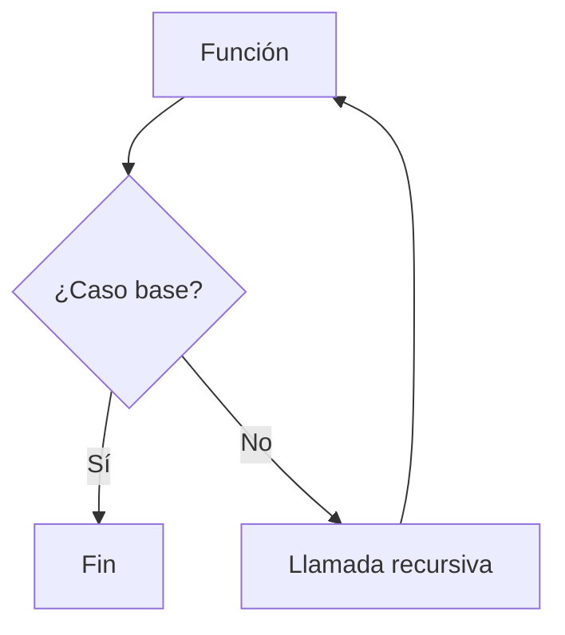

# Recursión

## Introducción

Hasta ahora hemos creado funciones que son llamadas desde otras partes del programa.

Por ejemplo:

```cpp
int sumar(int a, int b)
{
    return a + b;
}
```

---

Llamada:

```cpp
sumar(10, 20);
```

---

Normalmente:

```text
Una función llama a otra función.
```

---

Pero existe una técnica especial donde una función puede llamarse a sí misma.

A esto se le denomina:

```cpp
Recursión
```

---

# ¿Qué es la Recursión?

La recursión ocurre cuando una función se llama a sí misma.

---

## Visualización

```text
funcion()
    │
    ▼
funcion()
    │
    ▼
funcion()
```

---

Ejemplo conceptual:

```cpp
void repetir()
{
    repetir();
}
```

---

Aunque este ejemplo tiene un problema que veremos más adelante.

---

# Idea General

Una función recursiva divide un problema grande en versiones más pequeñas del mismo problema.

---

Visualización:

```text
Problema grande
      │
      ▼
Problema más pequeño
      │
      ▼
Problema más pequeño
      │
      ▼
Solución
```

---

# Componentes de una Función Recursiva

Toda función recursiva contiene dos elementos:

```text
Caso base
Paso recursivo
```

---

## Caso Base

Indica cuándo debe detenerse la recursión.

---

## Paso Recursivo

Realiza una nueva llamada a la función acercándose al caso base.

---

Visualización:

```text
Función
   │
   ▼
Caso base ?
 ╱        ╲
Sí         No
│           │
▼           ▼
Fin     Llamada recursiva
```

---

# Caso Base

Toda recursión necesita un:

```text
Caso base
```

---

El caso base indica cuándo debe detenerse la recursión.

---

Sin él:

```text
La función se llamaría para siempre.
```

---

# Primer Ejemplo

```cpp
#include <iostream>

void contar(int numero)
{
    if (numero == 0)
    {
        return;
    }

    std::cout
        << numero
        << '\n';

    contar(numero - 1);
}

int main()
{
    contar(5);

    return 0;
}
```

Salida:

```text
5
4
3
2
1
```

---

# ¿Qué Ocurre?

Llamada inicial:

```cpp
contar(5);
```

---

La función ejecuta:

```cpp
contar(4);
```

---

Luego:

```cpp
contar(3);
```

---

Luego:

```cpp
contar(2);
```

---

Luego:

```cpp
contar(1);
```

---

Finalmente:

```cpp
contar(0);
```

---

Caso base:

```cpp
if (numero == 0)
{
    return;
}
```

---

La recursión termina.

---

# Visualización

```text
contar(5)
    │
    ▼
contar(4)
    │
    ▼
contar(3)
    │
    ▼
contar(2)
    │
    ▼
contar(1)
    │
    ▼
contar(0)
    │
    ▼
Fin
```

---

# Recursión Infinita

Observa:

```cpp
void repetir()
{
    repetir();
}
```

---

Problema:

```text
Nunca se detiene.
```

---

Visualización:

```text
repetir()
   │
   ▼
repetir()
   │
   ▼
repetir()
   │
   ▼
...
```

---

Resultado:

```text
Stack overflow
```

---

# Regla Fundamental

Toda función recursiva necesita:

```text
Caso base
```

y

```text
Progreso hacia el caso base
```

---

Ejemplo:

```cpp
contar(numero - 1);
```

---

Cada llamada se acerca a:

```cpp
0
```

---

# Factorial

Uno de los ejemplos clásicos.

---

Definición matemática:

```text
5! = 5 × 4 × 3 × 2 × 1
```

---

```text
5! = 120
```

---

Observación:

```text
5! = 5 × 4!
```

---

```text
4! = 4 × 3!
```

---

```text
3! = 3 × 2!
```

---

# Implementación

```cpp
int factorial(int numero)
{
    if (numero <= 1)
    {
        return 1;
    }

    return numero *
           factorial(numero - 1);
}
```

---

Uso:

```cpp
factorial(5);
```

---

Resultado:

```text
120
```

---

# Visualización

```text
factorial(5)

5 * factorial(4)

5 * 4 * factorial(3)

5 * 4 * 3 * factorial(2)

5 * 4 * 3 * 2 * factorial(1)

5 * 4 * 3 * 2 * 1
```

---

# Seguimiento Paso a Paso

```cpp
factorial(3)
```

↓

```cpp
3 * factorial(2)
```

↓

```cpp
3 * 2 * factorial(1)
```

↓

```cpp
3 * 2 * 1
```

↓

```text
6
```

---

# Árbol de Llamadas

La ejecución de una función recursiva puede representarse como un árbol.

---

Ejemplo:

```cpp
factorial(4)
```

```text
factorial(4)
     │
     ▼
factorial(3)
     │
     ▼
factorial(2)
     │
     ▼
factorial(1)
```

---

# Stack de Llamadas

Cada llamada a una función se almacena temporalmente en memoria.

---

Esta estructura se denomina:

```text
Call Stack
```

---

Visualización:

```text
factorial(1)
factorial(2)
factorial(3)
factorial(4)
factorial(5)
```

---

Cuando el caso base se alcanza:

```text
Las llamadas se resuelven
```

---

y la pila se vacía en orden inverso.

---

Visualización:

```text
factorial(5)
factorial(4)
factorial(3)
factorial(2)
factorial(1)
```

↓

```text
factorial(1) termina
factorial(2) termina
factorial(3) termina
factorial(4) termina
factorial(5) termina
```

---

# Recursión vs Iteración

Muchos problemas recursivos pueden resolverse con bucles.

---

## Recursión

```cpp
contar(5);
```

---

## Iteración

```cpp
for (int i {5};
     i > 0;
     --i)
{
    std::cout
        << i
        << '\n';
}
```

---

Resultado:

```text
El mismo
```

---

# Comparación

| Característica                               | Recursión       | Iteración       |
| -------------------------------------------- | --------------- | --------------- |
| Utiliza funciones                            | Sí              | No              |
| Utiliza call stack                           | Sí              | No              |
| Más cercana a definiciones matemáticas       | Sí              | No siempre      |
| Consume más memoria                          | Generalmente sí | Generalmente no |
| Fácil para árboles y estructuras jerárquicas | Sí              | No siempre      |

---

# ¿Cuándo Utilizar Recursión?

Cuando el problema se define naturalmente en términos de sí mismo.

---

Ejemplos:

```text
Árboles
Directorios
Factoriales
Búsquedas
Divide y vencerás
```

---

# Ventajas

## Código Expresivo

Muchos algoritmos se vuelven más fáciles de entender.

---

## Cercanía a la Definición Matemática

Ejemplo:

```cpp
factorial(n)
```

---

se parece mucho a:

```text
n × factorial(n - 1)
```

---

# Desventajas

## Más Consumo de Memoria

Cada llamada ocupa espacio en el call stack.

---

## Riesgo de Stack Overflow

Si la profundidad es excesiva.

---

## A Veces Más Lenta

Que una solución iterativa equivalente.

---

# Ejemplo Completo

```cpp
#include <iostream>

int factorial(int numero)
{
    if (numero <= 1)
    {
        return 1;
    }

    return numero *
           factorial(numero - 1);
}

int main()
{
    std::cout
        << factorial(5)
        << '\n';

    return 0;
}
```

Salida:

```text
120
```

---

# Buenas Prácticas

## Definir un Caso Base Claro

Correcto:

```cpp
if (numero <= 1)
{
    return 1;
}
```

---

## Acercarse al Caso Base

Correcto:

```cpp
numero - 1
```

---

## Mantener la Recursión Simple

Evitar llamadas difíciles de seguir.

---

## Verificar Casos Extremos

```cpp
0
1
```

---

suelen ser casos importantes.

---

# Error Común

Olvidar el caso base.

---

Incorrecto:

```cpp
void repetir()
{
    repetir();
}
```

---

Resultado:

```text
Stack overflow
```

---

Otro error:

```cpp
factorial(numero + 1);
```

---

Porque:

```text
Se aleja del caso base.
```

---

# Diagrama General



---

# Visualización General

```text
Función
   │
   ▼
Caso base ?
 ╱        ╲
Sí         No
│           │
▼           ▼
Fin     Llamada recursiva
               │
               ▼
            Función
```

---

# Tabla Resumen

| Concepto       | Descripción                          |
| -------------- | ------------------------------------ |
| Recursión      | Función que se llama a sí misma      |
| Caso base      | Condición que detiene la recursión   |
| Paso recursivo | Nueva llamada a la función           |
| Call Stack     | Pila donde se almacenan las llamadas |
| Stack Overflow | Exceso de llamadas recursivas        |

---

## Resumen

* La recursión ocurre cuando una función se llama a sí misma.
* Toda función recursiva necesita un caso base.
* Cada llamada debe acercarse al caso base.
* La recursión se compone de un caso base y un paso recursivo.
* Las llamadas se almacenan en el call stack.
* Una recursión incorrecta puede producir stack overflow.
* Muchos problemas recursivos también pueden resolverse mediante iteración.
* Es una técnica fundamental en algoritmos y estructuras de datos.
