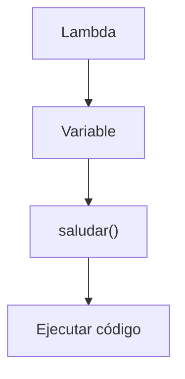
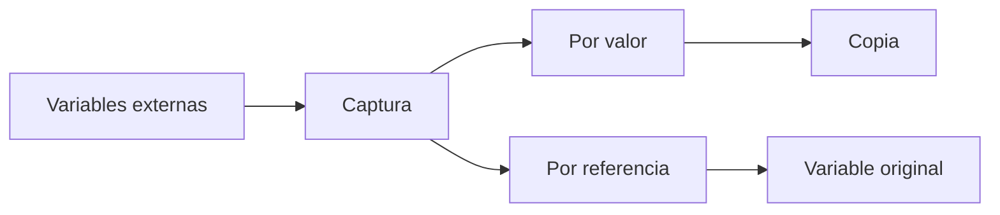

# Lambdas

## Introducción

Hasta ahora hemos creado funciones como:

```cpp
int sumar(int a, int b)
{
    return a + b;
}
```

---

o:

```cpp
void saludar()
{
    std::cout
        << "Hola\n";
}
```

---

Estas funciones tienen:

```text
Nombre
Parámetros
Cuerpo
```

---

Sin embargo, en ocasiones necesitamos una función pequeña que solo será utilizada una vez.

Crear una función completa puede resultar innecesario.

Para estos casos C++ proporciona:

```cpp
Lambdas
```

---

# ¿Qué es una Lambda?

Una lambda es una función anónima.

---

Anónima significa:

```text
No tiene nombre propio.
```

---

Ejemplo:

```cpp
[](int a, int b)
{
    return a + b;
}
```

---

Visualización:

```text
Función
 │
 ├── Parámetros
 ├── Código
 └── Sin nombre
```

---

# ¿Por Qué Existen?

Muchas veces necesitamos una función:

```text
Pequeña
Temporal
Utilizada una sola vez
```

---

Sin lambda:

```cpp
bool esPar(int numero)
{
    return numero % 2 == 0;
}
```

---

Con lambda:

```cpp
[](int numero)
{
    return numero % 2 == 0;
}
```

---

# Sintaxis General

```cpp
[capturas]
(parametros)
{
    cuerpo
};
```

---

Forma mínima:

```cpp
[]
{
};
```

---

## Componentes

```cpp
[capturas]
(parametros)
{
    cuerpo
};
```

| Parte | Descripción         |
| ----- | ------------------- |
| `[]`  | Capturas            |
| `()`  | Parámetros          |
| `{}`  | Código de la lambda |

---

# Primera Lambda

```cpp
#include <iostream>

int main()
{
    auto saludar =
        []()
        {
            std::cout
                << "Hola\n";
        };

    saludar();

    return 0;
}
```

Salida:

```text
Hola
```

---

# ¿Qué Ocurrió?

Creamos:

```cpp
[]()
{
    std::cout
        << "Hola\n";
}
```

---

La almacenamos en:

```cpp
saludar
```

---

Luego:

```cpp
saludar();
```

---

ejecuta la lambda.

---

# Visualización

```text
Lambda
   │
   ▼
Variable
   │
   ▼
Llamada
```

---



---

# Lambda con Parámetros

```cpp
auto sumar =
    [](int a, int b)
    {
        return a + b;
    };
```

---

Uso:

```cpp
std::cout
    << sumar(10, 20)
    << '\n';
```

Salida:

```text
30
```

---

# Tipo de Retorno

Generalmente el compilador puede deducirlo.

---

Ejemplo:

```cpp
auto sumar =
    [](int a, int b)
    {
        return a + b;
    };
```

---

Retorno deducido:

```cpp
int
```

---

# Retorno Explícito

También puede especificarse.

---

Sintaxis:

```cpp
[](...) -> tipo
{
}
```

---

Ejemplo:

```cpp
auto dividir =
    [](double a, double b)
    -> double
    {
        return a / b;
    };
```

---

# Capturas

La característica más importante de las lambdas.

---

Permiten acceder a variables externas.

---

Visualización:

```text
Variable externa
      │
      ▼
   Captura
      │
      ▼
    Lambda
```

---

# Captura por Valor

Sintaxis:

```cpp
[numero]
```

---

La lambda recibe una copia.

---

Ejemplo:

```cpp
int numero {10};

auto mostrar =
    [numero]()
    {
        std::cout
            << numero
            << '\n';
    };

numero = 20;

mostrar();
```

Salida:

```text
10
```

---

Visualización:

```text
numero = 10
      │
   copiar
      ▼
 lambda
```

---

# Captura por Referencia

Sintaxis:

```cpp
[&numero]
```

---

La lambda utiliza la variable original.

---

Ejemplo:

```cpp
int numero {10};

auto mostrar =
    [&numero]()
    {
        std::cout
            << numero
            << '\n';
    };

numero = 20;

mostrar();
```

Salida:

```text
20
```

---

Visualización:

```text
numero
   ▲
   │
lambda
```

---

# Capturar Todo por Valor

```cpp
[=]
```

---

Ejemplo:

```cpp
int a {10};
int b {20};

auto mostrar =
    [=]()
    {
        std::cout
            << a + b
            << '\n';
    };
```

---

# Capturar Todo por Referencia

```cpp
[&]
```

---

Ejemplo:

```cpp
int a {10};
int b {20};

auto mostrar =
    [&]()
    {
        std::cout
            << a + b
            << '\n';
    };
```

---

# Capturas Mixtas

También pueden combinarse.

---

Ejemplo:

```cpp
int a {10};
int b {20};

auto mostrar =
    [a, &b]()
    {
        std::cout
            << a + b
            << '\n';
    };
```

---

Aquí:

```cpp
a
```

se captura por valor.

---

Y:

```cpp
b
```

por referencia.

---

# mutable

Por defecto, las capturas por valor son de solo lectura dentro de la lambda.

---

Ejemplo:

```cpp
int numero {10};

auto incrementar =
    [numero]()
    {
        ++numero;
    };
```

---

Resultado:

```text
Error de compilación
```

---

Para permitir modificaciones sobre la copia:

```cpp
mutable
```

---

Ejemplo:

```cpp
int numero {10};

auto incrementar =
    [numero]() mutable
    {
        ++numero;

        std::cout
            << numero
            << '\n';
    };

incrementar();
```

Salida:

```text
11
```

---

La variable original no cambia.

---

# ¿Qué Modifica mutable?

```cpp
int numero {10};

auto lambda =
    [numero]() mutable
    {
        ++numero;
    };
```

---

Modifica:

```text
La copia interna
```

---

No modifica:

```text
La variable original
```

---

# Lambdas y Variables Externas

Ejemplo:

```cpp
int contador {0};

auto incrementar =
    [&contador]()
    {
        ++contador;
    };

incrementar();
incrementar();

std::cout
    << contador;
```

Salida:

```text
2
```

---

# Uso Habitual

Las lambdas son muy utilizadas junto a:

```cpp
std::vector
```

---

```cpp
std::sort
```

---

```cpp
std::find_if
```

---

```cpp
std::for_each
```

---

Estos temas los veremos más adelante.

---

# Ejemplo Completo

```cpp
#include <iostream>

int main()
{
    auto cuadrado =
        [](int numero)
        {
            return numero * numero;
        };

    std::cout
        << cuadrado(5)
        << '\n';

    return 0;
}
```

Salida:

```text
25
```

---

# Función vs Lambda

| Característica                 | Función         | Lambda           |
| ------------------------------ | --------------- | ---------------- |
| Tiene nombre                   | Sí              | No               |
| Reutilización                  | Alta            | Normalmente baja |
| Capturas                       | No              | Sí               |
| Uso temporal                   | No ideal        | Excelente        |
| Puede almacenarse en variables | No directamente | Sí               |

---

# ¿Cuándo Utilizar Lambdas?

Cuando:

```text
La función es pequeña
```

---

```text
Se utilizará pocas veces
```

---

```text
Necesita acceder a variables cercanas
```

---

# ¿Cuándo Utilizar Funciones Normales?

Cuando:

```text
La lógica es extensa
```

---

```text
Será reutilizada
```

---

```text
Forma parte de la interfaz pública
```

---

# Buenas Prácticas

## Mantenerlas Pequeñas

Correcto:

```cpp
[](int n)
{
    return n * n;
}
```

---

## Utilizar Capturas Mínimas

Preferir:

```cpp
[numero]
```

---

en lugar de:

```cpp
[=]
```

cuando sea posible.

---

## Utilizar Funciones para Lógica Compleja

Las lambdas deben ser simples.

---

## Capturar Solo lo Necesario

Evita:

```cpp
[&]
```

si solo necesitas una variable.

---

# Error Común

Capturar por valor esperando modificaciones posteriores.

---

Ejemplo:

```cpp
int numero {10};

auto mostrar =
    [numero]()
    {
        std::cout
            << numero;
    };

numero = 20;

mostrar();
```

---

Resultado:

```text
10
```

---

Porque:

```cpp
[numero]
```

creó una copia.

---

# Visualización General



---

# Tabla Resumen

| Sintaxis  | Significado                          |
| --------- | ------------------------------------ |
| `[]`      | Sin capturas                         |
| `[x]`     | Captura por valor                    |
| `[&x]`    | Captura por referencia               |
| `[=]`     | Todo por valor                       |
| `[&]`     | Todo por referencia                  |
| `[x, &y]` | Captura mixta                        |
| `mutable` | Permite modificar capturas por valor |

---

## Resumen

* Una lambda es una función anónima.
* Puede almacenarse en variables mediante `auto`.
* Puede recibir parámetros y devolver valores.
* Las capturas permiten acceder a variables externas.
* Existen capturas por valor y por referencia.
* `mutable` permite modificar copias capturadas por valor.
* Las capturas mixtas permiten combinar valor y referencia.
* Son ideales para funciones pequeñas y temporales.
* Se utilizan extensivamente en C++ moderno y la STL.
* Son una de las características más importantes introducidas en C++11.
